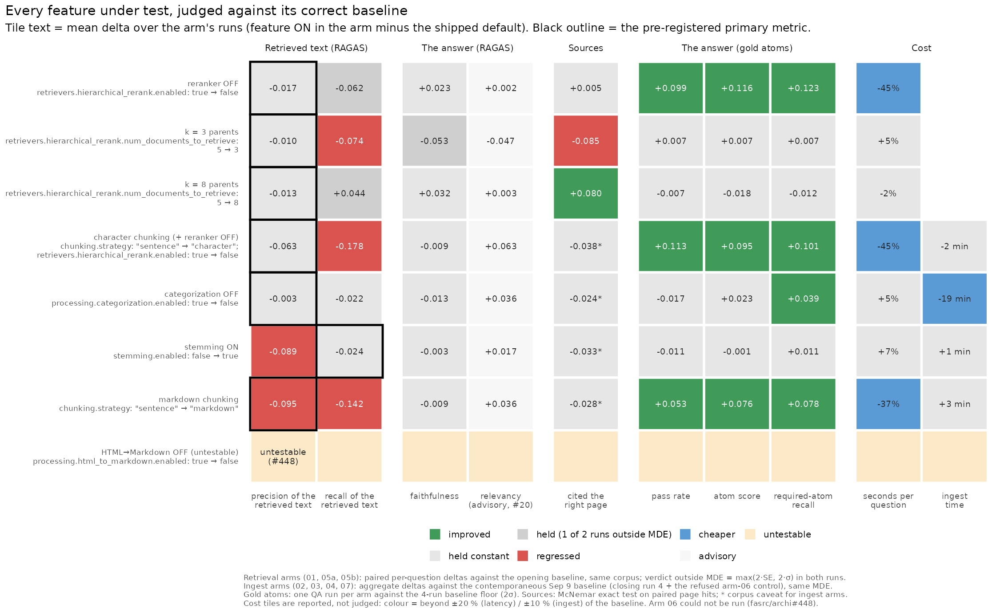
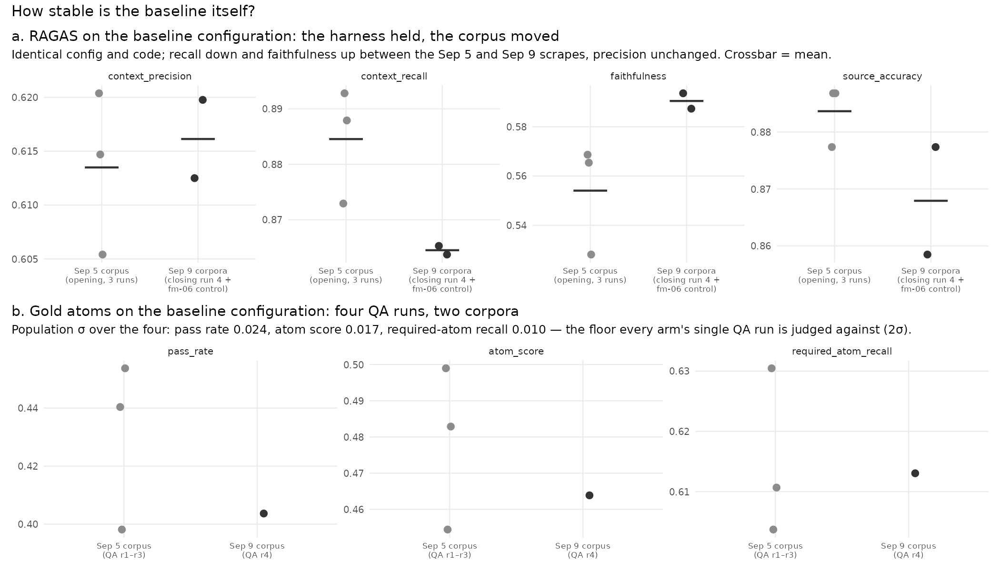
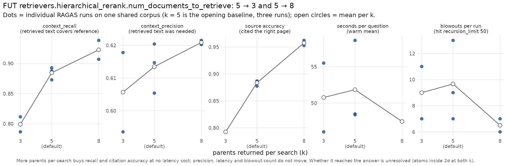
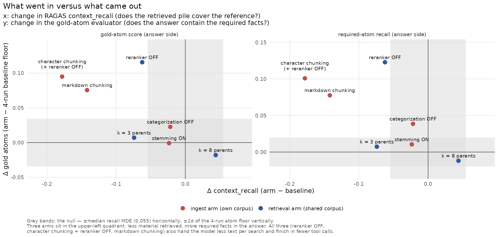
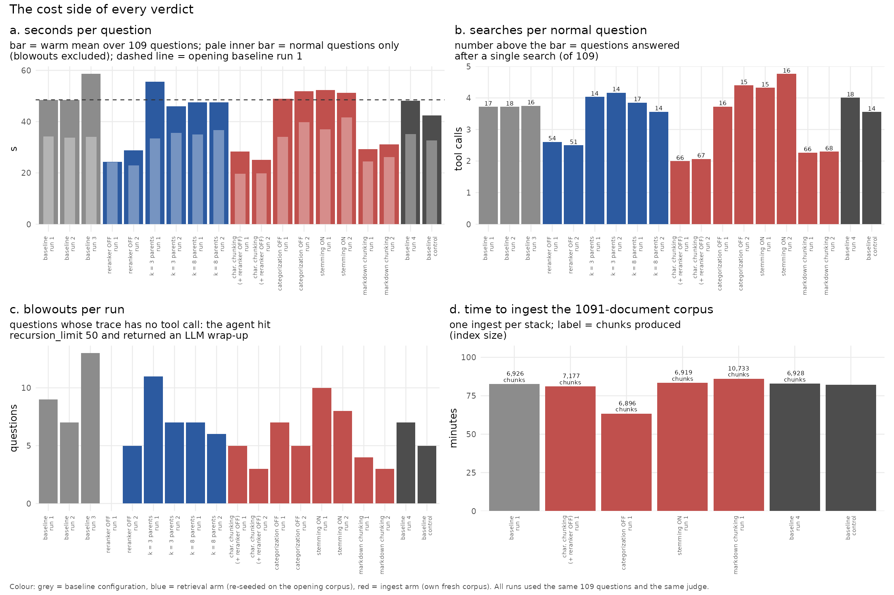

# Feature-Matrix Campaign Results (2026-09)

**Audience:** anyone deciding whether a shipped `data_manager` default should change. No
RAGAS background is assumed: every metric is introduced in plain words before its name is
used, and every comparison names the feature under test as `key: default → arm`.

**What this is.** The cross-arm report for issue
[#396](https://github.com/fasrc/archi/issues/396). Between 2026-09-04 and 2026-09-09, on the
production GPU host, eight configuration changes were each tested in isolation against the
shipped defaults, with the same 109 questions, the same judge, the same code and a locked
protocol. The protocol, the pre-registered decision rules and the day-by-day operating log
live in the [campaign plan](proposals/feature-matrix-campaign-2026.md) and the
[pre-registration](https://github.com/fasrc/archi/blob/dev/docs/eval/preregs/2026-09-feature-matrix.md);
this page reports what came out. Times are EDT (the operating log's convention); artifact
filenames carry UTC.

**The one-paragraph answer.** No retrieval-side knob moved the pre-registered primary metric
(`context_precision`, the share of retrieved text that was actually needed). Two ingest-side
changes made it worse: markdown chunking (`hurts`) and, as a strong secondary effect,
stemming. Two shipped defaults cost real money for no measurable benefit: per-document LLM
categorization adds 19 minutes to every ingest and changes nothing downstream, and the
hierarchical reranker roughly doubles time per question while the answers it produces contain
*fewer* of the required facts. Returning 8 parents per search instead of 5 raised citation
accuracy from 0.88 to 0.96 at no latency cost. One arm, turning HTML→Markdown conversion off,
could not be run at all: the config renderer silently ignores `enabled: false` for that key
([fasrc/archi#448](https://github.com/fasrc/archi/issues/448)). The two evaluators disagree
on three arms, and the disagreement is informative rather than contradictory: they measure
different stages of the pipeline.



---

## 1. The short version

Each line names the feature under test (`key: default → arm`), the pre-registered verdict on
the primary metric in the pre-registered vocabulary (helps / hurts / no measurable difference
/ mixed), and what else moved. Full tables are in [section 3](#3-results-by-feature).

| Feature under test | Primary verdict | What else moved | Cost |
|---|---|---|---|
| `retrievers.hierarchical_rerank.enabled: true → false` (reranker OFF) | **no measurable difference** (Δ −0.025 / −0.010, MDE 0.063) | retrieved-text recall lower in both runs (−0.072 / −0.052, one outside MDE); **answer-side gold atoms up on all three metrics, 3–6σ above the baseline floor** | **45 % less time per question**, a third fewer searches |
| `retrievers.hierarchical_rerank.num_documents_to_retrieve: 5 → 3` (k = 3) | **no measurable difference** (Δ −0.014 / −0.005, MDE 0.022) | recall **hurts** (−0.087 / −0.061); cited the right page 0.877 → 0.792 (p = 0.012 / 0.023) | no speed gain |
| `retrievers.hierarchical_rerank.num_documents_to_retrieve: 5 → 8` (k = 8) | **no measurable difference** (Δ −0.014 / −0.013, MDE 0.018) | recall up (+0.060 / +0.028, one outside MDE); **cited the right page 0.877 → 0.962 / 0.953 (p = 0.002 / 0.012)** | latency flat |
| `chunking.strategy: sentence → character` + `hierarchical_rerank.enabled: true → false` (two keys, pre-registered) | **no measurable difference** (Δ −0.058 / −0.067, MDE 0.081) | recall **hurts, worst in the campaign** (−0.162 / −0.195); gold atoms up (the reranker-OFF half) | 45 % faster (the reranker-OFF half) |
| `processing.categorization.enabled: true → false` (categorization OFF) | **no measurable difference** (Δ −0.004 / −0.002, MDE 0.026) | nothing on retrieval; one of three atom metrics just outside 2σ (suggestive) | **ingest 19 min faster (−23 %)** |
| `stemming.enabled: false → true` (stemming ON); primary is `context_recall` | **no measurable difference** (Δ −0.032 / −0.015, MDE 0.040 / 0.055) | **precision hurts as a secondary effect** (−0.091 / −0.088, MDE 0.057); the agent searches ~15 % more | +7 % time per question |
| `processing.html_to_markdown.enabled: true → false` (HTML→Markdown OFF) | **untestable** | the renderer forced the key back to `true`; the integrity gate refused the run after 3 h 45 m (#448) | — |
| `chunking.strategy: sentence → markdown` (markdown chunking) | **hurts** (Δ −0.098 / −0.091, MDE 0.072 / 0.074) | recall **hurts** (−0.145 / −0.140); gold atoms up on all three; +55 % chunks | 37 % faster, two searches per question instead of four |

Three things to take from the table before the details:

- **The primary metric is insensitive to the retrieval knobs.** Reranker, k and stemming all
  leave `context_precision` inside its minimum detectable effect; only the two chunking
  changes move it, and only downward. `context_recall` and citation accuracy are the metrics
  that respond to retrieval settings.
- **The two shipped defaults with a measurable cost buy nothing measurable.** Categorization
  costs 19 minutes per ingest (about 1 080 LLM calls) and is write-only in the code; the
  reranker costs 45 % of the time per question. Section 5 proposes the issues.
- **"Less material in, more facts out" happened three times.** Reranker OFF, character
  chunking (+ reranker OFF) and markdown chunking all lowered RAGAS recall of the retrieved
  text and all raised the answer-side gold-atom scores, while cutting searches per question
  roughly in half. Section 4.1 explains why this is not a contradiction.

---

## 2. What was tested and how to read the numbers

### 2.1 The arms

One factor flips per arm (arm 02 flips two, because `character` chunks carry no `parent_id`
and the reranker would have nothing to return). Baseline and arm configs are in
`config/benchmarking/feature_matrix/` (archi-config); the feature under test is derived by
diffing each arm's `data_manager` block against `00-baseline.yaml`, never written by hand.

| Arm | Feature under test (`key: default → arm`) | Kind | Corpus | RAGAS runs | QA runs | Baseline used for the verdict |
|---|---|---|---|---|---|---|
| 00 | — shipped defaults made explicit: `chunking.strategy: sentence`, `hierarchical_rerank.enabled: true`, `num_documents_to_retrieve: 5`, `html_to_markdown.enabled: true`, `categorization.enabled: true`, `stemming.enabled: false` | reference | opening `fc8ee1b5…` (Sep 5) and closing `137e41c1…` (Sep 9) | 3 opening + 1 closing | 4 | — |
| 01 | `retrievers.hierarchical_rerank.enabled: true → false` | retrieval (re-seeded on `fm-00`) | = opening | 2 | 1 | opening, paired per question |
| 05a | `retrievers.hierarchical_rerank.num_documents_to_retrieve: 5 → 3` | retrieval | = opening | 2 | 1 | opening, paired |
| 05b | `retrievers.hierarchical_rerank.num_documents_to_retrieve: 5 → 8` | retrieval | = opening | 2 | 1 | opening, paired |
| 02 | `chunking.strategy: sentence → character`; `retrievers.hierarchical_rerank.enabled: true → false` | ingest (own stack) | own, `d7417a68…` | 2 | 1 | contemporaneous (Sep 9), aggregate |
| 03 | `processing.categorization.enabled: true → false` | ingest | own, `570ccaa8…` | 2 | 1 | contemporaneous, aggregate |
| 04 | `stemming.enabled: false → true` | ingest | own, `95574702…` | 2 | 1 | contemporaneous, aggregate |
| 06 | `processing.html_to_markdown.enabled: true → false` | ingest | own, `e67eb9f0…` | 1 (refused) | 0 | untestable (#448); the refused run is reused as a baseline-configuration control |
| 07 | `chunking.strategy: sentence → markdown` | ingest | own, `e7ed322f…` | 2 | 1 | contemporaneous, aggregate |

Fixed for every arm: 1 091 documents from `config/lists/sources.list`, the 109-question bank
(104 bank rows + 5 tripwire anchors), the production agent prompt `fasrc-docs.md`, the
system under test (vLLM `Qwen3.6-35B-A3B-GPTQ-Int4`, temperature 0.3, 32 768-token in-loop
context bound, `recursion_limit: 50`), the judge (`claude-sonnet-4-5` via HUIT Bedrock) and
the code (lock `3e07ae79…`, runtime trees identical to `dev` tip `3170498c`). Totals: 17
archived RAGAS runs, 11 QA runs, zero degraded rows, every configuration-divergence check
passed, and no arm ran a configuration it did not declare (the one that tried was refused).

### 2.2 What is measured

The campaign uses two evaluators that look at different stages of the same pipeline. Keep
the stage in mind: most of the "disagreements" below are the two stages disagreeing.

| What is measured, in plain words | Metric | Evaluator | Stage |
|---|---|---|---|
| Of the text the agent retrieved, how much was actually needed to answer? | `context_precision` — **the pre-registered primary metric** (except arm 04) | RAGAS, judged against the reference answer | retrieved text (what went *in*) |
| Did the pile of retrieved text cover the facts in the reference answer? | `context_recall` — primary for arm 04 | RAGAS | retrieved text |
| Is the answer grounded in the retrieved text (no invented claims)? | `faithfulness` | RAGAS | the answer (what came *out*) |
| Does the answer address the question asked? | `answer_relevancy` — **advisory only** (see 6.2) | RAGAS | the answer |
| Did the agent cite the page the reference cites? | source accuracy (URL match, 106 of 109 questions carry a reference URL) | harness | cited sources |
| Does the answer contain the specific required facts? | gold atoms: attempt pass rate, atom score, required-atom recall | `archi eval qa`, same judge model | the answer |
| How long did a question take; how often did the agent give up? | seconds per question (warm mean, first question dropped); blowouts; searches per question | harness traces | cost |
| How long did the corpus take to ingest; how big is the index? | ingest wall seconds; chunk count | harness / ledger | cost |

A **blowout** is a question whose trace contains no tool call: the agent hit
`services.chat_app.recursion_limit: 50`, the error handler returned an LLM-written wrap-up
("The agent attempted to…"), and RAGAS scored that text as the answer. This mechanical
definition supersedes the hand counts in the operating log (which differ by one or two on
two baseline runs). A **normal question** is any other question.

### 2.3 The decision rule, and which baseline each arm is judged against

- **RAGAS metrics.** Verdicts come from `scripts/benchmarking/compare_runs.py`, never by hand.
  The minimum detectable effect is `MDE = max(2·SE, 2·σ)`: `SE` is the paired per-question
  standard error over the 104 bank questions, `σ` the run-to-run spread of the mean measured
  on the three opening baseline runs of this campaign (paired σ: `context_precision` 0.004,
  `context_recall` 0.011, `faithfulness` 0.021, `answer_relevancy` 0.016 — all below the
  planning prior, so N = 2 runs per arm stood). A delta inside the MDE is the null, never a
  direction. **Two runs combine as: outside the MDE in the same direction in both runs → a
  verdict; outside in one run → reported as the null, with the direction noted.**
- **Retrieval arms (01, 05a, 05b)** ran on the baseline's own stack and corpus, so their
  deltas are paired per question against the opening baseline, exactly as pre-registered.
- **Ingest arms (02, 03, 04, 07)** must ingest their own corpus, and the FASRC documentation
  changed between Sep 5 and Sep 9 (section 4.4). They are therefore judged against the
  **contemporaneous baseline**: the mean of the two baseline-configuration runs made on Sep 9
  — the closing baseline (run 4) and the refused arm-06 run, which the renderer bug turned
  into a baseline-configuration run on a third fresh corpus. Those two runs agree with each
  other to 0.0016 on recall and 0.007 on precision. The MDE applied is the tool's own for that
  arm and run. **This is a logged deviation from the pre-registration** (which compared every
  arm to the opening baseline); section 3 shows both numbers for every ingest arm so the
  reader can see what the re-basing changed. It changed two secondary readings (the
  categorization-OFF and stemming-ON recall dips were the corpus, not the feature) and no
  primary verdict except to sharpen them.
- **Gold atoms.** One QA run per arm against a **four-run baseline floor** (three opening runs
  on the Sep 5 corpus plus the closing run on the Sep 9 corpus): pass rate 0.424 ± 0.024,
  atom score 0.475 ± 0.017, required-atom recall 0.614 ± 0.010 (mean ± population σ). A delta
  inside 2σ is the null. Because the arm side is a single run, an atom "improved" is one draw
  several σ from a four-point floor, not a paired test.
- **Cited sources.** Exact McNemar test on paired page hits (question by question, arm run
  against the reference run of the right baseline); p < 0.05 in both runs is a verdict.
- **Cost** is reported beside every verdict, never judged (plan §4.4 step 4).



---

## 3. Results by feature

Every table is framed from the feature's point of view: the shipped default in one column,
the arm in the next, then the delta with its MDE (RAGAS), 2σ (atoms) or p-value (sources),
and a one-word reading. Two RAGAS runs per arm are shown as `run 1 / run 2`. Baseline values
in the RAGAS rows are the paired means the tool reports for that comparison.

### 3.1 Reranker OFF — `retrievers.hierarchical_rerank.enabled: true → false`

Same corpus as the baseline, paired per question.

| What is measured | Metric | reranker ON (default) | reranker OFF | Δ (MDE or 2σ) | Reading |
|---|---|---|---|---|---|
| retrieved text was needed | `context_precision` (primary) | 0.633 / 0.629 | 0.608 / 0.619 | −0.025 / −0.010 (0.063 / 0.064) | **no measurable difference** |
| retrieved text covers the reference | `context_recall` | 0.891 | 0.818 / 0.839 | −0.072 / −0.052 (0.057 / 0.055) | lower in both runs, one outside MDE → the null, but 3× the baseline's own replicate spread (+0.021 / +0.016) and opposite in sign: a probable small loss |
| answer grounded in retrieved text | `faithfulness` | 0.561 | 0.603 / 0.565 | +0.042 / +0.004 (0.058 / 0.055) | no difference |
| cited the right page | source accuracy | 0.877 | 0.877 / 0.887 | p = 1 / 1 | identical |
| answer contains the required facts | atom score | 0.475 ± 0.017 | **0.591** | **+0.116 (2σ 0.034)** | **improved** |
| required facts recalled | required-atom recall | 0.614 ± 0.010 | **0.737** | **+0.123 (2σ 0.020)** | **improved** |
| items passing | pass rate | 0.424 ± 0.024 | **0.523** (57 of 109) | **+0.099 (2σ 0.047)** | **improved** |
| time per question (warm mean) | seconds | 48.5 | 24.2 / 28.9 | **−45 %** | much cheaper |
| searches per normal question | tool calls | 3.72 (17 questions done in one search) | 2.61 / 2.50 (54 / 51 in one search) | −1.2 | a third fewer |
| gave up (blowouts) | count of 109 | 9 (7 / 13 in the replicates) | 0 / 5 | | fewer |

**Reading.** The pre-registered claim ("disabling the reranker lowers `context_precision`;
ADR 0003's +19 % still holds") is not supported: precision is inside its MDE in both runs.
What the reranker does buy is retrieved-text recall, about 0.06 of it. What it costs is time
and, on the answer side, facts: without it the agent finishes most questions in a single
search, never or rarely blows out, and its answers contain more of the required facts on all
three gold-atom metrics, 3–6σ above the four-run floor. One G8 tripwire is a genuine signal
here, not the false-positive pattern of defect #14: on the "which SLURM partition for GPU
jobs" anchor, reranker OFF drove `context_precision` to 0.000 in both runs (baseline
0.29–0.34) — the hybrid retriever put the right page nowhere near the top for that question.

- Caveat: the atom gain is one QA run against a four-run floor, not a paired test; the QA
  references are all `draft`.
- Caveat: recall is "probable small loss", not a verdict, under the two-run rule.

### 3.2 Fewer parents per search — `retrievers.hierarchical_rerank.num_documents_to_retrieve: 5 → 3`

| What is measured | Metric | k = 5 (default) | k = 3 | Δ (MDE or 2σ) | Reading |
|---|---|---|---|---|---|
| retrieved text was needed | `context_precision` (primary) | 0.622 / 0.637 | 0.608 / 0.631 | −0.014 / −0.005 (0.023 / 0.021) | **no measurable difference** |
| retrieved text covers the reference | `context_recall` | 0.891 | 0.804 / 0.830 | **−0.087 / −0.061 (0.052 / 0.057)** | **hurts** |
| answer grounded in retrieved text | `faithfulness` | 0.561 | 0.510 / 0.506 | −0.051 / −0.055 (0.054 / 0.052) | one outside MDE → the null; both negative |
| cited the right page | source accuracy | 0.877 (93 of 106) | **0.792 / 0.792** (84 of 106) | p = 0.012 / 0.023 | **regressed** |
| answer contains the required facts | atom score / required-atom recall / pass rate | 0.475 / 0.614 / 0.424 | 0.482 / 0.622 / 0.431 | +0.007 each | inside 2σ |
| time per question (warm mean) | seconds | 48.5 | 55.5 / 46.0 | +5 % | no speed gain |
| gave up (blowouts) | count | 9 | 11 / 7 | | same |

**Reading.** The pre-registered claim was "fewer parents raise precision and lower recall".
The recall half held; the precision half did not. Retrieving fewer documents bought no speed
at all (per normal question 33.5 / 35.6 s vs 34.3 s), lost nine citations of 106 in both
runs, and left the answers unchanged. Default confirmed against k = 3.

### 3.3 More parents per search — `retrievers.hierarchical_rerank.num_documents_to_retrieve: 5 → 8`

| What is measured | Metric | k = 5 (default) | k = 8 | Δ (MDE or 2σ) | Reading |
|---|---|---|---|---|---|
| retrieved text was needed | `context_precision` (primary) | 0.639 / 0.634 | 0.626 / 0.621 | −0.014 / −0.013 (0.018 / 0.017) | **no measurable difference**, but both runs sit within 0.004 of the MDE on the low side |
| retrieved text covers the reference | `context_recall` | 0.891 | **0.951** / 0.918 | +0.060 / +0.028 (0.042 / 0.042) | one outside MDE → the null; both positive, run 2 inside the replicate spread |
| answer grounded in retrieved text | `faithfulness` | 0.561 | 0.589 / 0.596 | +0.028 / +0.035 (0.046) | no difference |
| cited the right page | source accuracy | 0.877 (93 of 106) | **0.962 / 0.953** (102 / 101 of 106) | p = 0.002 / 0.012 | **improved** |
| answer contains the required facts | atom score / required-atom recall / pass rate | 0.475 / 0.614 / 0.424 | 0.457 / 0.603 / 0.417 (108 scored) | −0.018 / −0.012 / −0.007 | inside 2σ |
| time per question (warm mean) | seconds | 48.5 | 47.5 / 47.5 | −2 % | flat |
| searches per normal question | tool calls | 3.72 | 3.85 / 3.56 | | flat |
| gave up (blowouts) | count | 9 | 7 / 6 | | same |

**Reading.** The cleanest positive result in the campaign is citation accuracy: nine more
questions of 106 cite the right page, in both runs, at p ≤ 0.012, with no latency cost and
no rise in blowouts. `k` does not change how much the agent searches; it changes how much
each search returns. Whether the extra material reaches the answer is unresolved: the atoms
are flat over one QA run. The k-sweep is monotonic (section 4.2).



### 3.4 Character chunking — `chunking.strategy: sentence → character` + `retrievers.hierarchical_rerank.enabled: true → false`

Own corpus (7 177 chunks from the same 1 091 documents, +3.6 %). Two keys by design:
character chunks carry no `parent_id`, so the reranker had to go too. Arm 01 isolates the
reranker-OFF half; the difference between the two arms is what character chunking adds.

| What is measured | Metric | sentence + reranker ON (default) | character + reranker OFF | Δ vs Sep 9 baseline (MDE) | Δ vs Sep 5 opening (pre-registered) | Reading |
|---|---|---|---|---|---|---|
| retrieved text was needed | `context_precision` (primary) | 0.616 | 0.558 / 0.549 | −0.058 / −0.067 (0.081 / 0.082) | −0.070 / −0.073 | **no measurable difference** — the MDE is wide because per-question deltas scatter when chunk boundaries change |
| retrieved text covers the reference | `context_recall` | 0.865 | 0.703 / 0.670 | **−0.162 / −0.195 (0.069 / 0.073)** | −0.183 / −0.218 | **hurts — the largest regression in the campaign**; reranker OFF alone was −0.06, so character chunking itself costs about −0.13 |
| answer grounded in retrieved text | `faithfulness` | 0.590 | 0.562 / 0.601 | −0.029 / +0.010 (0.064 / 0.059) | +0.004 / +0.041 | no difference |
| cited the right page | source accuracy | 0.868 (the two Sep 9 baseline runs: 0.877, 0.859) | 0.840 / 0.840 | −0.028; p = 0.63 / 0.45 | | not separable from corpus variation |
| answer contains the required facts | atom score / required-atom recall / pass rate | 0.475 / 0.614 / 0.424 | **0.570 / 0.715 / 0.537** (108 scored) | +0.095 / +0.101 / +0.113 (2σ 0.034 / 0.020 / 0.047) | | **improved** — within 0.02 of reranker OFF alone, so this is the reranker-OFF half |
| time per question (warm mean) | seconds | 48.2 | 28.3 / 25.1 | **−45 %** | | the reranker-OFF half |
| searches per normal question | tool calls | 4.01 (Sep 9) / 3.72 (Sep 5) | 2.00 / 2.07 (66 / 67 done in one search) | | | half |
| gave up (blowouts) | count | 7 (Sep 9 run 4) | 5 / 3 | | | fewer |
| ingest | wall time / chunks | 4 960 s / 6 926 | 4 864 s / 7 177 | −2 min / +3.6 % | | about the same |

**Reading.** Everything good about this arm is the reranker-OFF half (compare 3.1 line by
line); everything bad is the chunking. Flat 1 000-character chunks with no parent context
lose a fifth of retrieved-text recall. Default (`sentence`) confirmed.

### 3.5 Categorization OFF — `processing.categorization.enabled: true → false`

Own corpus (6 896 chunks, −30). The chunk-count difference is caused by the feature, not by
scrape variation: the metadata-aware splitter subtracts the document's metadata tokens from
the child chunk size, so removing `llm_category` frees about 8 tokens per document (measured
effective child chunk 472 → 480) and shifts boundaries slightly.

| What is measured | Metric | categorization ON (default) | categorization OFF | Δ vs Sep 9 baseline (MDE) | Δ vs Sep 5 opening (pre-registered) | Reading |
|---|---|---|---|---|---|---|
| retrieved text was needed | `context_precision` (primary) | 0.616 | 0.612 / 0.614 | −0.004 / −0.002 (0.025 / 0.027) | −0.014 / −0.023 | **no measurable difference** |
| retrieved text covers the reference | `context_recall` | 0.865 | 0.839 / 0.846 | −0.025 / −0.018 (0.041 / 0.036) | −0.043 / −0.031 (one outside MDE) | no difference — the dip against the opening baseline was the corpus change |
| answer grounded in retrieved text | `faithfulness` | 0.590 | 0.585 / 0.570 | −0.006 / −0.020 (0.045 / 0.050) | +0.010 / +0.004 | no difference |
| cited the right page | source accuracy | 0.868 | 0.868 / 0.840 | 0.000 / −0.028; p = 1 / 0.38 | | not separable from corpus variation |
| answer contains the required facts | atom score / required-atom recall / pass rate | 0.475 / 0.614 / 0.424 | 0.498 / **0.653** / 0.407 (108 scored) | +0.023 / **+0.039 (2σ 0.020)** / −0.017 | | one of three just outside 2σ, positive: suggestive, not a win |
| time per question (warm mean) | seconds | 48.2 | 48.9 / 51.8 | +5 % | | flat |
| searches per normal question | tool calls | 4.01 | 3.73 / 4.39 | | | flat |
| gave up (blowouts) | count | 7 | 7 / 5 | | | same |
| **ingest** | **wall time** / chunks | **4 960 s (82.7 min)** / 6 926 | **3 802 s (63.4 min)** / 6 896 | **−19.3 min (−23 %)** | | **much cheaper** |

**Reading.** The pre-registered claim ("removing `llm_category` does not change precision")
is confirmed, and the 2026-09-01 code audit predicted why: the category is written to
metadata and read by no retriever, prompt or embedding path. The whole effect of the feature
is its cost — one LLM call per document, about 1 080 per ingest, 19 minutes on this host.
The atom reading (required-atom recall +0.039 against 2σ 0.020, the other two inside) is
one metric of three from one run and should be treated as noise until replicated.

### 3.6 Stemming ON — `stemming.enabled: false → true` (primary metric: `context_recall`)

Own corpus (6 919 chunks, −7). Stemming is applied to each child string *after* the
hierarchical splitter has produced it, so it cannot change chunk boundaries; its −7 is the
campaign's genuine measure of scrape-to-scrape variation (the closing baseline's re-scrape
gave +2).

| What is measured | Metric | stemming OFF (default) | stemming ON | Δ vs Sep 9 baseline (MDE) | Δ vs Sep 5 opening (pre-registered) | Reading |
|---|---|---|---|---|---|---|
| retrieved text covers the reference | `context_recall` **(primary for this arm)** | 0.865 | 0.832 / 0.850 | −0.032 / −0.015 (0.040 / 0.055) | −0.052 / −0.029 (one outside MDE) | **no measurable difference** — the pre-registered claim ("stemming raises recall through BM25") is not supported |
| retrieved text was needed | `context_precision` | 0.616 | **0.525 / 0.529** | **−0.091 / −0.088 (0.056 / 0.058)** | −0.104 / −0.098 | **hurts** (secondary) — about 1.6× the MDE in both runs |
| answer grounded in retrieved text | `faithfulness` | 0.590 | 0.568 / 0.608 | −0.023 / +0.018 (0.052) | −0.006 / +0.036 | no difference |
| cited the right page | source accuracy | 0.868 | 0.849 / 0.840 | −0.019 / −0.028; p = 0.61 / 0.42 | | not separable from corpus variation |
| answer contains the required facts | atom score / required-atom recall / pass rate | 0.475 / 0.614 / 0.424 | 0.474 / 0.625 / 0.413 | −0.001 / +0.011 / −0.011 | | inside 2σ — the answers did not get worse |
| time per question (warm mean) | seconds | 48.2 | 52.3 / 51.2 | +7 % | | slightly slower |
| searches per normal question | tool calls | 4.01 (Sep 9) / 3.72 (Sep 5) | 4.32 / 4.76 | | | **the agent searches more**, consistent with noisier first-pass results |
| gave up (blowouts) | count | 7 | 10 / 8 | | | slightly more |
| ingest | wall time / chunks | 4 960 s / 6 926 | 5 001 s / 6 919 | +1 min | | same |

**Reading.** Stemming the indexed text made the first search less precise (about a tenth of
the retrieved text that used to be relevant no longer is), which the agent compensated for by
searching more, and the answers ended up no different. Nothing here argues for turning it on.
Default (`false`) confirmed.

### 3.7 HTML→Markdown OFF — `processing.html_to_markdown.enabled: true → false` — untestable

The stack deployed, ingested for 4 933 s and completed a full RAGAS pass, then
`archive_run.sh` refused the artifact: the run had executed with
`html_to_markdown.enabled = True`. The cause is in the config renderer
(`src/cli/templates/base-config.yaml`): the key is rendered with Jinja's `default(true, true)`,
whose second argument substitutes the default for *any falsy value*, so an explicit `false`
becomes `true`. **This setting cannot be turned off in any archi deployment**, and 21 other
boolean keys in the same template share the pattern. Filed as
[fasrc/archi#448](https://github.com/fasrc/archi/issues/448) with the rendered config as
evidence. The pre-registered claim ("raw HTML lowers precision and faithfulness") is untested.
The refused run — a baseline configuration on a third fresh corpus — is reused in this report
only as a baseline-configuration control (sections 2.3 and 4.4), never as arm 06.

### 3.8 Markdown chunking — `chunking.strategy: sentence → markdown`

Own corpus: header-aware chunking produced **10 733 chunks from the same documents (+55 %)**,
i.e. many more, smaller chunks and smaller parents.

| What is measured | Metric | sentence (default) | markdown | Δ vs Sep 9 baseline (MDE) | Δ vs Sep 5 opening (pre-registered) | Reading |
|---|---|---|---|---|---|---|
| retrieved text was needed | `context_precision` (primary) | 0.616 | **0.518 / 0.525** | **−0.098 / −0.091 (0.072 / 0.074)** | −0.101 / −0.109 | **hurts** |
| retrieved text covers the reference | `context_recall` | 0.865 | **0.720 / 0.725** | **−0.145 / −0.140 (0.081 / 0.070)** | −0.160 / −0.160 | **hurts** |
| answer grounded in retrieved text | `faithfulness` | 0.590 | 0.581 / 0.583 | −0.010 / −0.007 (0.062 / 0.067) | +0.016 / +0.022 | no difference |
| cited the right page | source accuracy | 0.868 | 0.849 / 0.849 | −0.019; p = 0.58 / 0.58 | | not separable from corpus variation |
| answer contains the required facts | atom score / required-atom recall / pass rate | 0.475 / 0.614 / 0.424 | **0.551 / 0.692 / 0.477** | **+0.076 / +0.078 / +0.053** (2σ 0.034 / 0.020 / 0.047) | | **improved** on all three (pass rate just over its 2σ) |
| time per question (warm mean) | seconds | 48.2 | 29.2 / 31.1 | **−37 %** | | much cheaper |
| searches per normal question | tool calls | 4.01 | 2.27 / 2.30 (66 / 68 done in one search) | | | half |
| gave up (blowouts) | count | 7 | 4 / 3 | | | fewer |
| ingest | wall time / chunks | 4 960 s / 6 926 | 5 166 s / **10 733** | +3 min / **+55 %** | | index 55 % larger |

**Reading.** The pre-registered claim ("header-aware chunking raises precision on the
Markdown-bearing part of the corpus") is refuted at the corpus level: precision and recall of
the retrieved text both fall by more than their MDEs in both runs. The bank carries no
"Markdown-bearing page" slice, so the narrower claim was not tested. Yet the answers improved
on all three gold-atom metrics and arrived 37 % sooner — the same signature as reranker OFF.
Section 4.1 takes this up. As a default: `mixed` at best, and with a 55 % larger index; not
recommended without the follow-up in section 5.

---

## 4. Cross-cutting findings

### 4.1 What went in versus what came out



Three arms lowered RAGAS `context_recall` — the retrieved pile covered less of the reference
— while raising every answer-side gold-atom metric: reranker OFF, character chunking (+
reranker OFF) and markdown chunking. Read as two stages, this is not a contradiction:

- **RAGAS `context_recall` scores what went in.** A 25-round search that eventually blows out
  retrieves a great deal, and scores 0.79–0.96 on recall while its "answer" is an apology.
  Recall cannot see a blown-out answer; within the baseline, recall against number of
  sources retrieved is Spearman +0.02.
- **Gold atoms score what came out.** They fail a blown-out answer outright (blowouts pass
  1 of 18 QA attempts) and reward an answer that states the required facts, however few
  passages it took.

The three arms share a mechanism as well as a signature: each hands the model less text per
search (hybrid 1 000-character chunks instead of ~2 048-character parents; markdown sections
as smaller parents), each roughly halves the searches per question (3.7–4.0 → 2.0–2.6) and
the number of questions answered after a single search (14–18 → 51–68 of 109), and each has
fewer blowouts. Under the production in-loop context bound (`context_editing.keep: 1`), a
plausible reading is that large retrieved payloads push the agent into re-searching and
eventually into the recursion limit, while smaller payloads let it answer. **This mechanism
was not tested directly**; section 5 proposes the experiment that would.

Which evaluator should win is a product decision. The pre-registration fixed
`context_precision` as primary, and by that rule none of the three arms "helps". But the
metric that users experience is the answer, and on that metric the reranker's default-on
setting is the costliest one in the campaign.

### 4.2 The k sweep is monotonic

k = 3 / 5 / 8 on one shared corpus (section 3.2, 3.3, figure above): retrieved-text recall
0.80 → 0.88 → 0.92, citation accuracy 0.79 → 0.88 → 0.96, precision 0.61 → 0.61 → 0.62,
warm time per question 51 → 52 → 48 s, blowouts 9 → 10 → 7 per run. More parents per search
is close to a free improvement on the retrieval side; the answer side is flat at both k. Note
that `k` changes how much each search returns, not how often the agent searches (3.7–4.2
searches per normal question at every k).

### 4.3 About 8 % of questions never get an answer, and it dominates the latency picture



On the baseline configuration 7–13 of 109 questions per run end in a blowout (150–250 s each
against 23–40 s for a normal question). 23 distinct questions blew out at least once across
the three opening runs; 7 did so in two or more, so there is a question-intrinsic core plus a
stochastic tail, and 17 of the 23 are `reasoning` items. The baseline's 48 s mean per question
is 34 s without them. This is a production behaviour, not a benchmark artifact, and it moves
every latency number more than any retrieval knob except the two that also cut the searches
per question (reranker OFF, markdown chunking). Proposed as a follow-up in section 5.

### 4.4 The corpus moved between Sep 5 and Sep 9; the harness did not

The closing baseline (identical config and code, four days later) reproduced the opening
chunk count to ±2 (6 926 → 6 928) and `context_precision` to +0.006, but landed 0.021 lower
on `context_recall` and 0.033 higher on `faithfulness` — both beyond the opening within-corpus
2σ. The refused arm-06 run, an independent scrape the same day, agrees with the closing
baseline to 0.0016 on recall and 0.006 on faithfulness. That agreement is what turns "noise"
into "a real content change in the FASRC documentation between the two dates". Consequences:

- Ingest arms are judged against the contemporaneous baseline (section 2.3). Doing so removed
  two apparent recall dips (categorization OFF, stemming ON) and every ingest arm's apparent
  +0.02–0.03 faithfulness gain — all of it was the corpus.
- Citation accuracy differs by 0.019 between the two Sep 9 baseline runs, so no ingest arm's
  citation delta (−0.019 to −0.028) can be separated from corpus variation.
- The gold atoms drifted less than RAGAS did: the closing QA run sits inside the opening
  three-run 2σ on all three metrics, which is why a four-run floor spanning both corpora is
  used.
- Any future campaign that mixes ingest and retrieval arms needs a baseline-configuration
  ingest *per day of ingest arms*, not one at each end.

### 4.5 Scorecard against the pre-registered claims

| Arm | Claim under test (pre-registration) | Outcome |
|---|---|---|
| 01 | Disabling the reranker lowers `context_precision` (ADR 0003's +19 % holds) | **not supported** — no measurable difference at MDE 0.063; recall probably lower; answers better |
| 02 | Character chunks + hybrid retriever lower `context_precision` | **not established** at this MDE (−0.06 vs 0.08); recall collapses |
| 03 | Removing `llm_category` does not change `context_precision` | **confirmed** (−0.003, MDE 0.026) |
| 04 | Stemming raises `context_recall` through BM25 | **not supported** (−0.02, MDE 0.04–0.055); precision falls −0.09 |
| 05a | Fewer parents raise precision, lower recall | precision half **not supported**; recall half **confirmed** (−0.07) |
| 05b | More parents lower precision, raise recall | precision half **not supported at N = 2** (−0.013 vs MDE 0.017, both runs on the low side); recall up in both runs, one outside MDE; citations +0.08 |
| 06 | Raw HTML lowers precision and faithfulness | **untested** (#448) |
| 07 | Header-aware chunking raises precision on the Markdown-bearing part of the corpus | **refuted** at corpus level (−0.095); the slice was not testable with this bank |

---

## 5. Proposed follow-ups

Per plan §4.4 step 5: a default the campaign shows to hurt gets an issue; "no measurable
difference" on a default that costs ingest time or latency is itself a finding and gets an
issue proposing the cheaper setting. **None of these has been filed**; they are proposals for
the operator to open or decline against the release plan's gate bar.

1. **Propose `processing.categorization.enabled: false` as the default.** No measurable effect
   on any retrieval metric across two runs (3.5), the category is read by nothing, and it
   costs 19 min and ~1 080 LLM calls per ingest. The one atom metric just outside 2σ points the
   same way. Lowest-risk change in this report.
2. **Propose `retrievers.hierarchical_rerank.num_documents_to_retrieve: 8`.** Citation accuracy
   0.88 → 0.96 at p ≤ 0.012 in both runs, recall up, latency and blowouts flat (3.3). Ask for
   one more QA run at k = 8 before merging, since the answer side is one flat run.
3. **Decide the reranker's default — this needs a human call, not more data of the same
   kind.** The primary metric says nothing; the cost is 45 % of the time per question and a
   third of the searches; the answer-side evaluator says the answers are better without it;
   retrieved-text recall says they rest on less material. The campaign's lean: the evidence
   for default-on is not there, and the decision should be made on the answer-side metric with
   a paired QA design (two QA runs per side, McNemar on item passes), which is about 6 h of
   compute.
4. **Separate "smaller payload per search" from "better chunk boundaries".** Reranker OFF and
   markdown chunking share one signature (4.1). A two-arm follow-up that keeps sentence
   chunking and the reranker but caps the parent size, or raises `context_editing.keep`, would
   say whether the answer-side gains come from payload size — which would also settle whether
   markdown chunking's atom gain is worth its 55 % larger index.
5. **Recursion-limit blowouts as a production issue** (4.3): ~8 % of questions, 150–250 s
   each, an apology as the answer. Not a benchmark artifact.
6. **Fix #448 and re-run the HTML→Markdown arm** under a new lock, with a same-lock baseline
   (about 5.5 h extra), plus the lock-time render check so an arm can never again run a
   configuration it did not intend.
7. **Defaults confirmed, no action:** `chunking.strategy: sentence` (against both `character`
   and `markdown` on the primary metric), `stemming.enabled: false`, k = 5 against k = 3.
8. **Harness items unblocked now that the lock is released** (all logged in plan §13.2):
   G8 anchor threshold uses aggregate σ and fires on the baseline itself (#14);
   `answer_relevancy` abstains on ~18 % of the bank, concentrated by question class (#20); QA
   denominator drifts by one item between runs (#16); `qa_arm.sh` fails open on a zero-scored
   run ([#434](https://github.com/fasrc/archi/issues/434)); the benchmark service reads a
   baked config ([#439](https://github.com/fasrc/archi/issues/439)); a chain with a manual
   step must page the operator, not log a marker (cost 3 idle hours on Sep 9).

---

## 6. Integrity and caveats

### 6.1 What held

- Every archived run passed the gates: identical 109-question bank (G4), one pinned corpus
  per arm (G3, overridden by declaration for ingest arms), empty configuration divergence
  (Procedure E), one code digest and one baseline config digest across all replicates, zero
  degraded rows in 17 runs.
- The noise floor was measured on this campaign's own prompt, corpus and code, and came in
  below the planning prior on every metric, so the pre-registered N = 2 stood.
- The one run that executed a configuration other than the one it declared (arm 06) was
  refused by the factor check before any number from it was reported as an arm result.
- The baseline was re-run at the end; it reproduced the index to ±2 chunks and exposed a
  corpus change rather than a harness drift (4.4).

### 6.2 What to keep in mind when reading

- **Deviation from the pre-registration:** ingest arms are compared to a contemporaneous
  baseline rather than the opening one (2.3), and the refused arm-06 artifact is used as a
  baseline-configuration control. Both numbers are shown for every ingest arm; the
  pre-registered comparison reaches the same primary verdict in every case.
- **One QA run per arm.** Every gold-atom "improved" is a single draw against a four-run
  floor; the σ is the baseline's. Suggestive readings (categorization OFF) are labelled as
  such.
- **`answer_relevancy` is advisory.** RAGAS emits no score for answers it judges
  non-committal; that drops 13–25 of 109 rows per run, more for `reasoning` items, so paired
  n is 66–75 and every delta lands inside a wide MDE. It carries no verdict in this report.
- **G8 anchor alarms** fire on baseline-vs-baseline comparisons because the threshold is the
  aggregate σ (5× smaller than one question's own spread); no verdict rests on them. The one
  anchor signal that is real (reranker OFF zeroing precision on the SLURM-partition question)
  is reported in 3.1.
- **The QA references are all `draft`**; the atoms family measures relative movement, not
  absolute quality. All 105 bank references were unchanged for the campaign (G4).
- **Arms are not a factorial design.** One factor at a time; interactions (for example
  k = 8 with the reranker off) were not measured.
- **Latency shares a vLLM server**; runs are timestamped and compared within the same days
  where possible, and the blowout count moves the mean more than server load did.

---

## 7. Reproducibility

Everything below is on the GPU host `holygpu7c0717` unless noted; `bench_out/` is its own
repository (`fasrc/archi-bench-out`) checked out inside the archi tree.

| What | Where |
|---|---|
| Protocol, gates, budget, operating log (defects #1–#20, timestamped run log) | `docs/docs/proposals/feature-matrix-campaign-2026.md` §1–§13 |
| Pre-registered decision rules | `docs/eval/preregs/2026-09-feature-matrix.md` (commit `c2deac32`, before any arm ran) |
| Campaign lock (bank, anchors, prompt, sources, SUT, judge, arm hashes, runtime trees) | `bench_out/feature_matrix/campaign.lock`, sha256 `3e07ae79…` |
| Arm configs | `config/benchmarking/feature_matrix/*.yaml` (archi-config) |
| Machine ledger, one row per run | `bench_out/feature_matrix/ledger.json` |
| RAGAS artifacts (17 archived + the refused arm-06 run) | `bench_out/feature_matrix/benchmarking-fm-*.json` |
| QA runs | `bench_out/feature_matrix/qa/<stack>-arm<arm>-r<n>/` |
| Per-arm reports (deltas from `compare_runs.py` only) | `bench_out/feature_matrix/reports/arm-*.md` and `.json` |
| Figure data and scripts | `bench_out/feature_matrix/figures/extract_figure_data.py` → `figures/data/*.csv`; `figures/make_figures.R` → `docs/docs/_static/feature_matrix_2026_09/*.png` |
| Evidence for #448 | `bench_out/feature_matrix/evidence/fm-06-rendered-config.yaml` (line 383) |

To regenerate every number and figure in this page:

```bash
# per-arm reports (already archived; re-running is idempotent)
for a in 01 05a 05b 02 03 04 07 00; do python bench_out/feature_matrix/report_arm.py "$a"; done

# tidy CSVs + figures (R 4.4 with ggplot2, dplyr, tidyr, readr, jsonlite, patchwork, ragg;
# on this host: conda env at /scratch/a2rchi/conda-envs/r-bench)
python bench_out/feature_matrix/figures/extract_figure_data.py
Rscript bench_out/feature_matrix/figures/make_figures.R
```

The extractor recomputes every aggregate from the artifacts (mean over finite scores across
all 109 rows, the artifact's own aggregate), reads paired deltas, SE and σ from the per-arm
JSON, derives each arm's feature under test by diffing its YAML against the baseline, and
writes the verdict grid with the rules in section 2.3. It reproduces the operating log's
re-based numbers exactly.

---

## Appendix A — run inventory

| Arm | Feature under test | Stack | RAGAS artifacts (`benchmarking-<stack>-<UTC>`) | QA run | Corpus | Chunks | Ingest (s) |
|---|---|---|---|---|---|---|---|
| 00 opening | — | `fm-00` | `20260905_001802`, `_024701`, `_053600` | `qa/fm-00-arm00-r1`, `r2`, `r3` | `fc8ee1b5…` | 6 926 | 4 959.9 |
| 01 | `hierarchical_rerank.enabled: true → false` | `fm-00` (re-seeded) | `20260906_054238`, `_073529` | `qa/fm-00-arm01-r1` | `fc8ee1b5…` | 6 926 | — |
| 05a | `num_documents_to_retrieve: 5 → 3` | `fm-00` (re-seeded) | `20260906_112444`, `_134950` | `qa/fm-00-arm05a-r1` | `fc8ee1b5…` | 6 926 | — |
| 05b | `num_documents_to_retrieve: 5 → 8` | `fm-00` (re-seeded) | `20260906_175600`, `_203046` | `qa/fm-00-arm05b-r1` | `fc8ee1b5…` | 6 926 | — |
| 02 | `chunking.strategy: sentence → character`; `hierarchical_rerank.enabled: true → false` | `fm-02` | `20260908_042141`, `_061046` | `qa/fm-02-arm02-r1` | `d7417a68…` | 7 177 | 4 863.5 |
| 03 | `processing.categorization.enabled: true → false` | `fm-03` | `20260908_104423`, `_132337` | `qa/fm-03-arm03-r1` | `570ccaa8…` | 6 896 | 3 802.3 |
| 04 | `stemming.enabled: false → true` | `fm-04` | `20260908_190046`, `_213459` | `qa/fm-04-arm04-r1` | `95574702…` | 6 919 | 5 001.4 |
| 06 | `processing.html_to_markdown.enabled: true → false` | `fm-06` | `20260909_030421` — **refused**, ran as baseline config; used as a control only | — | `e67eb9f0…` | — | 4 932.8 |
| 07 | `chunking.strategy: sentence → markdown` | `fm-07` | `20260909_062810`, `_082735` | `qa/fm-07-arm07-r1` | `e7ed322f…` | 10 733 | 5 165.7 |
| 00 closing | — | `fm-00` (fresh) | `20260909_163725` (run 4) | `qa/fm-00-arm00-r4` | `137e41c1…` | 6 928 | 4 974.4 |

Compute: about 5 days wall clock on one host, roughly 2–3 h per RAGAS run, 1.5 h per QA run,
1.1–1.4 h per ingest; 3 h 45 m lost to the refused arm and 3 h to an unattended manual step.
