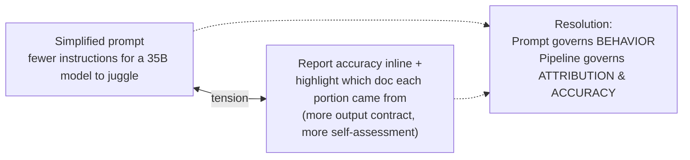
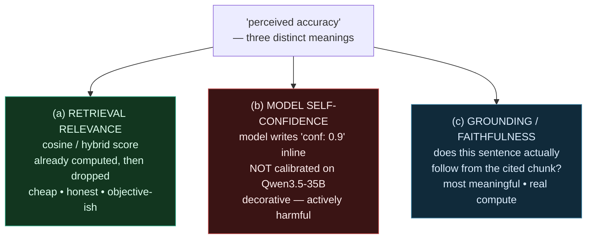
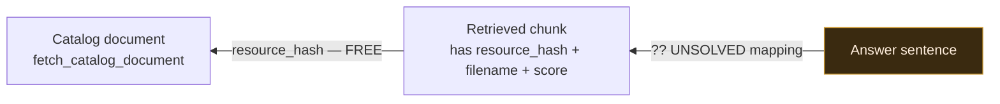
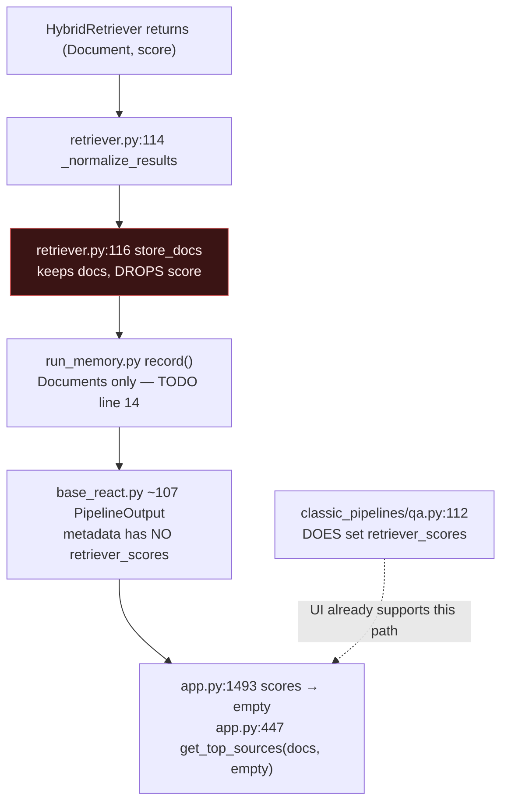
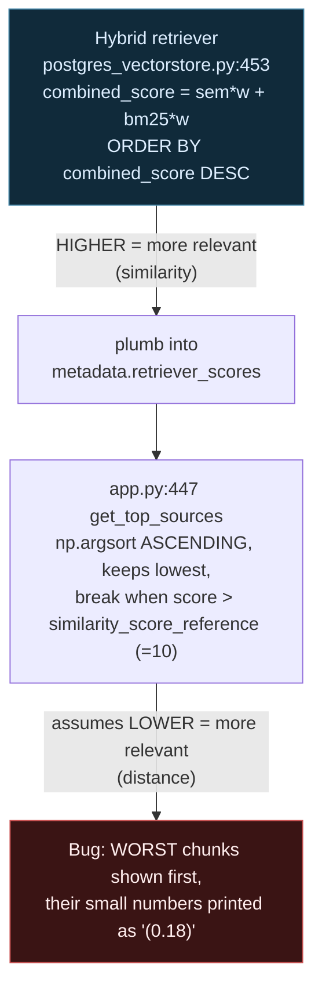
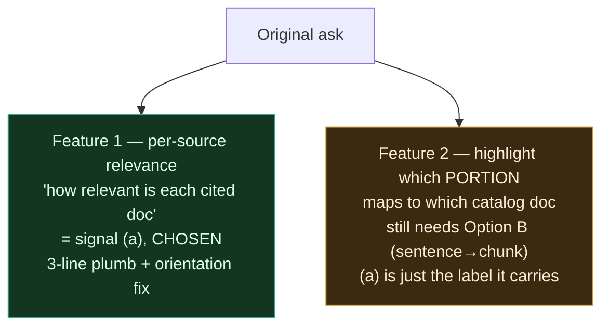
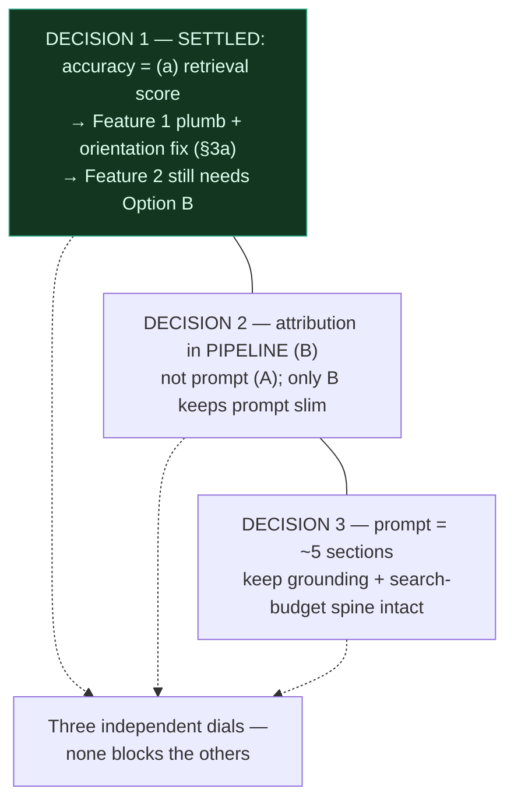

# Notes: Tuning the FASRC Cannon Prompt + Inline Accuracy & Attribution

> Exploration notes (thinking, not a spec). Goal: a *simplified* support prompt
> that reacts to questions, seeks clarification, and — if possible — reports
> perceived accuracy inline and highlights which catalog document each portion
> of the answer came from.

---

## 0. The hidden tension

The request contains two pulls that fight each other:

You can't make the *prompt* simpler by asking the *model* to do more
bookkeeping. You **can** have both by splitting the concern:

- The **prompt** stays short and only governs behavior (ground, clarify, answer).
- A **deterministic pipeline step** — which already holds the retrieved chunks
  and their scores — decorates the answer afterward.

This keeps the prompt slim *and* makes the accuracy signal trustworthy instead
of theater. This reframe drives everything below.

---

## 1. "Perceived accuracy" means three different things

This is the crux. The three readings differ wildly in trust and cost:

The phrasing *"reports perceived accuracy inline"* sounds like **(b)** — the
**worst** of the three. A self-reported confidence number from a 35B model is
noise dressed as precision; users trust it *more* because it's numeric, which
makes it dangerous for a "never guess" support bot.

What is almost certainly wanted:

- **(a)** as the cheap default — the retriever already knows how well each chunk
  matched. That signal is computed at `retriever.py:56` and **thrown away** at
  `retriever.py:116`.
- Optionally upgraded to **(c)** for real "is this sentence supported"
  verification.

> **DECISION 1 — SETTLED: (a) retrieval relevance.** "Perceived accuracy" =
> the retriever's own score for each chunk. Cheap, honest, already computed.
> Signals (b) and (c) are out of scope. See §3a — this is *not* a pure
> plumbing job; there is a score-orientation gotcha.

---

## 2. The attribution anchor already exists — the mapping is the hard part

Every retrieved chunk already carries a stable handle back to its catalog
document:

| Field | Where | Role |
|---|---|---|
| `resource_hash` | `retriever.py:48-49` | stable document id |
| `filename` | `retriever.py:45-46` | human-readable label |

So the chunk → document link is **free**. The unsolved arrow is sentence → chunk:

Two ways to draw the unsolved arrow:

```mermaid
flowchart TD
    subgraph OptA["Option A — MODEL-DRIVEN (prompt does it)"]
        A1["Prompt instructs model to tag claims<br/>'...max 4 GPUs per node [doc:3]'"]
        A1 --> A2["+ cheap, no extra compute"]
        A1 --> A3["- Qwen3.5-35B fabricates [doc:5]<br/>when only 3 returned; mis-attributes"]
        A1 --> A4["- bloats the prompt<br/>(against the simplification goal)"]
    end
    subgraph OptB["Option B — PIPELINE-DRIVEN (post-step)"]
        B1["Model writes a clean answer"]
        B1 --> B2["Embed each sentence, cosine-match<br/>to retrieved chunks, attach best + score"]
        B2 --> B3["+ deterministic, model can't lie"]
        B2 --> B4["+ prompt stays simple"]
        B2 --> B5["- ambiguous when 2 chunks say<br/>similar things"]
    end
    style OptB fill:#102a1c,stroke:#3a8
    style OptA fill:#2a1414,stroke:#a55
```

**Only Option B is consistent with "simplify the prompt."** Option A makes the
prompt longer and more fragile. B also yields signal (a) for free and is the
natural home for signal (c) later.

---

## 3. Where the data flow has to be cut

The live agent path loses the score at a single, well-defined point:

Key point: the **classic QA pipeline** already sets `retriever_scores`, and the
UI (`get_top_sources` → `format_links`, the "Show all sources (N) ▼" block)
already renders `(0.78)`-style numbers. The signal-(a) UI **exists** — it is
just starved on the agent path.

So the minimum cut-point for *any* of this is three lines:
`retriever.py:116`, `run_memory.py`, `base_react.py:107`. Everything else
(buckets vs raw score, inline markers, faithfulness) is a layer on top of that
one plumbing fix.

---

## 3a. Gotcha: the renderer expects the OPPOSITE score orientation

> **Superseded — this section describes behaviour that no longer exists.** Issue
> #208 corrected the shared renderer: `get_top_sources` now sorts **descending**
> (best first) and treats `similarity_score_reference` as a *lower* bound that
> ships disabled, and every `PostgresVectorStore` producer now returns
> `1.0 - distance` (higher = better) for all three distance metrics. Option 2's
> "invert to the distance convention" and "add a similarity-mode branch" are both
> obsolete — the orientation was reconciled at the producers and in the shared
> consumer instead, so there is no second code path to add. The diagnosis below
> is kept as the record of how the bug was found; read it as history, not as a
> description of the current code.

Now that (a) is chosen, this is the load-bearing detail. The hybrid retriever
emits a **similarity** (higher = better); the existing UI renderer was built
for a **distance** (lower = better):

Why the classic-QA path "works" today: it feeds a distance-like metric, so
ascending sort = best-first and the `> 10` threshold rarely trips. The agent's
hybrid score breaks both assumptions.

So **Decision 1 = (a)** decomposes into work, not a one-liner:

1. **Plumb** `(doc, score)` through the 3-line cut (`retriever.py:116` →
   `run_memory.py` → `base_react.py:107` `metadata["retriever_scores"]`).
2. **Reconcile orientation** — pick one:
   - invert/normalize hybrid `combined_score` to the distance convention the
     renderer expects, **or**
   - add a similarity-mode branch to `get_top_sources` (sort DESC, threshold
     as a *lower* bound), **or**
   - normalize to a 0–1 relevance and bypass the legacy `similarity_score_reference`
     semantics entirely.
3. **Choose presentation** — a raw `combined_score` is opaque *and* now
   scale-ambiguous. A bucket label (Strong / Partial / Weak) is more honest
   than `(0.18)` and sidesteps "what does 0.34 mean".

### The original ask splits into two features

Choosing (a) fully unblocks **Feature 1**. It does **not** by itself deliver
**Feature 2** ("highlight what portion relates to what document") — that still
requires the Option B sentence→chunk mapping from §2. Once Option B exists, the
(a) score simply rides along as each span's relevance label.

---

## 4. What is load-bearing in the current prompt

Simplification audit — behavioral yield vs. decoration for a capable
instruction-follower:

| Section | Verdict | Why |
|---|---|---|
| Role line | **keep** | cheap, sets domain |
| Grounding Rule | **KEEP** | load-bearing — the "never guess" spine |
| Search Budget — Hard Limit | **KEEP** | this *is* the loop fix; removing it regresses the bug just fixed |
| Core Behavior: Clarify | **keep** | this is the "seeks clarification" requirement |
| Response Guidelines | **trim** | half is generic ("be direct", "use code blocks") — a 35B model does this anyway |
| Search Topics | **CUT** | pure decoration; dilutes attention, no behavioral yield |
| Interaction Patterns (3 scripts) | **mostly CUT** | three near-identical 4-step scripts; high token cost. Maybe keep ONE generic "clarify → search → answer/defer" |
| Tone | **trim** | one line, not a section |

Simplified skeleton: **Role → Grounding Rule → Search Budget → Clarify-first →
one short answer-format line.** ~5 short sections instead of 8, keeping every
behaviorally critical piece. Accuracy/attribution does **not** go here — per §0
it lives in the pipeline.

> **Risk to name:** the Interaction Patterns scripts were probably added
> *because* the model under-clarified. Cutting them is safe **only if** the
> "Clarify Before You Solve" section holds on its own. Testable, not guessable.

---

## 5. Where this leaves us — three independent dials

### Open questions to steer next

1. ~~Which meaning of "accuracy"?~~ **Settled: (a) retrieval score.**
2. **Orientation fix approach** (§3a step 2) — invert hybrid score to the
   distance convention, add a similarity-mode branch to `get_top_sources`, or
   normalize to 0–1 and drop the legacy `similarity_score_reference` semantics?
3. **Presentation form** — raw number `(0.34)` (opaque, scale-ambiguous) vs a
   bucket label (Strong / Partial / Weak)? Recommendation: bucket.
4. **"Inline" = mid-sentence** (`...4 GPUs [GPU Partitions, strong]`) **or** is
   the existing post-answer "Show all sources" block with relevance labels
   enough? (Mid-sentence requires Feature 2 / Option B.)
5. **Replacement or A/B?** Is the simplified prompt a *replacement* for
   `fasrc-cannon.md`, or a *second agent* you A/B against the current one
   (safer, given the loop was just stabilized)?

---

*Next step options: keep pulling any thread above, or capture this as an
OpenSpec proposal once the three dials are set. No rush to formalize.*
