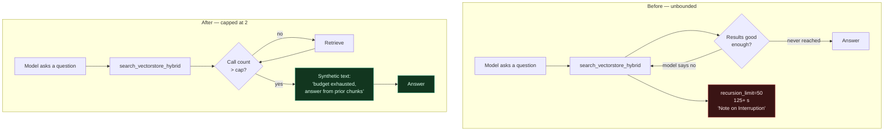

# Agent Search-Call Cap and the Relevance Floor

**Author:** Austin Swinney, FASRC — Harvard University
**Date:** August 2026
**Status:** Shipped — reference write-up, not a proposal
**Code anchors:** verified against `dev` at `5a26b5a3`

---

## TL;DR

- The FASRC agent looped on its search tool. It called
  `search_vectorstore_hybrid` 8 to 50 times for one question, hit the framework
  limit `recursion_limit=50`, and returned an error wrapper instead of an answer.
- A prompt rule did not stop the loop. Three prompt versions failed. The rule
  had to live in the tool layer.
- The fix is a **per-turn call cap**, enforced inside the tool. The default is
  **2 calls of `search_vectorstore_hybrid` per user turn**.
- Past the cap the tool skips the retriever and returns a short synthetic text.
  The model reads that text as a normal tool result and finishes the turn.
- The **"minimum accuracy" setting is a different control**. It is
  `similarity_score_reference`, a floor on the **source list under the answer**.
  It ships **disabled**, and it never gates a tool call.
- No code in archi stops an agent call because a relevance score is low. The cap
  counts calls. It does not read scores.

---

## 1. Why the cap exists

We tested three versions of the FASRC agent prompt against
`Qwen3.5-35B-A3B-GPTQ-Int4`. All three failed, in two opposite ways.

| Prompt version | Behavior | Result |
|---|---|---|
| v10 | Did not search at all | Invented AWS CLI flags from training data |
| v11 | Looped the search tool 8 to 50 times | Hit `recursion_limit=50`, 125+ seconds |
| v12 | Looped the search tool 8 to 50 times | Same failure as v11 |

The v11 and v12 turns ended in `_handle_recursion_limit_error`, which wraps the
partial output in "Best Possible Answer / Note on Interruption" text. That text
is an error report, not an answer.

**The mechanism.** The model judged each result set too weak to answer from, so
it searched again with a new phrase. Nothing bounded that judgment. The model
does not obey a prompt instruction that says "stop after N searches". Prompt
discipline of that kind is not reliable on this model, so the stop rule moved
into the tool itself.

---

## 2. How the cap works

1. A user turn starts. `BaseReActAgent.start_run_memory()` builds a fresh
   `RunMemory`. The per-tool counter resets with it. No separate turn hook is
   necessary.
2. The model calls the retriever tool. The tool closure calls the
   `enforce_budget` callback **first**, before any retrieval work.
3. `_consume_tool_budget` bumps the counter for that tool name. Under the cap it
   returns `None`, and retrieval runs as normal.
4. Past the cap it returns a text string. The tool returns that string and skips
   the retriever completely.
5. The model treats the string as a normal tool result and writes its answer.
   There is no exception, no `GraphRecursionError`, and no interruption wrapper.

The over-budget text is deliberate. A bare marker invites a retry. This text
names the limit, points the model at the evidence it already holds, and gives it
a permitted exit:

> Search budget exhausted: you have already called `search_vectorstore_hybrid`
> the maximum number of times for this turn (limit=2). The chunks retrieved by
> your earlier calls remain available in the conversation above — answer the
> user's question from those chunks, or state that the indexed documentation
> does not appear to cover this case. Do not call
> `search_vectorstore_hybrid` again on this turn.

### Configuration

The lookup has three layers. It mirrors the existing `_recursion_limit()`
pattern.

| Layer | Key | Precedence |
|---|---|---|
| Class default | `BaseReActAgent.DEFAULT_TOOL_BUDGETS` | lowest |
| Deployment | `services.chat_app.tool_budgets` | middle |
| Pipeline | `pipeline_config.tool_budgets` | highest |

The value is a `Dict[str, int]` keyed by tool name, so the structure extends to
any other expensive tool. Only `search_vectorstore_hybrid` carries a cap today.

### Guards

- **A non-positive cap is rejected.** A value of `0` or below was read as "no
  budget", which silently switched the cap off. Such a value now produces a
  warning and the default stands.
- **A non-integer cap is ignored**, with a warning that names the key and value.
- **The check fails open.** With no active `RunMemory` — between turns, or in a
  non-agent context — the call proceeds. A guard against a failed turn must not
  cause one.
- **Callers that omit `enforce_budget` are unaffected.** The smoke-test tool
  factory behaves exactly as before.

---

## 3. The relevance floor is a separate control

The phrase "minimum accuracy" points to a different setting. The two are easy to
confuse, so this table separates them.

| | Search-call cap | Relevance floor |
|---|---|---|
| Setting | `tool_budgets.search_vectorstore_hybrid` | `similarity_score_reference` |
| Unit | call count, per user turn | a similarity score |
| Acts on | tool calls inside the agent loop | the source list under the answer |
| Default | 2 | **disabled** |
| Effect past the limit | tool returns synthetic text | source is dropped from the list |
| Code | `base_react.py:2093` | `similarity_threshold.py:37` |

**What "accuracy" means here.** `docs/docs/notes_response_tuning.md` settled this
as Decision 1. Accuracy is **(a) the retriever's own relevance score** for each
chunk — a number the retriever already computes. It is not (b) the model's
self-reported confidence, which is not calibrated on a 35B model and reads as
precision it does not have. It is not (c) faithfulness of a sentence to its
cited chunk, which costs real compute and stays out of scope.

**Why the floor ships disabled.** The score scale is not comparable across
retrieval modes, so no single number means the same thing everywhere:

- Under `cosine`, `1.0 - distance` gives a similarity in `-1..1`. An operator's
  `0.3` means about what they expect.
- Under `l2` and `inner_product` the same expression is unbounded. A fixed
  number has no shared meaning.
- On the classic QA path the score is the hybrid `combined_score`, a weighted
  blend of a semantic score and an unbounded BM25 score. The number is
  query-dependent, not an absolute relevance.

**How a configured value is read.**

| Configured value | Result |
|---|---|
| Above `1.0` | Warning, and **no floor**. Such a value is a leftover distance ceiling. Obeyed literally it drops every source and the answer cites nothing. |
| At or below `0.0` | **No floor.** This is the shipped default. A literal `0.0` would be a real floor, and a cosine score runs to `-1.0`. |
| Above `0.0` and at or below `1.0` | Honoured as a floor. |

**One ordering subtlety.** Sources sort best-first, so the first source under the
floor stops the scored run. A score of `-1.0` is a sentinel that means "no score
available", not a poor match. The code partitions the sentinels out before it
applies the floor, and appends them after the survivors. A plain `break` would
never reach them and would drop a source that is documented to bypass the floor.

---

## 4. The third bound: the in-loop context budget

A third control fights the same loop from another side (issue #235). Tool
results accumulate in the prompt during the agent loop. Left unbounded they
exhaust the context window, and the turn ends in a canned apology.

The middleware clears the oldest tool results once the request crosses the
budget. It replaces each cleared result with this text:

> `[Tool result cleared to stay within the context window; do not re-request it.]`

The last clause is the point. A bare marker invites the exact retry loop that
the budget exists to prevent.

The three bounds also interact. Retrieval results are exempt from clearance
while the exemption stays cheap, and the exempt set is sized from the call
budget. With a cap of 2 and a `keep` of 3, an ordinary five-result turn makes the
exempt set the same as the clearable set. Exempt results are then given back one
at a time until the request fits. The newest exempt results go first, because
past the call cap the retrieval tool returns refusals under the same tool name —
the later results trend toward refusals, and a refusal is the cheapest thing to
give up.

---

## 5. Code map

| Piece | Location |
|---|---|
| Cap default (`{"search_vectorstore_hybrid": 2}`) | `src/archi/pipelines/agents/base_react.py:89` |
| Three-layer config lookup `_tool_budgets()` | `src/archi/pipelines/agents/base_react.py:2025` |
| Counter bump and over-budget text `_consume_tool_budget()` | `src/archi/pipelines/agents/base_react.py:2093` |
| Per-turn counter `bump_tool_call_count()` | `src/archi/pipelines/agents/utils/run_memory.py:219` |
| Tool short-circuit (`enforce_budget`) | `src/archi/pipelines/agents/tools/retriever.py:127` |
| Wiring, CMS agent | `src/archi/pipelines/agents/cms_comp_ops_agent.py:330` |
| Wiring, FASRC docs agent | `src/archi/pipelines/agents/fasrc_docs_agent.py:231` |
| Relevance floor | `src/interfaces/chat_app/similarity_threshold.py:37` |
| In-loop context bound | `src/archi/pipelines/agents/utils/context_middleware.py` |
| Operator documentation | `docs/docs/rag_architecture.md:68` |

### Tests

- `tests/unit/test_react_agent_tool_budget.py`
- `tests/unit/test_retriever_tool_budget.py`
- `tests/unit/test_similarity_threshold.py`

---

## 6. History

| Change | Reference |
|---|---|
| Cap the search tool at 2 calls per turn | commit `38a2c55b`, PR #21, 2026-06-04 |
| Validate budgets, neutral over-budget text, document kwargs | commit `60efc924`, PR #21, 2026-06-10 |
| Cite best sources first under a similarity convention | commit `80765cb4`, issue #240 |
| Bound in-loop tool-content accumulation | commit `ab5c20ee`, issue #235, PR #265 |
| Specification | `openspec/changes/agent-search-budget-cap/` |

---

## 7. Open items

- **The floor is not calibrated.** `similarity_score_reference` stays disabled
  until somebody picks a number per retrieval mode. That calibration is tracked
  apart from the citation code, and the module cannot decide it.
- **The prompt follow-on is unverified from this repository.** The original
  specification noted that the agent prompt can drop its "do not call this tool
  again" text once the cap is structural. The agent specs live in
  `config/agents/*.md`, which is bind-mounted at deploy and is not in this
  repository. Check the running deployment before you edit that text.
- **Only one tool carries a cap.** `search_local_files` and the MCP tools have
  no budget. The structure supports them; the entries do not exist yet.
