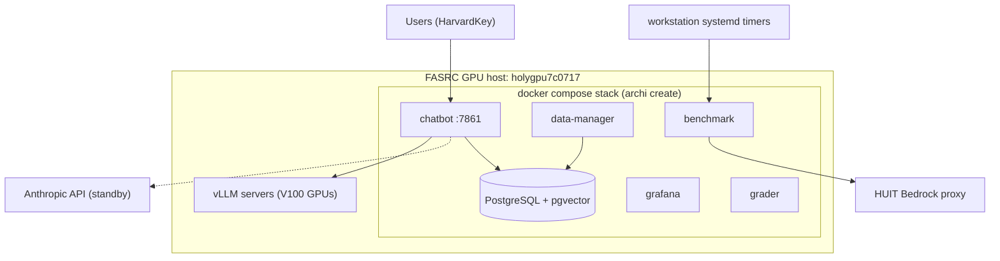
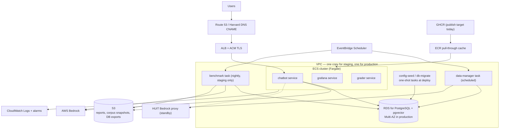
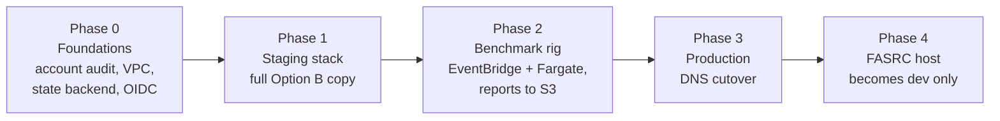

# AWS Migration Plan: Service Options and Call Notes

**Status:** draft for the call with the AWS solutions architects and management.
**Date:** 2026-09-01.
**Owner:** FASRC archi team.
**Method:** Terraform manages all AWS resources.

This document lists the AWS service options for the archi migration. The
comparison factors are monthly cost, service reliability, and system
performance. Section 9 holds the notes for the call.

> **NOTE:** All prices in this document are estimates for us-east-1,
> on-demand, from 2026-09-01. Confirm current prices with the AWS Pricing
> Calculator and the solutions architects before any commitment.

## 1. Decisions already made

- AWS will host the **staging stack**, the **production stack**, and the
  **nightly benchmark rig**.
- The **dev stack stays on the FASRC GPU host** (`holygpu7c0717`).
  *Assumption — confirm.*
- LLM inference will **not** run on self-hosted GPUs in AWS. The two candidate
  paths are **direct AWS Bedrock** and the **HUIT Bedrock proxy**. Section 3.3
  compares them.
- The deployment will use the **current FASRC AWS account**.
- Management has not set a cost target. Section 6 gives cost ranges per
  option, and the target is a decision for the call.

## 2. The system today

The stack is a docker compose deployment that `archi create` renders from
templates. It runs on one FASRC GPU host. Container images come from GHCR.
The running app config lives in Postgres, and a config-seed job writes it at
deploy time.

| Component | Function | Where it runs today |
| --- | --- | --- |
| chatbot | Web chat app, port 7861, RAG agents | compose, GPU host |
| data-manager | Scrape, chunk, and embed the corpus | compose, GPU host |
| postgres | PostgreSQL with pgvector: app config, documents, vectors | compose, GPU host |
| config-seed, db-migrate | One-shot deploy jobs | compose, GPU host |
| grafana | Dashboards | compose, GPU host |
| grader | Grading app, no GPU | compose, GPU host |
| benchmark | RAGAS goldenset runs | compose, GPU host |
| piazza, mattermost, redmine mailer | Optional integrations | compose, off by default |
| vLLM servers | Qwen models on 2 of 4 V100 GPUs | GPU host, outside compose |
| nightly timers | Benchmark report, team update | systemd on a workstation |

Facts that shape the options:

- **pgvector is the only supported vector backend.** The migration must keep
  PostgreSQL.
- **The corpus is small.** About 820 files and about 6,000 vector chunks. The
  database is tiny by AWS standards.
- **The embedding model is small.** all-MiniLM-L6-v2, about 80 MB. A full
  CPU embed run took 44 minutes on one core. More vCPUs cut this time.
- **The Bedrock API shape is already proven.** The HUIT Bedrock provider in
  `src/archi/providers/huit_bedrock_provider.py` speaks the Bedrock-native
  Anthropic API today.



## 3. Options by component

### 3.1 Container compute

The long-lived services are chatbot, grafana, and grader. The batch jobs are
data-manager, benchmark, config-seed, and db-migrate.

| Option | Monthly cost | Reliability | Performance | Notes |
| --- | --- | --- | --- | --- |
| **ECS on Fargate** (recommended) | About $36 per vCPU + 2 GB, per service | High: multi-AZ, auto restart, no hosts to patch | Good; per-service CPU and memory sizes | Serverless containers. Batch jobs run as one-shot tasks. |
| ECS on EC2 | Lower at steady load | High, but you patch the hosts | Same as EC2 | Worth it only above about 4 always-on vCPUs. |
| EKS | +$73 per cluster per month, plus nodes | High, but most operator work | Same as nodes | Kubernetes skills and upkeep are not justified at this scale. |
| EC2 + docker compose (lift and shift) | One t3.large is about $61 | Low: one instance, one AZ | Fine for this load | Reuses `archi create` unchanged. Fastest path, least AWS-native. |

**Recommendation:** ECS on Fargate. The stack is about 2 to 4 always-on vCPUs,
which is below the EC2 break-even point, and Fargate removes host patch work.

### 3.2 PostgreSQL and pgvector

| Option | Monthly cost | Reliability | Performance | Notes |
| --- | --- | --- | --- | --- |
| **RDS for PostgreSQL** (recommended) | db.t4g.medium: about $47 single-AZ, about $95 Multi-AZ, + storage | Multi-AZ failover, automated backups, PITR | More than enough for 6,000 vectors | pgvector is a supported extension on RDS. |
| Aurora PostgreSQL Serverless v2 | About $87+ at 1 ACU minimum, per instance | Highest | Overkill here | Pays off at much larger scale or spiky load. |
| Self-managed on EC2 | Instance + EBS only | You own backups, patches, failover | Same hardware | Saves little money and adds all the operator work. |

**Recommendation:** RDS for PostgreSQL. Multi-AZ in production, single-AZ in
staging. The dataset is small, so the smallest Graviton instance class is a
safe start.

### 3.3 LLM inference

Self-hosted GPU serving is out of scope by decision. The two paths:

| Option | Monthly cost | Reliability | Performance | Notes |
| --- | --- | --- | --- | --- |
| **AWS Bedrock, direct** | Per token; no idle cost. See section 6. | AWS-managed; quotas apply | Lowest latency from inside AWS | Traffic stays in the FASRC account. Data boundary review needed. |
| HUIT Bedrock proxy | Per token via HUIT | Adds one hop and one dependency | Extra egress hop from AWS to HUIT and back | Keeps the Harvard compliance boundary. Provider code exists today. |

**Recommendation:** decide on the call. The choice is a compliance question,
not a technical one. The archi provider layer supports both, so the config
can switch between them per environment. A sane setup: Bedrock direct as the
primary in production, the HUIT proxy as the configured standby.

Questions that gate this choice are in section 9.1, items 2 and 3.

### 3.4 Ingestion and embedding (data-manager)

| Option | Monthly cost | Reliability | Performance | Notes |
| --- | --- | --- | --- | --- |
| **Scheduled ECS Fargate task** (recommended) | About $0.20 per run at 4 vCPU for 1 hour | Retries via EventBridge | 4 vCPUs cut the 44-minute embed far down | Zero idle cost. |
| AWS Batch | Same compute prices | Adds queue semantics | Same | Extra moving parts with no gain at one job. |
| Bedrock managed embeddings (Titan, Cohere) | Per token | High | Good | **Changes the embedding model.** Forces a full re-benchmark. Not now. |

**Recommendation:** keep all-MiniLM-L6-v2 on CPU in a scheduled Fargate task.
The model is CPU-friendly and the benchmark baseline stays valid.

### 3.5 Nightly benchmark rig

| Option | Monthly cost | Reliability | Notes |
| --- | --- | --- | --- |
| **EventBridge Scheduler + Fargate task** (recommended) | Compute per run + judge tokens | Managed schedule, retries, CloudWatch alarms on failure | Report artifacts go to S3. |
| Small EC2 with systemd timers | About $8 (t4g.micro) | One instance; closest to today | Acceptable interim step. |

The benchmark must run against **staging**, never against production. The
RAGAS judge LLM calls Bedrock or the HUIT proxy, the same choice as 3.3.

### 3.6 Ingress, DNS, and TLS

- **Application Load Balancer** in front of the chatbot service. About $20 to
  $30 per month per environment. Health checks give clean deploys.
- **ACM** for free TLS certificates, with DNS validation.
- **Route 53** for zone or record management, or a CNAME from the current
  Harvard DNS (`archi.rc.fas.harvard.edu`) to the ALB. The hostname decision
  is a call item (section 9.1, item 5).
- **CAUTION:** A NAT gateway costs about $33 per month plus $0.045 per GB
  before any workload runs. Put the Fargate tasks in public subnets with
  public IPs, or use VPC endpoints, to avoid it in staging.

### 3.7 Observability

- **CloudWatch Logs** for all container logs. Set retention to 30 or 90 days;
  unlimited retention grows cost forever.
- **Grafana:** keep the current container on ECS (cost: one small task) rather
  than Amazon Managed Grafana ($9 per editor per month). Move later if SSO
  for dashboards becomes a requirement.

### 3.8 Secrets

| Option | Monthly cost | Notes |
| --- | --- | --- |
| **SSM Parameter Store, SecureString** (recommended) | Free at standard tier | Covers API keys, `GIT_TOKEN`, DB passwords. ECS injects them natively. |
| Secrets Manager | $0.40 per secret per month | Choose it only where automatic rotation is required (the RDS password is a fair case). |

### 3.9 Container images

Images ship from GHCR today. Two options:

1. Keep GHCR as the source and add an **ECR pull-through cache**. This keeps
   one publish path and removes a GHCR outage as a deploy blocker.
2. Publish to ECR in CI as a second target.

Option 1 is less CI change. Note: the current GHCR pulls need a classic PAT;
ECR pull-through moves that credential into AWS.

## 4. Three candidate architectures

| | A: Lift and shift | B: ECS Fargate + RDS | C: EKS |
| --- | --- | --- | --- |
| Shape | EC2 per environment, docker compose via `archi create` | Managed containers, managed Postgres | Kubernetes cluster per environment |
| Monthly cost (staging + production, before tokens) | About $150 to $350 | About $350 to $700 | About $650 to $1,100 |
| Reliability | Low: single instance per environment | High: multi-AZ services and database | High |
| Operator load | Highest: patch OS, docker, Postgres | Lowest | High: cluster upkeep |
| Change to archi tooling | None | Compose templates map to ECS task definitions; config-seed and db-migrate become one-shot ECS tasks | Same mapping plus manifests |
| Best when | Speed matters most and downtime is acceptable | Steady production service with small team | The org standardizes on Kubernetes |

**Recommendation: Option B.** Option A is a legitimate phase-1 stepping stone:
it can host staging in days and buys time to build Option B in Terraform for
production. Option C solves problems this stack does not have.

Target shape for Option B:



## 5. Terraform approach

- **State backend:** S3 bucket with state lock (native S3 lock on
  Terraform 1.10+, or a DynamoDB lock table). One state per environment.
- **Layout:** shared modules, thin environment roots.

```text
infra/
  modules/
    network/          # VPC, subnets, endpoints
    database/         # RDS + pgvector, backups
    ecs-service/      # one long-lived service (chatbot, grafana, grader)
    scheduled-task/   # data-manager, benchmark
    ingress/          # ALB, ACM, DNS
    secrets/          # SSM parameters
  envs/
    staging/
    prod/
```

- **CI auth:** a GitHub Actions OIDC role in the FASRC account. No long-lived
  AWS keys in GitHub secrets. Plan on pull request, apply on merge.
- **App config stays app config.** Terraform provisions infrastructure. The
  archi config still seeds Postgres through the config-seed job, so the
  "edit config.yaml, then redeploy" model survives the move.

## 6. Cost ranges

Line items for Option B (estimates; confirm on the call):

| Item | Staging | Production |
| --- | --- | --- |
| Fargate services (chatbot, grafana, grader) | About $40 (1 vCPU total) | About $110 to $150 (3 to 4 vCPU total) |
| RDS for PostgreSQL | About $47 (db.t4g.medium, single-AZ) | About $95 to $130 (Multi-AZ) + storage |
| ALB | About $20 | About $25 |
| Scheduled tasks (ingest, benchmark) | About $5 to $15 per month of run time | About $5 |
| S3, CloudWatch, EventBridge, SSM | About $10 | About $20 |
| NAT gateway (only if used) | $0 with public subnets | About $35 to $60 |
| **Subtotal** | **About $120 to $135** | **About $255 to $390** |

**Bedrock tokens are the variable line.** A worked example for a Claude
Sonnet-class model at $3 per million input tokens and $15 per million output
tokens: one RAG chat query with about 8,000 input tokens of retrieved context
and about 600 output tokens costs about $0.03. One thousand queries cost
about $33. The nightly benchmark adds judge-model tokens per run; current
goldenset runs are hundreds of queries, so tens of dollars per month at a
nightly cadence.

Cost levers to raise on the call:

- Graviton (ARM) for Fargate and RDS: about 20% less than x86.
- Compute Savings Plans after load is steady: about 20% to 30% less.
- Fargate Spot for the benchmark task: about 70% less for that line.
- Stop or shrink staging outside work hours.
- Education prices, credits, or an Internet2 agreement — ask the SAs.

## 7. Migration phases



1. **Phase 0 — foundations.** Audit the FASRC account (org membership,
   guardrails, quotas). Create the Terraform state backend, the OIDC role,
   and the network module. Request Bedrock model access.
2. **Phase 1 — staging.** Stand up the full Option B stack. Load the corpus
   with a fresh ingest run. Point the team at it for daily use.
3. **Phase 2 — benchmark rig.** Move the nightly goldenset run and reports
   off the workstation. Compare results against the FASRC baseline to prove
   the platform change did not move the numbers.
4. **Phase 3 — production.** Restore a Postgres dump into production RDS
   (the database is small, so dump-and-restore beats DMS). Cut DNS over in a
   planned window. Keep the FASRC deployment warm as rollback for two weeks.
5. **Phase 4 — settle.** The GPU host keeps dev and vLLM provider testing.
   Decommission nothing else until management signs off.

## 8. Risks and open questions

- **Data boundary.** The HUIT proxy exists so Harvard traffic stays inside
  the HUIT compliance boundary. Direct Bedrock in the FASRC account changes
  that boundary. This is the main compliance question for the call.
- **Bedrock quotas.** Default per-model token rates can be low in a fresh
  account. Request increases in Phase 0, not at cutover.
- **HarvardKey SAML.** The chat app's SAML integration needs the production
  hostname registered as a service provider. A hostname change means an IdP
  metadata update — coordinate with HUIT IAM.
- **Benchmark integrity.** Corpus fingerprints must match across
  environments before any cross-environment comparison of scores.
- **Optional integrations.** piazza, mattermost, and the redmine mailer are
  off by default today. Undecided whether they move at all.
- **Assumption to confirm:** dev stays on the FASRC GPU host; AWS region is
  us-east-1.

## 9. Notes for the call

### 9.1 Questions for the AWS solutions architects

1. Account posture: is the FASRC account inside an AWS Organization? Which
   guardrails, SCPs, or Control Tower constraints apply to it?
2. Bedrock: which Claude models are enabled in which regions for this
   account? What are the default quotas, and what is the path to raise them?
   Are cross-region inference profiles advisable here?
3. Data boundary: what do AWS and Harvard agreements say about Bedrock
   direct from the FASRC account versus the HUIT proxy, for our data
   classification (public docs corpus plus user chat logs)?
4. Network: does FASRC-to-AWS traffic ride Internet2 peering, Direct
   Connect, or the public internet? Any private connectivity requirement for
   HarvardKey SAML? (We believe browser redirects suffice — confirm.)
5. DNS and TLS: can `rc.fas.harvard.edu` names CNAME to an ALB, and does ACM
   DNS validation work with Harvard-managed DNS?
6. Cost: education prices, credits, an EDP, or an Internet2 Net+ agreement
   available to this account? What support plan does the account carry?
7. Scheduled containers at our scale: EventBridge Scheduler + ECS RunTask,
   or AWS Batch — which do they recommend and why?
8. pgvector on RDS: supported versions, HNSW index guidance, and the
   smallest sane instance class for about 10,000 vectors.
9. Review our Option B diagram (section 4) — what would they change?

### 9.2 Decisions for management

1. Monthly cost target. Section 6 gives the ranges; Option B lands near
   $400 to $500 per month plus tokens for both environments.
2. Order of environments. Recommendation: staging first, production after
   the benchmark rig proves parity.
3. LLM path: Bedrock direct or HUIT proxy as the production primary. Needs
   the compliance answer from question 9.1.3.
4. Data classification sign-off for the corpus and for user chat logs.
5. Ownership: who operates the AWS environment and holds the on-call duty.
   Managed services shrink this load; they do not remove it.
6. Cutover window for production DNS, and the two-week FASRC rollback hold.
7. Scope ruling on the optional integrations (piazza, mattermost, redmine).

### 9.3 Facts to have on hand

- Corpus: about 820 files, about 6,000 vector chunks. Database size is tiny.
- Embedding model: all-MiniLM-L6-v2, about 80 MB, CPU-friendly.
- Always-on compute today: roughly 2 to 4 vCPUs across chatbot, grafana, and
  grader.
- Images: GHCR, pulled with a classic PAT.
- The Bedrock Anthropic API shape is already in production use through the
  HUIT proxy provider.
- Deploy model: config lives in Postgres, seeded at deploy; a config edit
  without a reseed is a no-op. Any AWS design must keep the seed step.
