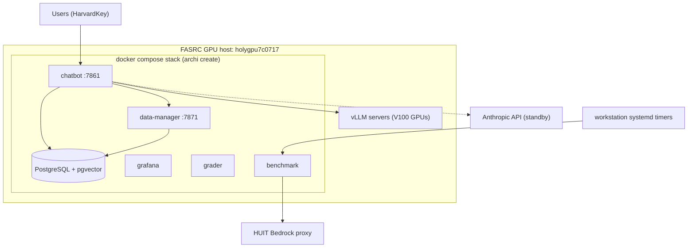
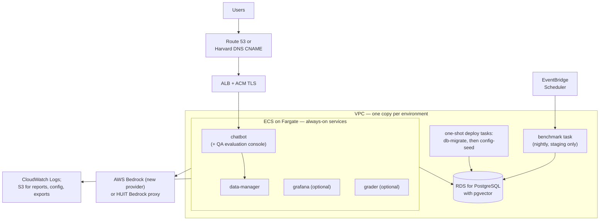
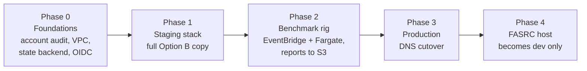

# AWS Migration Plan: Service Options and Call Notes

**Status:** draft for the call with the AWS solutions architects and management.
**Date:** 2026-09-01.
**Owner:** FASRC archi team.
**Method:** Terraform manages all AWS resources.

This document lists the AWS service options for the archi migration. The
comparison factors are monthly cost, service reliability, and system
performance. Section 9 holds the notes for the call.

> **NOTE:** All prices in this document are estimates for us-east-1,
> on-demand, from 2026-09-01. Confirm current prices with the AWS Pricing
> Calculator and the solutions architects before any commitment.

## The request

Original prompt (2026-09-01), verbatim:

> We are moving archi to AWS, via terraform, give me the options available
> for AWS services to utilize in that migration. factors to consider are
> ongoing cost, service reliability, system performance. ask questions for
> clarity on ambiguious items. Present this as a plan, with notes for an
> upcoming call with AWS solutions architects and management. Output is a
> markdown file in docs, use mermaid for visual aids.

Clarity answers received before this draft:

- Scope: the staging stack, the production stack, and the nightly benchmark rig.
- LLM inference: direct AWS Bedrock and the HUIT Bedrock proxy. No
  self-hosted GPUs in AWS.
- Account: the current FASRC AWS account.
- Cost target: none yet.

## 1. Assumptions

This plan builds on the assumptions below, drawn from the clarity answers in
the section above. Confirm or correct each one on the call.

- AWS will host the **staging stack**, the **production stack**, and the
  **nightly benchmark rig**.
- The **dev stack stays on the FASRC GPU host** (`holygpu7c0717`).
- LLM inference will **not** run on self-hosted GPUs in AWS. The two candidate
  paths are **direct AWS Bedrock** and the **HUIT Bedrock proxy**. Direct
  Bedrock needs a new provider module — see section 3.3.
- The deployment will use the **current FASRC AWS account**.
- The Terraform code will live in the **FASRC GitLab**, and AWS will pick it
  up from there through GitLab CI.
- Management has not set a cost target. Section 6 gives cost ranges per
  option, and the target is a decision for the call.

## 2. The system today

The stack is a docker compose deployment that `archi create` renders from
templates. It runs on one FASRC GPU host. Container images come from GHCR.
The running app config lives in Postgres, and a config-seed job writes it at
deploy time.

| Component | Function | Where it runs today | On dev today |
| --- | --- | --- | --- |
| chatbot | Web chat app, port 7861, RAG agents | compose, GPU host | **Yes** |
| data-manager | Always-on ingest service, port 7871: scrape, chunk, and embed; upload, schedule, and status APIs for the chatbot | compose, GPU host | **Yes** |
| postgres | PostgreSQL with pgvector: app config, documents, vectors | compose, GPU host | **Yes** |
| config-seed, db-migrate | One-shot deploy jobs | compose, GPU host | **Yes**, at each deploy |
| grafana | Dashboards | compose template, available | No |
| grader | Grading app, no GPU | compose template, available | No |
| benchmark | RAGAS goldenset runs | compose, GPU host | On demand, for goldenset campaigns |
| QA evaluation console | Atoms evaluation: judges answers against gold atoms (`atom_score`, `required_atom_recall`) with a judge-LLM oracle; reads the RAGAS golden set | routes inside the chatbot app, plus a CLI (`src/cli/qa_eval.py`) | **Yes**, inside chatbot |
| piazza, slack/mattermost, redmine mailer | Optional integrations | compose template, available | No |
| vLLM servers | Qwen models on 2 of 4 V100 GPUs | GPU host, outside compose | **Yes** |
| nightly timers | Benchmark report, team update | systemd on a workstation | **Yes** |

The dev deploy enables `--services chatbot`, which auto-pulls postgres and
data-manager (`deploy/scripts/lib.sh:112`). The other services exist as
templates and deploy only when named in `--services`.

Facts that constrain the options:

- **pgvector is the only supported vector backend.** The migration must keep
  PostgreSQL.
- **The corpus is small.** About 820 files and about 6,000 vector chunks. The
  database is tiny by AWS standards.
- **The embedding model is small.** all-MiniLM-L6-v2, about 80 MB. A full
  CPU embed run took 44 minutes on one core. More vCPUs cut this time.
- **The Bedrock request format is already in use.** The HUIT Bedrock provider
  (`src/archi/providers/huit_bedrock_provider.py`) sends the Bedrock-native
  Anthropic JSON request format today.
- **The chatbot depends on data-manager at runtime.** It calls the
  data-manager upload, schedule, and status APIs over HTTP.



## 3. Options by component

### 3.1 Container compute

The long-lived services in use today are chatbot and data-manager. grafana
and grader are available in the templates but off on dev; they enter the
cost model only if the team enables them in AWS. The batch jobs are
benchmark, config-seed, and db-migrate. The chatbot calls the data-manager
APIs at runtime, so data-manager must stay always-on.

| Option | Monthly cost | Reliability | Performance | Notes |
| --- | --- | --- | --- | --- |
| **ECS on Fargate** (recommended) | About $36 per vCPU + 2 GB, per service | High: multi-AZ, auto restart, no hosts to patch | Good; per-service CPU and memory sizes | Serverless containers. Batch jobs run as one-shot tasks. |
| ECS on EC2 | Lower at steady load | High, but you patch the hosts | Same as EC2 | Worth it only above about 4 always-on vCPUs. |
| EKS | +$73 per cluster per month, plus nodes | High, but most operator work | Same as nodes | Kubernetes skills and upkeep are not justified at this scale. |
| EC2 + docker compose (lift and shift) | One t3.large is about $61 | Low: one instance, one AZ | Fine for this load | Reuses `archi create` unchanged. Fastest path, least AWS-native. |

**Recommendation:** ECS on Fargate. The in-use stack is about 2 to 4
always-on vCPUs, below the EC2 break-even point, and Fargate removes host
patch work.

### 3.2 PostgreSQL and pgvector

| Option | Monthly cost | Reliability | Performance | Notes |
| --- | --- | --- | --- | --- |
| **RDS for PostgreSQL** (recommended) | db.t4g.medium: about $47 single-AZ, about $95 Multi-AZ, + storage | Multi-AZ failover, automated backups, PITR | More than enough for 6,000 vectors | pgvector is a supported extension on RDS. |
| Aurora PostgreSQL Serverless v2 | About $87+ at 1 ACU minimum, per instance | Highest | More than this load needs | Pays off at much larger scale or spiky load. |
| Self-managed on EC2 | Instance + EBS only | You own backups, patches, failover | Same hardware | Saves little money and adds all the operator work. |

**Recommendation:** RDS for PostgreSQL. Multi-AZ in production, single-AZ in
staging. The dataset is small, so the smallest Graviton instance class is a
safe start.

### 3.3 LLM inference

Self-hosted GPU serving is out of scope (section 1 assumptions). The two
paths:

| Option | Monthly cost | Reliability | Performance | Notes |
| --- | --- | --- | --- | --- |
| **AWS Bedrock, direct** | Per token; no idle cost. See section 6. | AWS-managed; quotas apply | Lowest latency from inside AWS | Traffic stays in the FASRC account. Data boundary review needed. **Needs a new provider module.** |
| HUIT Bedrock proxy | Per token via HUIT | Adds one network hop and one org dependency | Extra round trip from AWS to HUIT and back | Keeps the Harvard compliance boundary. Works today with no code change. |

Two facts from the code bound this choice:

- **The provider registry has no direct AWS Bedrock provider.**
  `src/archi/providers/__init__.py` registers `huit_bedrock`, `anthropic`,
  `openai`, and others; none signs AWS requests. A direct Bedrock provider is
  new, bounded work: the HUIT provider already sends the Bedrock-native
  Anthropic JSON request format, so the new module changes authentication and
  transport, not message handling.
- **A standby is a manual config switch, not automatic failover.** The chat
  app reads one `services.chat_app.default_provider` value. A fallback today
  means an operator edits the config and reseeds Postgres. Automatic failover
  is new code — do not promise it on the call.

**Recommendation:** decide the target on the call; it is a compliance
question. The HUIT proxy works with no code change. If the call picks direct
Bedrock, schedule the provider module in Phase 1 and budget that work.

Questions that gate this choice are in section 9.1, items 2 and 3.

### 3.4 Ingestion and embedding (data-manager)

data-manager is not a batch job. It is a long-lived Flask service on port
7871 (`src/bin/service_data_manager.py`). The chatbot calls its upload,
schedule, and status APIs at runtime. A cron-style replacement breaks
uploads and schedule reloads.

| Option | Monthly cost | Reliability | Notes |
| --- | --- | --- | --- |
| **Always-on Fargate service** (recommended) | About $45 (1 vCPU + 4 GB) | Same as the other services | Ingest runs on the service's internal schedule. No code change. |
| Split: small API service + batch ingest task | API task + about $0.20 per ingest run | Good | **Needs code changes** to split the service. Price both pieces if this path is chosen. |
| Bedrock managed embeddings (Titan, Cohere) | Per token | High | **Changes the embedding model** and forces a full re-benchmark. Not now. |

**Recommendation:** keep data-manager whole, as an always-on Fargate
service, with all-MiniLM-L6-v2 on CPU. The model is CPU-friendly and the
benchmark baseline stays valid. Fargate cannot resize a live task, so size
the task for the ingest peak — the embed took 44 minutes on one core, and
more vCPUs cut that time.

### 3.5 Nightly benchmark rig

| Option | Monthly cost | Reliability | Notes |
| --- | --- | --- | --- |
| **EventBridge Scheduler + Fargate task** (recommended) | Compute per run + judge tokens | Managed schedule, retries, CloudWatch alarms on failure | Report artifacts go to S3. |
| Small EC2 with systemd timers | About $8 (t4g.micro) | One instance; closest to today | Acceptable interim step. |

The benchmark must run against **staging**, never against production. The
RAGAS judge LLM calls Bedrock or the HUIT proxy, the same choice as 3.3.

### 3.6 Ingress, DNS, and TLS

- **Application Load Balancer** in front of the chatbot service. About $20 to
  $30 per month per environment. Health checks give clean deploys.
- **ACM** for free TLS certificates, with DNS validation.
- **Route 53** for zone or record management, or a CNAME from the current
  Harvard DNS (`archi.rc.fas.harvard.edu`) to the ALB. The hostname decision
  is a call item (section 9.1, item 5).
- **CAUTION:** A NAT gateway costs about $33 per month plus $0.045 per GB
  before any workload runs. Put the Fargate tasks in public subnets with
  public IPs, or use VPC endpoints, to avoid it in staging.

### 3.7 Observability

- **CloudWatch Logs** for all container logs. Set retention to 30 or 90 days;
  unlimited retention grows cost forever.
- **Grafana** (off on dev today): if it moves to AWS, keep the container on
  ECS (cost: one small task) rather than Amazon Managed Grafana ($9 per
  editor per month). Move later if SSO for dashboards becomes a requirement.

### 3.8 Secrets

| Option | Monthly cost | Notes |
| --- | --- | --- |
| **SSM Parameter Store, SecureString** (recommended) | Free at standard tier | Covers API keys, `GIT_TOKEN`, DB passwords. ECS injects them natively. |
| Secrets Manager | $0.40 per secret per month | Choose it only where automatic rotation is required (the RDS password is a fair case). |

### 3.9 Container images

Images ship from GHCR today. Two options:

1. Keep GHCR as the source and add an **ECR pull-through cache**. This keeps
   one publish path and removes a GHCR outage as a deploy blocker.
2. Publish to ECR in CI as a second target.

Option 1 is less CI change. Note: the current GHCR pulls need a classic PAT;
ECR pull-through moves that credential into AWS.

## 4. Three candidate architectures

| | A: Lift and shift | B: ECS Fargate + RDS | C: EKS |
| --- | --- | --- | --- |
| Architecture | EC2 per environment, docker compose via `archi create` | Managed containers, managed Postgres | Kubernetes cluster per environment |
| Monthly cost (staging + production, before tokens) | About $150 to $350 | About $400 to $650 | About $750 to $1,150 |
| Reliability | Low: single instance per environment | High: multi-AZ services and database | High |
| Operator load | Highest: patch OS, docker, Postgres | Lowest | High: cluster upkeep |
| Change to archi tooling | None | Compose templates map to ECS task definitions; a deploy pipeline must run db-migrate and config-seed before any service update (section 5) | Same mapping plus manifests |
| Best when | Speed matters most and downtime is acceptable | Steady production service with small team | The org standardizes on Kubernetes |

**Recommendation: Option B.** Option A is a legitimate phase-1 interim step:
it can host staging in days and gives time to build Option B in Terraform
for production. Option C solves problems this stack does not have.

The Option B architecture:



## 5. Terraform approach

- **State backend:** S3 bucket with state lock (native S3 lock on
  Terraform 1.10+, or a DynamoDB lock table). One state per environment.
- **Layout:** shared modules, thin environment roots.

```text
infra/
  modules/
    network/          # VPC, subnets, endpoints
    database/         # RDS + pgvector, backups
    ecs-service/      # one long-lived service (chatbot, data-manager, grafana, grader)
    scheduled-task/   # benchmark
    ingress/          # ALB, ACM, DNS
    secrets/          # SSM parameters
  envs/
    staging/
    prod/
```

- **Repo home and CI:** the Terraform lives in the FASRC GitLab, and GitLab
  CI applies it to AWS. Federate GitLab CI to an IAM role through an OIDC
  identity provider for the GitLab issuer — no long-lived AWS keys as CI
  variables. Plan on merge request, apply on merge.
- **Two repo homes stay in play:** the archi app code and images remain on
  GitHub and GHCR; only the infrastructure code lives in GitLab. A deploy
  connects the two only through image tags.
- **App config stays app config.** Terraform provisions infrastructure; the
  archi config still seeds Postgres through the config-seed job.
- **The compose start gate must be rebuilt in the deploy pipeline.** Today,
  compose mounts the rendered config into the containers and blocks service
  start until db-migrate and config-seed complete. ECS has no cross-service
  `depends_on`, so the pipeline owns the order:

1. Render the config and upload it to a versioned S3 object.
2. Run the db-migrate one-shot task. Wait for exit 0.
3. Run the config-seed one-shot task against that S3 config. Wait for exit 0.
4. Update the ECS services to the new task definition revision.

Services fetch the rendered config from S3 at container start (an entrypoint
step sets `CONFIG_PATH`). A failed step 2 or 3 stops the deploy before any
user-facing service restarts.

## 6. Cost ranges

Line items for Option B (estimates; confirm on the call):

| Item | Staging | Production |
| --- | --- | --- |
| Fargate services (chatbot, data-manager; grafana and grader if enabled) | About $60 to $75 | About $110 to $190 |
| RDS for PostgreSQL | About $47 (db.t4g.medium, single-AZ) | About $95 to $130 (Multi-AZ) + storage |
| ALB | About $20 | About $25 |
| Benchmark task (nightly) | About $5 to $15 | $0 — the benchmark runs in staging only |
| S3, EFS (evaluation artifacts), CloudWatch, EventBridge, SSM | About $15 | About $25 |
| NAT gateway (only if used) | $0 with public subnets | About $35 to $60 |
| **Subtotal** | **About $145 to $175** | **About $255 to $430** |

**Bedrock tokens are the variable line.** A worked example for a Claude
Sonnet-class model at $3 per million input tokens and $15 per million output
tokens: one RAG chat query with about 8,000 input tokens of retrieved context
and about 600 output tokens costs about $0.03. One thousand queries cost
about $33. The nightly benchmark adds judge-model tokens per run; current
goldenset runs are hundreds of queries, so tens of dollars per month at a
nightly cadence.

Cost levers to raise on the call:

- Graviton (ARM) for Fargate and RDS: about 20% less than x86.
- Compute Savings Plans after load is steady: about 20% to 30% less.
- Fargate Spot for the benchmark task: about 70% less for that line.
- Stop or shrink staging outside work hours.
- Education prices, credits, or an Internet2 agreement — ask the SAs.

## 7. Migration phases



1. **Phase 0 — foundations.** Audit the FASRC account (org membership,
   guardrails, quotas). Create the Terraform state backend, the OIDC role,
   and the network module. Request Bedrock model access.
2. **Phase 1 — staging.** Stand up the full Option B stack. Load the corpus
   with a fresh ingest run. Point the team at it for daily use. Build the
   direct Bedrock provider module here if the call picks that path.
3. **Phase 2 — benchmark rig.** Move the nightly goldenset run and reports
   off the workstation. Compare results against the FASRC baseline to prove
   the platform change did not move the numbers.
4. **Phase 3 — production.** Restore a Postgres dump into production RDS
   (the database is small, so dump-and-restore beats DMS). Cut DNS over in a
   planned window. Keep the FASRC deployment in place as rollback for two
   weeks.
5. **Phase 4 — settle.** The GPU host keeps dev and vLLM provider testing.
   Decommission nothing else until management signs off.

## 8. Risks and open questions

- **Data boundary.** The HUIT proxy exists so Harvard traffic stays inside
  the HUIT compliance boundary. Direct Bedrock in the FASRC account changes
  that boundary. This is the main compliance question for the call.
- **Bedrock quotas.** Default per-model token rates can be low in a fresh
  account. Request increases in Phase 0, not at cutover.
- **HarvardKey SSO is OIDC, not SAML.** The chat app uses Authlib OAuth with
  OpenID Connect (`src/interfaces/chat_app/app.py`): issuer metadata, a
  registered redirect URI, and client credentials. A production hostname
  change means a new redirect URI registration with HUIT IAM, and the client
  secret moves to SSM.
- **Benchmark integrity.** Corpus fingerprints must match across
  environments before any cross-environment comparison of scores.
- **Evaluation artifacts are file-backed.** The QA evaluation console
  (`src/evaluation/qa/`) keeps atoms, judgments, and run history in files
  and SQLite on the container filesystem. Fargate task storage is ephemeral:
  without a persistent volume (EFS) or an S3 sync, a task restart erases
  the evaluation history.
- **Optional integrations.** piazza, slack/mattermost, and the redmine
  mailer are off by default today. Undecided whether they move at all.
- **Region assumption.** All prices in this plan assume us-east-1. Confirm
  the region on the call, with the section 1 assumptions.

## 9. Notes for the call

### 9.1 Questions for the AWS solutions architects

1. Account posture: is the FASRC account inside an AWS Organization? Which
   guardrails, SCPs, or Control Tower constraints apply to it?
2. Bedrock: which Claude models are enabled in which regions for this
   account? What are the default quotas, and what is the path to raise them?
   Are cross-region inference profiles advisable here?
3. Data boundary: what do AWS and Harvard agreements say about Bedrock
   direct from the FASRC account versus the HUIT proxy, for our data
   classification (public docs corpus plus user chat logs)?
4. Network: does FASRC-to-AWS traffic ride Internet2 peering, Direct
   Connect, or the public internet? Any private connectivity requirement for
   the HarvardKey OIDC flow? (We believe browser redirects and public issuer
   metadata suffice — confirm.)
5. DNS and TLS: can `rc.fas.harvard.edu` names CNAME to an ALB, and does ACM
   DNS validation work with Harvard-managed DNS?
6. Cost: education prices, credits, an EDP, or an Internet2 Net+ agreement
   available to this account? What support plan does the account carry?
7. Scheduled containers at our scale: EventBridge Scheduler + ECS RunTask,
   or AWS Batch — which do they recommend and why?
8. pgvector on RDS: supported versions, HNSW index guidance, and the
   smallest reasonable instance class for about 10,000 vectors.
9. Review our Option B diagram (section 4): what changes do they recommend?
10. CI federation: the Terraform repo lives in the FASRC GitLab. What is the
    recommended IAM OIDC identity-provider setup for a self-hosted GitLab
    issuer, and which claim conditions (audience, project path, branch) do
    they advise on the role trust policy?

### 9.2 Decisions for management

1. Monthly cost target. Section 6 gives the ranges; Option B lands near
   $400 to $600 per month plus tokens for both environments.
2. Order of environments. Recommendation: staging first, production after
   the benchmark rig proves parity.
3. LLM path: Bedrock direct or HUIT proxy as the production primary. Needs
   the compliance answer from question 9.1.3, and Bedrock direct also needs
   the new provider module (section 3.3).
4. Data classification sign-off for the corpus and for user chat logs.
5. Ownership: who operates the AWS environment and holds the on-call duty.
   Managed services shrink this load; they do not remove it.
6. Cutover window for production DNS, and the two-week FASRC rollback hold.
7. Scope ruling on the optional services: grafana, grader, piazza,
   slack/mattermost, redmine mailer.

### 9.3 Facts to have on hand

- Corpus: about 820 files, about 6,000 vector chunks. Database size is tiny.
- Embedding model: all-MiniLM-L6-v2, about 80 MB, CPU-friendly.
- Always-on compute on dev today: about 2 to 3 vCPUs (chatbot and
  data-manager). grafana and grader add about 1 vCPU if enabled.
- Images: GHCR, pulled with a classic PAT.
- Terraform home: the FASRC GitLab; GitLab CI applies it to AWS. The app
  code and images stay on GitHub and GHCR.
- The Bedrock-native Anthropic JSON request format is already in production
  use through the HUIT proxy provider. A direct AWS Bedrock provider does
  not exist in the code yet; it is new, bounded work.
- Deploy model: config lives in Postgres, seeded at deploy; a config edit
  without a reseed is a no-op. Any AWS design must keep the seed step and
  its start-order gate (section 5).
