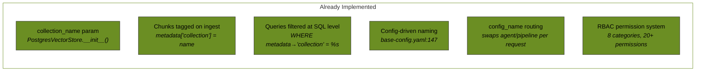
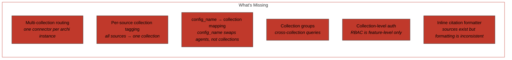
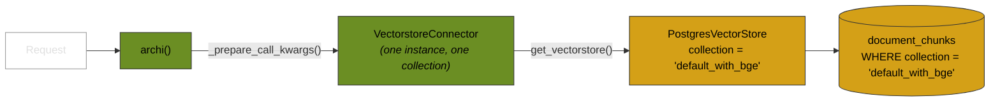
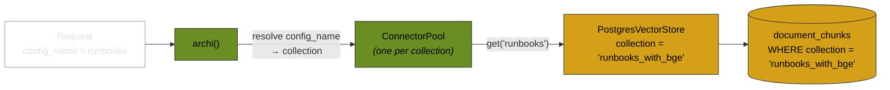
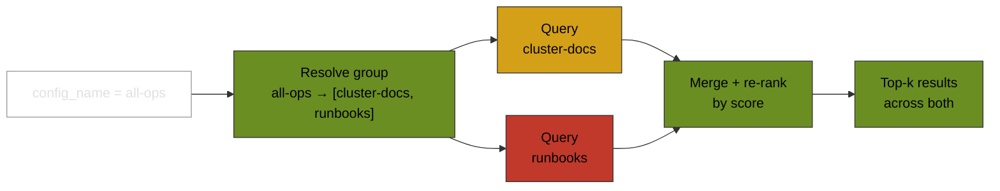

# Multi-Collection Routing

**Author:** Austin Swinney, FASRC — Harvard University
**Date:** March 2026
**Status:** Proposal
**Companion:** [OpenWebUI Compatibility Mode](openwebui-compat.md) (independent, works well together)

---

## TL;DR

Enable a single archi deployment to serve **multiple isolated document collections** — e.g., public cluster docs for everyone and privileged runbooks for superusers. archi's pgvector vectorstore already supports per-collection filtering; the gap is routing requests to the right collection, ingesting sources into named collections, and enforcing access. This proposal adds collection config, a connector pool, collection groups for cross-collection queries, collection-level auth, and standardized inline source citations.

**Scope:** 13 tasks. The vectorstore collection filtering infrastructure already exists — the work is routing, ingestion tagging, auth, and citations.

---

## Motivation

A cluster operator needs to serve different document sets to different audiences from the same archi deployment:

- **Public users** query cluster documentation (job submission, software modules, storage)
- **Superusers** query internal runbooks (failover procedures, incident response, capacity planning)

Today, archi boots with one vectorstore collection. All users search all documents. There's no way to isolate document sets or restrict access by role.

---

## What Already Exists

archi's pgvector vectorstore already supports per-collection filtering. This is not new work.



| Component | File | What it does |
|---|---|---|
| `PostgresVectorStore(collection_name=...)` | `postgres_vectorstore.py:51` | Accepts collection name at init |
| `metadata["collection"] = self._collection_name` | `postgres_vectorstore.py:139` | Tags every chunk with its collection |
| `WHERE metadata->>'collection' = %s` | `postgres_vectorstore.py:296` | Filters all queries by collection |
| `collection_name` in config YAML | `base-config.yaml:147` | Deployment config sets the collection name |
| `VectorstoreConnector` | `vectorstore_connector.py:36` | Builds `{collection_name}_with_{embedding_name}` |
| `config_name` request routing | `app.py:1300` | Swaps agent/pipeline per request |
| RBAC permissions | `rbac/permission_enum.py` | Feature-level gating (`chat:query`, etc.) |

Multiple collections can coexist in the same `document_chunks` table today. Each query is already scoped to its collection.

---

## The Gap



**The core limitation:** archi boots with one `VectorstoreConnector` bound to one `collection_name` for the lifetime of the process. To serve multiple collections, each request needs to resolve to the correct collection — but `VectorstoreConnector` is initialized once in `archi.__init__()` and reused for every call.

---

## Design

### How It Works Today (Single Collection)



### How It Would Work (Multi-Collection)



The change is in `archi._prepare_call_kwargs()`: instead of always using `self.vs_connector`, it resolves the collection from the request's `config_name` and picks (or creates) the right `VectorstoreConnector` from a pool.

### Configuration

```yaml
# archi deployment config
collections:
  cluster-docs:
    description: "Public cluster documentation"
    sources:
      - type: web
        url: https://docs.rc.fas.harvard.edu
      - type: git
        repo: https://github.com/fasrc/docs
    pipeline: QAPipeline
    model: vllm/meta-llama/Llama-3.1-70B

  runbooks:
    description: "Internal operations runbooks"
    sources:
      - type: local_files
        path: /data/runbooks
      - type: git
        repo: https://github.com/fasrc/runbooks
        branch: main
    pipeline: QAPipeline
    model: vllm/meta-llama/Llama-3.1-70B

# Named groups that span multiple collections.
collection_groups:
  all-ops:
    description: "All operations documentation"
    collections: [cluster-docs, runbooks]
```

### Collection Groups

A single query can search across multiple collections using named **collection groups**. Each group resolves to a set of collections at query time.



At the SQL level, this is a single query with an `ANY` filter — not two separate queries:

```sql
-- Single collection:
WHERE metadata->>'collection' = 'runbooks_with_bge'

-- Collection group (all-ops):
WHERE metadata->>'collection' = ANY(ARRAY['cluster-docs_with_bge', 'runbooks_with_bge'])
```

Collection groups inherit the pipeline and model config from their first collection, or can override:

```yaml
collection_groups:
  all-ops:
    collections: [cluster-docs, runbooks]
    pipeline: QAPipeline              # optional override
    model: vllm/meta-llama/Llama-3.1-70B  # optional override
```

Access control: a user must have access to **all** collections in a group to use it.

### Collection-Level Auth

archi already has session-based auth (anonymous, basic, SSO via OIDC) and an RBAC system that gates features via permissions like `chat:query`, `documents:view`, `config:modify`. The extension adds collection-level authorization:

| Component | Current | New |
|---|---|---|
| RBAC permissions | Feature-level (`chat:query`) | + Collection-level (`collections:runbooks:query`) |
| Access table | None for collections | `user_collection_access(user_id, collection_name)` |

This enforces access regardless of which frontend is in use — archi's native UI, Open WebUI, or direct API access.

### Inline Source Citations

Citations are critical. archi's `PipelineOutput.source_documents` carries retrieved sources, but formatting into the final answer is inconsistent. This proposal standardizes a shared inline citation formatter used by all response paths (native UI, `/v1` compat, any future interface).

```
The failover procedure involves three steps. First, verify the
standby node is healthy. Then initiate the switchover via the
management console. Finally, update DNS records.

---
**Sources:**
- `runbooks/failover-guide.md` (relevance: 0.92)
- `runbooks/disaster-recovery.md` (relevance: 0.87)
```

Edge cases:
- **No sources retrieved** — no citation block appended
- **Duplicate sources** (same document, different chunks) — deduplicated by filename
- **Collection groups** — sources labeled with their collection of origin:

```
---
**Sources:**
- `runbooks/failover-guide.md` [runbooks] (relevance: 0.92)
- `cluster-docs/ha-overview.md` [cluster-docs] (relevance: 0.85)
```

---

## Implementation Summary

### Multi-Collection Routing (7 tasks)

| # | Task | Touches |
|---|---|---|
| 1 | Add `collections` + `collection_groups` config sections | `base-config.yaml` |
| 2 | Map `config_name` → `collection_name` in request path | `archi.py` |
| 3 | Pool `VectorstoreConnector` instances by collection | `vectorstore_connector.py` |
| 4 | Per-source collection tagging in data-manager | `data_manager.py`, `manager.py` |
| 5 | Add `collection` column to `documents` table | `init.sql` |
| 6 | Support `ANY(ARRAY[...])` filter for collection groups | `postgres_vectorstore.py` |
| 7 | Merge + re-rank results from multi-collection queries | `semantic_retriever.py` |

### Collection-Level Auth (3 tasks)

| # | Task | Touches |
|---|---|---|
| 8 | Add `user_collection_access` table | `init.sql` |
| 9 | Add `collections:<name>:query` to RBAC permission enum | `permission_enum.py`, `registry.py` |
| 10 | Enforce collection access check in request path | `archi.py` or middleware |

### Inline Citations (1 task)

| # | Task | Touches |
|---|---|---|
| 11 | Build inline citation formatter (shared utility) | New module in `src/archi/utils/` |

### Documentation (2 tasks)

| # | Task | Touches |
|---|---|---|
| 12 | Document collection + collection group configuration | `docs/` |
| 13 | Document collection-level access control setup | `docs/` |

---

## Design Decisions

| # | Question | Decision | Rationale |
|---|---|---|---|
| 1 | Should archi enforce collection-level auth? | **Yes — defense in depth.** archi checks `user_collection_access` on every request regardless of frontend. | archi may be exposed directly without a frontend ACL layer. Network topology should not be the only access control. |
| 2 | How should multi-collection queries work? | **Named collection groups** defined in config. Each group resolves to `WHERE collection = ANY(...)` at query time. | Cleaner than comma-separated names. Configurable by operators. Access requires permission on all member collections. |
| 3 | Citation format? | **Inline citations** appended to every response. Shared formatter used by all response paths. | Citations are critical and currently deficient. Inline is visible without client-side parsing. |

---

## References

- archi source: `src/data_manager/vectorstore/postgres_vectorstore.py` — existing collection filtering
- archi source: `src/archi/utils/vectorstore_connector.py` — single-collection connector
- archi source: `src/archi/archi.py` — orchestrator with `_prepare_call_kwargs()`
- archi source: `src/interfaces/chat_app/app.py` — config_name routing
- archi source: `src/utils/rbac/` — existing permission framework
