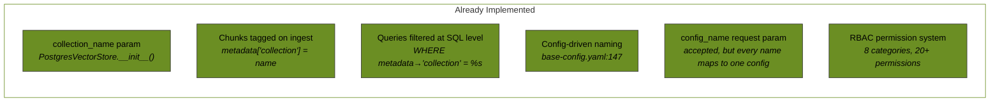
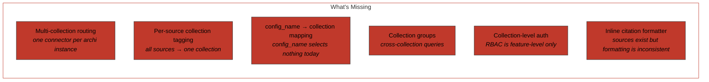
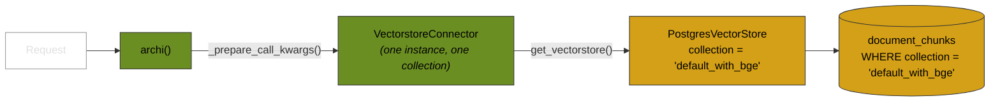
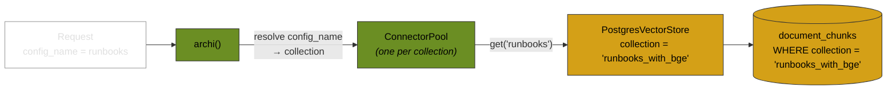
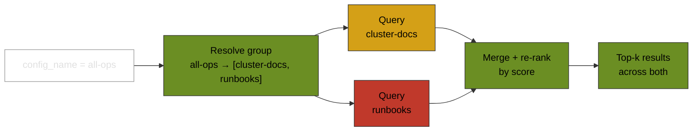

# Multi-Collection Routing

**Author:** Austin Swinney, FASRC — Harvard University
**Date:** March 2026
**Status:** Proposal
**Companion:** [OpenWebUI Compatibility Mode](openwebui-compat.md) (independent, works well together)

---

## TL;DR

Enable a single archi deployment to serve **multiple isolated document collections** — e.g., public cluster docs for everyone and privileged runbooks for superusers. archi's pgvector vectorstore already supports per-collection filtering; the gap is routing requests to the right collection, ingesting sources into named collections, and enforcing access. This proposal adds collection config, a connector pool, collection groups for cross-collection queries, collection-level auth, and standardized inline source citations.

**Scope:** 19 tasks. The vectorstore collection filtering infrastructure already exists — the work is routing, ingestion tagging, auth, and citations.

---

## Motivation

A cluster operator needs to serve different document sets to different audiences from the same archi deployment:

- **Public users** query cluster documentation (job submission, software modules, storage)
- **Superusers** query internal runbooks (failover procedures, incident response, capacity planning)

Today, archi boots with one vectorstore collection. All users search all documents. There's no way to isolate document sets or restrict access by role.

---

## What Already Exists

archi's pgvector vectorstore already supports per-collection filtering. This is not new work.


```mermaid
graph LR
    subgraph existing["Already Implemented"]
        direction TB
        E1["collection_name param<br/><i>PostgresVectorStore.__init__()</i>"]:::done
        E2["Chunks tagged on ingest<br/><i>metadata['collection'] = name</i>"]:::done
        E3["Queries filtered at SQL level<br/><i>WHERE metadata→'collection' = %s</i>"]:::done
        E4["Config-driven naming<br/><i>base-config.yaml:147</i>"]:::done
        E5["config_name request param<br/><i>accepted, but every name maps to one config</i>"]:::done
        E6["RBAC permission system<br/><i>8 categories, 20+ permissions</i>"]:::done
    end

    style existing fill:none,stroke:#6b8e23

    classDef done fill:#6b8e23,stroke:#333,color:#000
```

| Component | File | What it does |
|---|---|---|
| `PostgresVectorStore(collection_name=...)` | `postgres_vectorstore.py:51` | Accepts collection name at init |
| `metadata["collection"] = self._collection_name` | `postgres_vectorstore.py:139` | Tags every chunk with its collection |
| `WHERE metadata->>'collection' = %s` | `postgres_vectorstore.py:296` | Filters all queries by collection |
| `collection_name` in config YAML | `base-config.yaml:147` | Deployment config sets the collection name |
| `VectorstoreConnector` | `vectorstore_connector.py:36` | Builds `{collection_name}_with_{embedding_name}` |
| `config_name` request parameter | `app.py:1981-1982` | Accepted per request, but every name resolves to the same config (see [The Gap](#what-bound-to-one-collection-means)) |
| RBAC permissions | `rbac/permission_enum.py` | Feature-level gating (`chat:query`, etc.) |

Multiple collections can coexist in the same `document_chunks` table today. Each query is already scoped to its collection.

---

## The Gap


```mermaid
graph LR
    subgraph gap["What's Missing"]
        direction TB
        G1["Multi-collection routing<br/><i>one connector per archi instance</i>"]:::todo
        G2["Per-source collection tagging<br/><i>all sources → one collection</i>"]:::todo
        G3["config_name → collection mapping<br/><i>config_name selects nothing today</i>"]:::todo
        G4["Collection groups<br/><i>cross-collection queries</i>"]:::todo
        G5["Collection-level auth<br/><i>RBAC is feature-level only</i>"]:::todo
        G6["Inline citation formatter<br/><i>sources exist but formatting is inconsistent</i>"]:::todo
    end

    style gap fill:none,stroke:#c0392b

    classDef todo fill:#c0392b,stroke:#333,color:#000
```

**The core limitation:** archi boots with one `VectorstoreConnector` bound to one `collection_name` for the lifetime of the process. To serve multiple collections, each request needs to resolve to the correct collection — but `VectorstoreConnector` is initialized once in `archi.__init__()` and reused for every call.

### What "bound to one collection" means

Line anchors in this section are against `origin/dev` at the time of writing.

`VectorstoreConnector` holds three things: one embedding model instance, one collection name, and the Postgres connection settings. It computes the collection name one time, as `collection_name + "_with_" + embedding_name` (`vectorstore_connector.py:36`). `get_vectorstore()` makes a new `PostgresVectorStore` on each call, but each new store gets the same name (`vectorstore_connector.py:75`).

The binding is stronger than "one connector per process":

- **Only `archi.__init__()` makes the connector** (`archi.py:22`). `archi.update()` rebuilds the pipeline, but it does not rebuild the connector. The process searches the same collection until a restart.
- **`config_name` does not select a config.** The chat app calls `update_config(config_name=...)` on each request (`app.py:1981-1982`). But `_get_config_payload()` returns the same cached `get_full_config()` for every name (`app.py:618-621`), `_config_names()` lists only the one active name (`app.py:301-303`), and `archi.update()` ignores `config_name` (`archi.py:30-31`). At runtime, only the agent spec file can change. The "`config_name` routing" in the table above is therefore a parameter with no effect, and this proposal must add the name-to-config resolution itself, from the new `collections` section.
- **The embedding model is part of the collection name.** One connector means one embedding model, and a query embeds with that model only. A collection group can use one `ANY(ARRAY[...])` query only if all member collections use the same embedding model. Collections with different embedding models need one query each, and the scores from different models are not comparable for a merge.
- **The embedding model is the expensive part of a connector.** The benchmark code lists this embedding instance as one of three shared-state blockers to parallel `archi()` instances (`service_benchmark.py:1535-1542`). A pool with one connector per collection loads one model per collection. The pool must share one model instance per `embedding_name`, and keep only the collection name per entry.

### Isolation is weaker than "each query is scoped"

The "What Already Exists" table says that each query is scoped to its collection. That is true for rows with a tag. It is not true for rows without a tag, or for the write path.

- **Rows without a tag go to all collections.** Both search paths filter with `collection = %s OR collection IS NULL` (`postgres_vectorstore.py:345`, `postgres_vectorstore.py:477`). A chunk with no `collection` key is visible in every collection. With one public and one private collection, a private chunk without a tag leaks to public users. Collection-level auth cannot stop this leak, because the leak is in the SQL filter, not in the request path. A migration must tag every row, and the filter must then drop the `IS NULL` branch.
- **One URL can be in one collection only.** `documents.resource_hash` is `UNIQUE` (`init.sql:209`), and chunks are unique on `(document_id, chunk_index)` (`init.sql:284`). There are two write paths, and a second collection breaks each one differently:
  - *The data manager* (the production ingest) uses a plain `INSERT` (`manager.py:809`, `manager.py:996`). The second collection's insert hits the unique key, rolls back to its savepoint, and sets the shared `documents` row to `ingestion_status = 'failed'` (`manager.py:828-837`). The page stays in the first collection only, and the status of the first collection's copy now reads as failed.
  - *`PostgresVectorStore.add_texts()`* uses an upsert that replaces the text, the embedding, and the metadata (`postgres_vectorstore.py:221`). It overwrites the first collection's chunks only when both calls pass the same `document_id`. Then the page moves into the second collection, and no error occurs. The default `document_id` is `None`, and Postgres treats each `NULL` as distinct in a unique key, so a default call inserts a second set of rows with no link to `documents`.

  Task 5 (a `collection` column on `documents`) must widen the `documents` key to `(resource_hash, collection)`. Each copy then gets its own `document_id`, so the chunk key `(document_id, chunk_index)` is already per collection and needs no change. The catalog must change with the key: `PostgresCatalogService` upserts `ON CONFLICT (resource_hash)` (`catalog_postgres.py:321`) and caches document ids and paths by `resource_hash` alone (`catalog_postgres.py:152-154`, `catalog_postgres.py:236-238`). After the key widens, that upsert has no matching constraint and fails. Test both write paths with one page in two collections.
- **Deletes and the reset reach past the collection.** The data manager's removal of stale chunks filters on its collection, but also on untagged rows (`manager.py:487-490`). While untagged rows exist, a refresh in one collection deletes untagged rows that every collection reads. The untagged-row migration must thus come before this path is collection-safe. Also, `PostgresVectorStore.delete(document_id=...)` removes the chunks of the document for all collections (`postgres_vectorstore.py:590`). `reset_collection` runs `TRUNCATE TABLE document_chunks` (`manager.py:195`), which empties every collection, not only the configured one.

### What it means for archi in general

- **One deployment is one knowledge base.** Two audiences need two full stacks (two databases, two data managers, two chat services), or one shared stack where every user sees every document.
- **A wrong collection name is not an error.** The connector counts the chunks in the collection, but it logs the count only at debug level (`vectorstore_connector.py:71-72`). If the name matches no rows, hybrid search logs a warning and falls back to semantic search (`postgres_vectorstore.py:547`), which also finds no tagged rows. The agent then answers from untagged rows or from no context. The user sees a weak answer, not a configuration error.
- **The task list must also fix the write path.** The routing tasks (2, 3, 6, 7) change the read path. Without changes to the `documents` key, the catalog, the deletes, and the reset, a second collection can fail or corrupt the first at the next ingest. Tasks 14-16 below add this work.

### What it means for the eval

The evaluation stack assumes one corpus per deployment, and one collection per corpus. Each run is thus an evaluation of one collection, and the run records do not say which collection.

- **Each eval path finds its collection in a different place.** The goldenset benchmark (`service_benchmark.py`) builds `archi()` (`service_benchmark.py:1527`), so its collection comes from the running config in Postgres. The QA workflow builds its own `VectorstoreConnector` from the resolved agent config that it loaded into memory (`runtime.py:333`, `workflow.py:364-370`). It writes that config to `agent_config.resolved.yaml`, and a resumed run reads the file again (`workflow.py:946`). The two paths can search different collections on the same stack. Both paths save a full config that contains the name (the QA path in `agent_config.resolved.yaml`, the benchmark in `running_configuration` at `service_benchmark.py:558`). But neither path records the collection as a separate field, and no comparison gate checks it.
- **The corpus fingerprint ignores collections.** `CORPUS_STATE_QUERY` (`service_benchmark.py:110`) hashes all live documents, chunks, and parents in the database, but retrieval reads one collection plus the untagged rows. With two collections, this causes two errors:
  - *False "corpus changed":* an ingest into collection B changes the fingerprint of an eval that searches only collection A. The G3 gate in `compare_runs.py` (one pinned corpus) then rejects a fair comparison.
  - *False "corpus unchanged":* the fingerprint hashes chunk text, not the `collection` tag. A move of chunks from one collection to a different collection changes what retrieval returns, but the fingerprint stays the same. Task 4 (per-source tagging) makes this move a routine operation. This is the same class of defect as a change to `category` only, which the fingerprint also does not see (see the `CATEGORY_MAP_QUERY` comment at `service_benchmark.py:134-137`).

  Separately from collections, the fingerprint misses chunks with no document link. `CORPUS_STATE_QUERY` joins chunks to `documents` with an inner join, but retrieval uses a `LEFT JOIN` (`postgres_vectorstore.py:377`, `postgres_vectorstore.py:509`) and returns chunks with a `NULL` `document_id`. The data manager writes such chunks when it finds no document row (`manager.py:702`, `manager.py:781`). A change to one of them does not move the fingerprint.
- **A wrong collection looks like a quality regression.** If an arm's config names a collection with no rows, the agent gets almost no context. The fingerprint still matches the pin, because the fingerprint reads the full database. The arm then scores low on faithfulness and context metrics, and the provenance says that the corpus was correct. Only the debug-level chunk count shows the real cause.
- **Some eval tools know about collections, and others do not.** `dump_chunk_overlap_corpus.sql` and `measure_chunk_overlap.py` take the collection as an input and use the same `IS NULL` rule as retrieval (`dump_chunk_overlap_corpus.sql:41`). The fingerprint and the category map (`CATEGORY_MAP_QUERY`) read the full `documents` table, and `documents` has no collection column. A per-category slice thus cannot be limited to one collection.
- **An embedding A/B test in one database is blocked twice.** Two collections with different embedding models in one database is the natural rig to compare models on the same corpus. First, `document_chunks.embedding` is one `vector(N)` column for the whole table (`init.sql:275`), so models with different output dimensions cannot share the table. Second, for models with the same dimension, the `documents` key above makes the second ingest of each page fail. Today an embedding A/B test thus needs two stacks, or same-dimension models run one after the other on one stack (the plan in #216).
- **A collection group cannot be evaluated.** There is no code path that searches more than one collection, so no eval can measure the merge and re-rank of task 7. The group feature needs its own eval arm before it can ship with evidence.

For the eval, the minimum changes are these:

1. Record the searched collection name, its embedding name, and its embedding model (`model_name`) on every run and every arm. The embedding name is not enough: #216 swaps the model and keeps the name.
2. Limit the fingerprint queries to that collection (plus the untagged rows while they exist), start from every chunk that retrieval can return (including chunks with no document link), and hash the `collection` tag of each chunk.
3. Stop a run before its first question if the collection has zero chunks.

These three changes are independent of routing and are useful with one collection too. They are tracked in [#570](https://github.com/fasrc/archi/issues/570), and listed as tasks 17-19 below.

Do them in this order: 17 (backfill first), 19, 18, then re-pin. Task 17 includes a backfill that stamps the identity on existing reports, so the old baselines carry it with no re-run. Task 18 changes the fingerprint to v2, and a v1 pin never equals a v2 digest, so the campaign re-pins once, after the deploy.

The #411 orphan-parent cleanup does not move the v2 fingerprint. Fingerprint v2 hashes only the parent nodes that an in-scope chunk references, and an orphan parent has no such chunk.

---

## Design

### How It Works Today (Single Collection)


```mermaid
graph LR
    REQ["Request"]:::req --> ARCHI["archi()"]:::component
    ARCHI -->|"_prepare_call_kwargs()"| VSC["VectorstoreConnector<br/><i>(one instance, one collection)</i>"]:::component
    VSC -->|"get_vectorstore()"| PVS["PostgresVectorStore<br/>collection = 'default_with_bge'"]:::db
    PVS --> CHUNKS[("document_chunks<br/>WHERE collection = 'default_with_bge'")]:::db

    style REQ fill:none,stroke:#999

    classDef component fill:#6b8e23,stroke:#333,color:#000
    classDef db fill:#d4a017,stroke:#333,color:#000
    classDef req fill:none,stroke:#999,color:#e0e0e0
```

### How It Would Work (Multi-Collection)


```mermaid
graph LR
    REQ["Request<br/>config_name = runbooks"]:::req --> ARCHI["archi()"]:::component
    ARCHI -->|"resolve config_name<br/>→ collection"| POOL["ConnectorPool<br/><i>(one per collection)</i>"]:::component
    POOL -->|"get('runbooks')"| PVS["PostgresVectorStore<br/>collection = 'runbooks_with_bge'"]:::db
    PVS --> CHUNKS[("document_chunks<br/>WHERE collection = 'runbooks_with_bge'")]:::db

    style REQ fill:none,stroke:#999

    classDef component fill:#6b8e23,stroke:#333,color:#000
    classDef db fill:#d4a017,stroke:#333,color:#000
    classDef req fill:none,stroke:#999,color:#e0e0e0
```

The change is in `archi._prepare_call_kwargs()`: instead of always using `self.vs_connector`, it resolves the collection from the request's `config_name` and picks (or creates) the right `VectorstoreConnector` from a pool.

The name must reach `_prepare_call_kwargs()` as an argument of each call. Today the chat app passes `config_name` only to the shared `update_config()` and then calls `self.archi(...)` without it (`app.py:1981-1986`). If the collection is read from shared state, two concurrent requests for different collections can each search the collection of the other. `invoke()` and `stream()` must therefore take the collection name per call, as they already take a per-call `pipeline` (`archi.py:91-106`).

### Configuration

```yaml
# archi deployment config
collections:
  cluster-docs:
    description: "Public cluster documentation"
    sources:
      - type: web
        url: https://docs.rc.fas.harvard.edu
      - type: git
        repo: https://github.com/fasrc/docs
    pipeline: QAPipeline
    model: vllm/meta-llama/Llama-3.1-70B

  runbooks:
    description: "Internal operations runbooks"
    sources:
      - type: local_files
        path: /data/runbooks
      - type: git
        repo: https://github.com/fasrc/runbooks
        branch: main
    pipeline: QAPipeline
    model: vllm/meta-llama/Llama-3.1-70B

# Named groups that span multiple collections.
collection_groups:
  all-ops:
    description: "All operations documentation"
    collections: [cluster-docs, runbooks]
```

### Collection Groups

A single query can search across multiple collections using named **collection groups**. Each group resolves to a set of collections at query time.


```mermaid
graph LR
    REQ["config_name = all-ops"]:::req --> RESOLVE["Resolve group<br/>all-ops → [cluster-docs, runbooks]"]:::component
    RESOLVE --> Q1["Query<br/>cluster-docs"]:::store_public
    RESOLVE --> Q2["Query<br/>runbooks"]:::store_private
    Q1 --> MERGE["Merge + re-rank<br/>by score"]:::component
    Q2 --> MERGE
    MERGE --> RES["Top-k results<br/>across both"]:::component

    classDef req fill:none,stroke:#999,color:#e0e0e0
    classDef component fill:#6b8e23,stroke:#333,color:#000
    classDef store_public fill:#d4a017,stroke:#333,color:#000
    classDef store_private fill:#c0392b,stroke:#333,color:#000
```

At the SQL level, this is a single query with an `ANY` filter — not two separate queries:

```sql
-- Single collection:
WHERE metadata->>'collection' = 'runbooks_with_bge'

-- Collection group (all-ops):
WHERE metadata->>'collection' = ANY(ARRAY['cluster-docs_with_bge', 'runbooks_with_bge'])
```

All collections in a group must use the same embedding model. The single `ANY` query embeds the question one time, and a similarity score between vectors from two different models has no meaning, even when the dimensions match. Config validation rejects a group whose collections use different embedding models.

Collection groups inherit the pipeline and model config from their first collection, or can override:

```yaml
collection_groups:
  all-ops:
    collections: [cluster-docs, runbooks]
    pipeline: QAPipeline              # optional override
    model: vllm/meta-llama/Llama-3.1-70B  # optional override
```

Access control: a user must have access to **all** collections in a group to use it.

### Collection-Level Auth

archi already has session-based auth (anonymous, basic, SSO via OIDC) and an RBAC system that gates features via permissions like `chat:query`, `documents:view`, `config:modify`. The extension adds collection-level authorization:

| Component | Current | New |
|---|---|---|
| RBAC permissions | Feature-level (`chat:query`) | + Collection-level (`collections:runbooks:query`) |
| Access table | None for collections | `user_collection_access(user_id, collection_name)` |

This enforces access regardless of which frontend is in use — archi's native UI, Open WebUI, or direct API access.

### Inline Source Citations

Citations are critical. archi's `PipelineOutput.source_documents` carries retrieved sources, but formatting into the final answer is inconsistent. This proposal standardizes a shared inline citation formatter used by all response paths (native UI, `/v1` compat, any future interface).

```
The failover procedure involves three steps. First, verify the
standby node is healthy. Then initiate the switchover via the
management console. Finally, update DNS records.

---
**Sources:**
- `runbooks/failover-guide.md` (relevance: 0.92)
- `runbooks/disaster-recovery.md` (relevance: 0.87)
```

Edge cases:
- **No sources retrieved** — no citation block appended
- **Duplicate sources** (same document, different chunks) — deduplicated by filename
- **Collection groups** — sources labeled with their collection of origin:

```
---
**Sources:**
- `runbooks/failover-guide.md` [runbooks] (relevance: 0.92)
- `cluster-docs/ha-overview.md` [cluster-docs] (relevance: 0.85)
```

---

## Implementation Summary

### Multi-Collection Routing (7 tasks)

| # | Task | Touches |
|---|---|---|
| 1 | Add `collections` + `collection_groups` config sections; reject a group whose collections use different embedding models | `base-config.yaml`, config validation |
| 2 | Map `config_name` → `collection_name` in request path, and pass the collection to `invoke()`/`stream()` per call, not through shared state | `archi.py`, `app.py` |
| 3 | Pool `VectorstoreConnector` instances by collection, with one shared embedding model instance per `embedding_name` | `vectorstore_connector.py` |
| 4 | Per-source collection tagging in data-manager | `data_manager.py`, `manager.py` |
| 5 | Add a backfilled `collection` column to `documents` through a migration (`init.sql` runs only on a new database; upgrades apply only `migrations/*.sql`) | `init.sql`, `migrations/` |
| 6 | Support `ANY(ARRAY[...])` filter for collection groups | `postgres_vectorstore.py` |
| 7 | Merge + re-rank results from multi-collection queries, with an eval arm that measures the merge | `semantic_retriever.py`, benchmark |

### Collection-Level Auth (3 tasks)

| # | Task | Touches |
|---|---|---|
| 8 | Add `user_collection_access` table | `init.sql` |
| 9 | Add `collections:<name>:query` to RBAC permission enum | `permission_enum.py`, `registry.py` |
| 10 | Enforce collection access check in request path | `archi.py` or middleware |

### Inline Citations (1 task)

| # | Task | Touches |
|---|---|---|
| 11 | Build inline citation formatter (shared utility) | New module in `src/archi/utils/` |

### Documentation (2 tasks)

| # | Task | Touches |
|---|---|---|
| 12 | Document collection + collection group configuration | `docs/` |
| 13 | Document collection-level access control setup | `docs/` |

### Write Path (3 tasks)

| # | Task | Touches |
|---|---|---|
| 14 | Replace `UNIQUE(resource_hash)` with `UNIQUE(resource_hash, collection)` in `init.sql` and in a migration; thread the collection through every hash-keyed read and write: the catalog upsert, lookups, caches, `delete_resource()`, `update_ingestion_status()`, and the data manager's direct `UPDATE documents` statements | `init.sql`, `migrations/`, `catalog_postgres.py`, `manager.py` |
| 15 | Tag every untagged chunk, then drop the `IS NULL` branch from search, count, and stale-chunk removal | `postgres_vectorstore.py`, `manager.py`, migration |
| 16 | Scope `PostgresVectorStore.delete()` and `reset_collection` to one collection | `postgres_vectorstore.py`, `manager.py` |

### Eval Provenance (3 tasks, [#570](https://github.com/fasrc/archi/issues/570))

| # | Task | Touches |
|---|---|---|
| 17 | Record the searched collection, embedding name, and embedding model on every run; gate comparisons on the collection | `service_benchmark.py`, `src/evaluation/qa/`, `compare_runs.py` |
| 18 | Scope the corpus fingerprint and the category map to the searched collection, include chunks with no document link, and hash the collection tag | `service_benchmark.py`, `benchmark_provenance.py` |
| 19 | Stop a run before its first question if its collection has zero chunks | `service_benchmark.py`, `src/evaluation/qa/workflow.py` |

---

## Design Decisions

| # | Question | Decision | Rationale |
|---|---|---|---|
| 1 | Should archi enforce collection-level auth? | **Yes — defense in depth.** archi checks `user_collection_access` on every request regardless of frontend. | archi may be exposed directly without a frontend ACL layer. Network topology should not be the only access control. |
| 2 | How should multi-collection queries work? | **Named collection groups** defined in config. Each group resolves to `WHERE collection = ANY(...)` at query time. | Cleaner than comma-separated names. Configurable by operators. Access requires permission on all member collections. |
| 3 | Citation format? | **Inline citations** appended to every response. Shared formatter used by all response paths. | Citations are critical and currently deficient. Inline is visible without client-side parsing. |

---

## References

- archi source: `src/data_manager/vectorstore/postgres_vectorstore.py` — existing collection filtering
- archi source: `src/archi/utils/vectorstore_connector.py` — single-collection connector
- archi source: `src/archi/archi.py` — orchestrator with `_prepare_call_kwargs()`
- archi source: `src/interfaces/chat_app/app.py` — config_name routing
- archi source: `src/utils/rbac/` — existing permission framework
