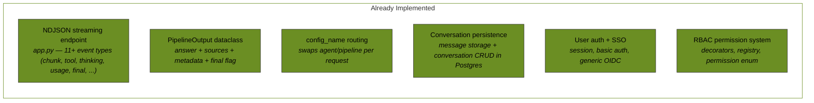
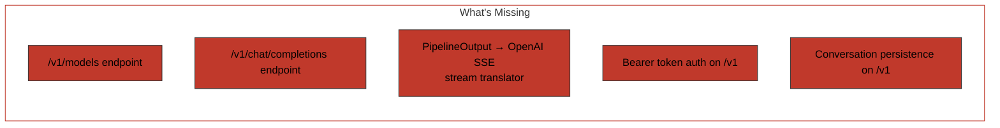
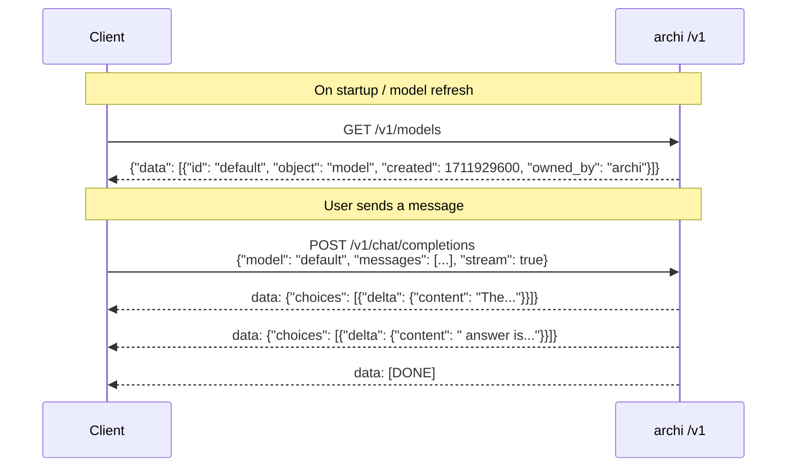
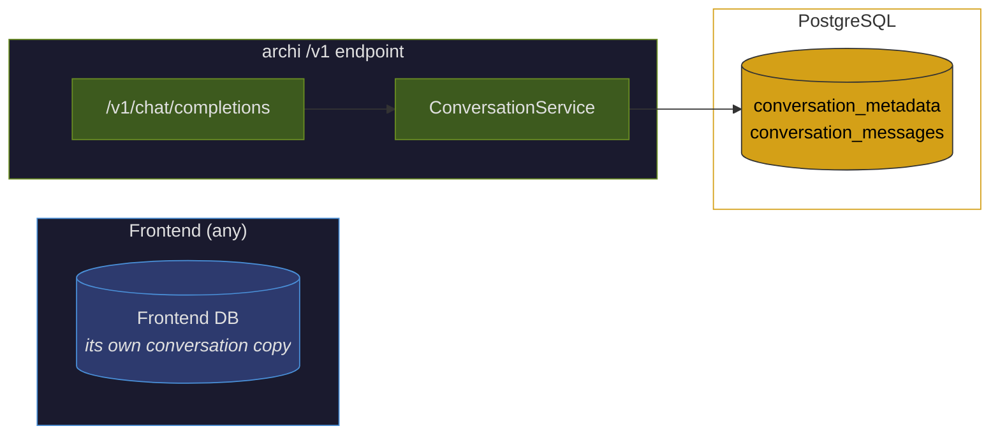
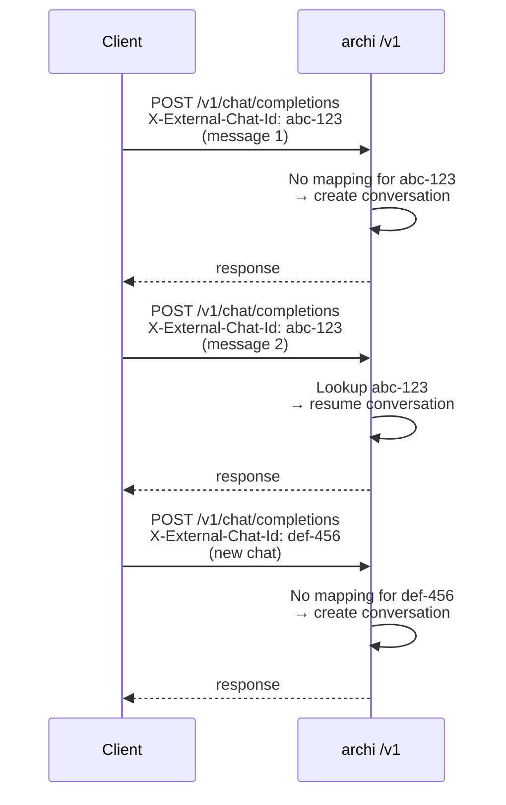
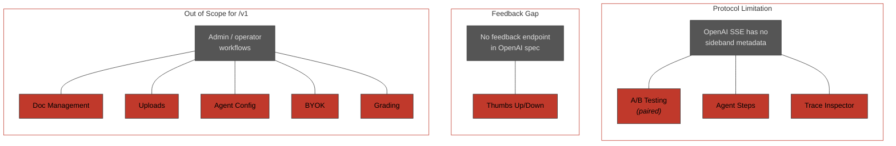
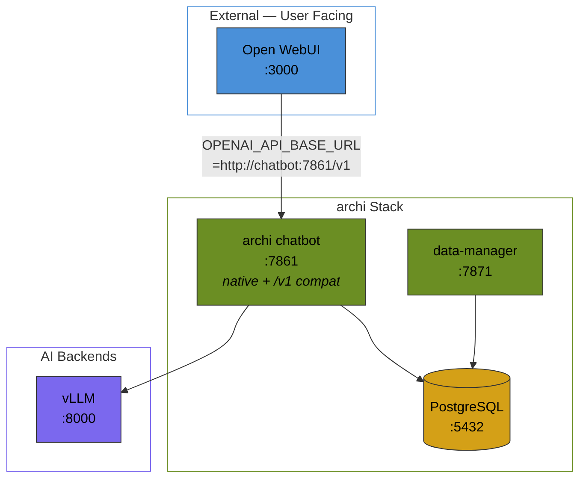
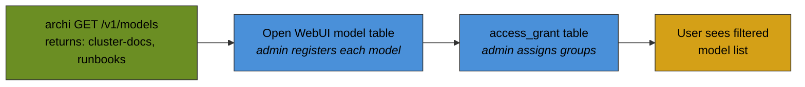
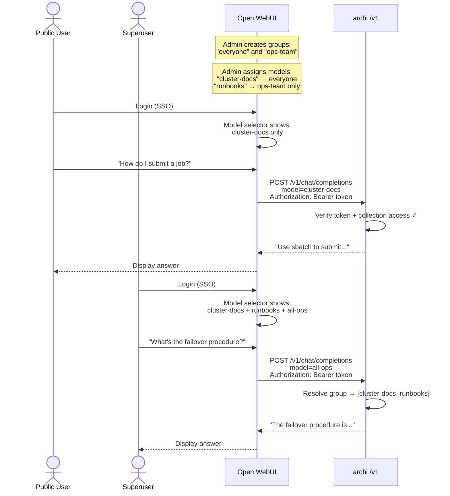

# OpenAI-Compatible API for archi

**Author:** Austin Swinney, FASRC — Harvard University
**Date:** March 2026
**Status:** Proposal
**Companion:** [Multi-Collection Routing](multi-collection-routing.md) (independent, works well together)

---

## TL;DR

- **Goal:** Add an OpenAI-compatible `/v1` API to archi so it can serve as a headless RAG backend for any OpenAI-compatible client — Open WebUI, LibreChat, LiteLLM, Continue.dev, or custom scripts using the OpenAI Python SDK.

- **Why:** archi's native chat UI is one of many possible frontends. Rather than rebuilding polished multi-user UX, SSO, and group management in archi, expose archi as a standard backend and let deployers choose the frontend that fits their organization.

- **What already exists:** NDJSON streaming, PipelineOutput dataclass, config-based routing, conversation persistence, auth + SSO, and RBAC are all implemented — the work is a thin translation layer, not new RAG logic.

- **What's needed:** Two new endpoints (`GET /v1/models`, `POST /v1/chat/completions`), a NDJSON→SSE stream translator, bearer token auth, and conversation persistence on the `/v1` path. ~10 tasks total (7 code, 3 docs).

- **Additive, not destructive:** archi's native chat UI, all pipelines, data ingestion, BYOK, A/B testing — everything keeps working. `/v1` is a new blueprint alongside existing routes.

- **What users lose via `/v1`:** Paired A/B testing, agent step visibility, trace inspector, and feedback flowing back to archi — all due to OpenAI protocol limitations, not removal. Native UI still has everything.

- **Conversation mapping:** Frontends that forward a conversation/chat ID header (Open WebUI, LibreChat) get multi-turn conversation continuity. Clients without the header get one conversation per request.

- **Companion proposal:** Works well with [Multi-Collection Routing](multi-collection-routing.md) — archi collections appear as "models" in the frontend's model selector with group-based access control.

- **Validated frontends:** This proposal evaluates [Open WebUI](#open-webui) and [LibreChat](#librechat) in depth. Both consume the same `/v1` API — the archi-side implementation does not change.

---

## Motivation

Archi is a powerful RAG framework — pipelines, agents, data ingestion from diverse sources, BYOK, A/B testing — but its native chat UI is one of many possible frontends. Open-source chat interfaces like [Open WebUI](https://github.com/open-webui/open-webui) and [LibreChat](https://github.com/danny-avila/LibreChat) offer polished multi-user UX, SSO, and group management out of the box. Rather than rebuilding these capabilities in archi, we can expose archi as an **OpenAI-compatible backend** and let deployers choose the frontend that fits their organization.

This also frees archi developer resources from maintaining a frontend — the native chat UI continues to work, but organizations that want a more polished user experience can use a dedicated frontend instead.

---

## What Already Exists



| Component | File | What it does |
|---|---|---|
| NDJSON streaming | `app.py:1597` (stream), `app.py:3560` (endpoint) | 11+ event types: `meta`, `chunk`, `tool_start`, `tool_output`, `tool_end`, `thinking_start`, `thinking_end`, `usage`, `error`, `warning`, `step`, `final` |
| PipelineOutput | `output_dataclass.py` | Standardized `answer`, `source_documents`, `messages`, `metadata`, `final` |
| `config_name` routing | `app.py:1300` | `_resolve_config_name()` selects agent/pipeline per request |
| Conversation persistence | `conversation_service.py`, `app.py` | `ConversationService` handles message storage; conversation CRUD (create, load, list, delete) in `app.py` via direct SQL |
| Auth + SSO | `app.py:2327` | Session-based auth with basic auth and generic OIDC |
| RBAC | `src/utils/rbac/` | Permission enum, registry, `@require_permission()` and `@require_any_permission()` decorators |

---

## The Gap



archi has no OpenAI-compatible endpoint. Clients must use archi's native `/api/get_chat_response_stream` with its custom NDJSON format. The gap is a thin translation layer — not new RAG or pipeline logic.

---

## Design

### How Clients Connect

Any OpenAI-compatible client connects to archi's `/v1` endpoint using the standard [OpenAI Chat Completions API](https://platform.openai.com/docs/api-reference/chat). Two endpoints are required:



| Endpoint | Purpose | Maps to |
|---|---|---|
| `GET /v1/models` | List available configurations | archi agent configs / collections |
| `POST /v1/chat/completions` | Chat with RAG | `ChatWrapper.stream(message=..., config_name=...)` |

When combined with [Multi-Collection Routing](multi-collection-routing.md), collections and collection groups also appear in the `/v1/models` list.

### Request Translation

```
OpenAI Request                          archi Call
─────────────────                       ──────────────
model: "default"                →       config_name: "default"
messages[-1].content            →       message (last user message)
messages[:-1]                   →       loaded from conversation history in Postgres
stream: true                    →       ChatWrapper.stream(...)
temperature: 0.7                →       NEW: per-request LLM parameter override
max_tokens: 4096                →       NEW: per-request LLM parameter override
```

**Note:** archi currently uses `config_name` to select a pipeline/agent and `provider` + `model` to override the LLM within that pipeline. The `/v1` endpoint maps the OpenAI `model` field to archi's `config_name`. Per-request `temperature` and `max_tokens` overrides do not exist today — they are new work in this proposal.

### Response Translation

archi's `ChatWrapper.stream()` yields 11+ NDJSON event types. The `/v1` blueprint translates the ones that map to OpenAI's SSE format and silently consumes the rest:

| archi NDJSON Event | OpenAI SSE Chunk | Notes |
|---|---|---|
| `{"type": "meta", "event": "stream_started"}` | *(consumed — not forwarded)* | Initializes stream; includes 2KB padding for HTTP flush |
| `{"type": "chunk", "content": "The..."}` | `data: {"choices": [{"delta": {"content": "The..."}}]}` | Core text streaming |
| `{"type": "tool_start", "tool_name": "...", "tool_args": {...}}` | *(omitted or mapped to `delta.tool_calls`)* | Tool invocation beginning |
| `{"type": "tool_output", "output": "...", "truncated": bool}` | *(omitted)* | Tool execution result — no OpenAI equivalent |
| `{"type": "tool_end", "status": "...", "duration_ms": N}` | *(omitted)* | Tool completion with timing |
| `{"type": "thinking_start", "step_id": "..."}` | *(omitted)* | Agent reasoning phase — no OpenAI equivalent |
| `{"type": "thinking_end", "thinking_content": "...", "duration_ms": N}` | *(omitted)* | Reasoning completion |
| `{"type": "step", "step_type": "tool_call\|tool_result\|agent"}` | *(omitted)* | Legacy pipeline events |
| `{"type": "usage", "prompt_tokens": N, "completion_tokens": N}` | Included in final chunk's `usage` field | Token accounting |
| `{"type": "error", "status": N, "message": "..."}` | `data: {"error": {"message": "...", "code": N}}` | Error conditions |
| `{"type": "warning", "message": "..."}` | *(omitted)* | Non-fatal warnings |
| `{"type": "final", "response": "...", "trace_id": "..."}` | `data: {"choices": [{"finish_reason": "stop"}]}` | Terminal event — `response` already contains inline citations |

**Important:** The `final` event's `response` field is a pre-formatted string that already includes inline source citations (appended by `format_links_markdown()` during pipeline execution). The `/v1` translator does not need to extract or re-append sources — they're baked into the response text.

### Bearer Token Auth

The `/v1` endpoint authenticates via `Authorization: Bearer <token>` headers, standard for OpenAI-compatible APIs. The token resolves to an archi user, which determines:

- Whether the request is allowed at all (RBAC `chat:query` permission)
- Which collections/configs the user can access (when combined with [Multi-Collection Routing](multi-collection-routing.md))

Without the multi-collection companion, all authenticated users can access the single default collection.

### Conversation Persistence

archi always persists its own conversation history regardless of frontend. The `/v1` endpoint creates conversations (via direct SQL in `app.py`) and persists messages (via `ConversationService.insert_message()`):



The two stores are independent — no sync required. The frontend keeps its own copy for its UI; archi keeps its own for debugging, evaluation, and A/B testing.

### Conversation Mapping via External Chat ID

Frontends that forward a conversation or chat ID header allow archi to map multiple messages to a single conversation. On first sight of an external chat ID, archi creates a new conversation and stores the mapping. On subsequent requests with the same ID, it resumes the existing conversation.



**Fallback:** Clients that don't send the header (curl, LiteLLM, custom scripts) get one conversation per request — acceptable for ad-hoc usage.

**Schema change:** Add an `external_chat_id` column to `conversation_metadata` with a unique index for fast lookups.

The header name is configurable. Known frontends:

| Frontend | Header | How to enable |
|---|---|---|
| Open WebUI | `X-OpenWebUI-Chat-Id` | Set `ENABLE_FORWARD_USER_INFO_HEADERS=true` |
| LibreChat | Custom (e.g. `X-LibreChat-Conversation-Id`) | Configure in `librechat.yaml` headers with `{{LIBRECHAT_BODY_CONVERSATIONID}}` |

---

## What archi Keeps

This compatibility mode is **additive**. Nothing is removed:

| Capability | Status |
|---|---|
| Native chat UI (`:7861`) | Still works — `/v1` is a new blueprint alongside existing routes |
| All pipelines (QA, Grading, ReAct, Agents) | Intact — exposed as "models" via `/v1` or via native API |
| Data ingestion (web, git, Jira, uploads) | Unchanged |
| BYOK (bring your own key) | Works via native UI |
| A/B testing | Works via native UI |
| Conversation history | archi always persists its own (debugging + evaluation) |
| RBAC | Intact for native UI; extended with bearer token auth for `/v1` |
| Streaming | Translated from NDJSON to SSE for `/v1` |

---

## What You Lose Through `/v1`

The OpenAI Chat Completions protocol (`/v1/chat/completions`) is a narrow interface: send messages, receive text. archi's native API is much richer. When users interact through any `/v1` client instead of archi's native UI, the following features are **not accessible** — not because they're broken, but because the OpenAI protocol has no way to express them.

archi's native UI remains available on `:7861` for any feature that requires it.



### Protocol Barriers

These features are lost because the OpenAI SSE protocol has no mechanism to carry the required data:

| Feature | What it does in native UI | Why `/v1` can't express it |
|---|---|---|
| **A/B Testing** (paired side-by-side) | Sends the same query to two models/configs, presents both responses side-by-side, collects user preference (`/api/ab/create`, `/api/ab/preference`) | OpenAI protocol returns one response per request. No concept of paired responses or preference collection. |
| **Agent Step Visibility** | Streams `tool_start`, `tool_output`, `tool_end`, `thinking_start`, `thinking_end` events showing the agent's reasoning and tool use in real time | OpenAI SSE only supports `delta.content` (text) and `delta.tool_calls` (structured tool invocations). archi's richer event types (thinking, tool output content, step durations) have no equivalent. The `/v1` translator omits these or flattens them to text. |
| **Trace / Debug Inspector** | Per-message trace view showing full pipeline execution: tool calls, durations, intermediate steps, cancellation info (`/api/trace/<trace_id>`) | OpenAI responses have no trace ID or link to execution details. archi still records traces internally, but `/v1` clients have no way to view them. |

### Feedback Barriers

| Feature | What it does in native UI | Why `/v1` can't express it |
|---|---|---|
| **Response Feedback** | Thumbs up/down with structured categories (incorrect, unhelpful, inappropriate) and free-text feedback (`/api/like`, `/api/dislike`, `/api/text_feedback`) | OpenAI protocol has no feedback mechanism. Frontends may have their own feedback UI, but that data stays in the frontend's database — it doesn't flow back to archi for evaluation. |

### Scope Barriers

These features are administrative or orthogonal to chat. They're not lost because of a protocol limitation — they simply aren't chat completions:

| Feature | What it does in native UI | Why it's out of scope for `/v1` |
|---|---|---|
| **Document Management** | Browse, search, enable/disable documents per user or conversation, view chunks, bulk operations (`/data`, `/api/data/*`) | Document management is an admin/operator concern, not a chat request. Use archi's native UI or data-manager API directly. |
| **Data Upload + Ingestion** | Upload files, add URLs, connect git repos, add Jira sources, trigger embedding, monitor ingestion status (`/upload`, `/api/upload/*`) | Ingestion is handled by archi's data-manager service. This is an operator workflow, not a user chat workflow. |
| **Agent Configuration** | List, create, edit, delete agent specs (markdown-based); set active agent; get agent template with available tools (`/api/agents/*`) | Agent management is admin configuration. The frontend's "model" selector maps to archi configs, but creating/editing agent specs requires archi's native UI or direct file editing. |
| **BYOK Key Management** | Users store their own API keys per provider, which are encrypted in Postgres and used for their requests (`/api/providers/keys/*`) | For archi's `/v1` backend, BYOK doesn't apply — archi uses its own configured provider keys. |
| **Grading Pipeline** | Dedicated grading service with its own UI on `:7862` for automated assessment | Grading is a separate archi service (`grader`), not exposed through the chatbot endpoint at all. |
| **Dynamic Config Switching** | Users switch active pipeline, model, temperature, prompt templates at runtime (`/api/update_config`, `/api/config/dynamic`) | `/v1` maps `model` to a config name and supports basic `temperature`/`max_tokens` overrides, but the full config surface (prompt selection, hybrid search weights, retrieval parameters, provider/model LLM overrides) isn't expressible in the OpenAI request schema. |
| **Database Admin** | Browse tables, run read-only queries (`/admin/database/*`) | Admin tooling, requires archi's native UI. |

### Summary

| Category | Features lost | Workaround |
|---|---|---|
| **Protocol** | A/B testing (paired), agent steps, trace inspector | Use archi native UI. Some frontends offer their own evaluation (e.g. Open WebUI Arena Mode) |
| **Feedback** | Thumbs up/down flowing to archi | Frontends collect their own; archi's native UI for archi-tracked feedback |
| **Scope** | Document mgmt, uploads, agent config, BYOK, grading, dynamic config, DB admin | Use archi's native UI or data-manager API directly |

None of these features are broken or removed. They continue to work through archi's native interface. The `/v1` endpoint is a **chat-focused projection** of archi's capabilities — it surfaces RAG Q&A through a standard protocol, but the full feature set lives behind archi's native API.

---

## Implementation Summary

### OpenAI-Compatible API (7 tasks)

| # | Task | Touches |
|---|---|---|
| 1 | Create `/v1/models` endpoint (return `id`, `object`, `created`, `owned_by` per model) | New blueprint |
| 2 | Create `/v1/chat/completions` with SSE streaming | New blueprint |
| 3 | Build `PipelineOutput` → OpenAI response translator | New module |
| 4 | Build NDJSON → SSE stream adapter | New module |
| 5 | Map OpenAI params (`temperature`, `max_tokens`) — **new per-request override support** | Translator + pipeline kwargs |
| 6 | Persist conversations via `ConversationService` on `/v1` | New blueprint |
| 7 | Bearer token auth on `/v1` endpoints | New blueprint |

### Documentation (3 tasks)

| # | Task | Touches |
|---|---|---|
| 8 | Write frontend integration guides (Open WebUI, LibreChat) | `docs/` |
| 9 | Add example Docker Compose configs per frontend | `examples/deployments/` |
| 10 | Document `/v1` API endpoint reference | `docs/` |

---

## Design Decisions

| # | Question | Decision | Rationale |
|---|---|---|---|
| 1 | Conversation history ownership? | **archi always persists its own copy** (conversation CRUD via `app.py`, message storage via `ConversationService`), regardless of frontend. Frontends keep their own independently. | archi's conversation history is needed for debugging and evaluation. The two stores are independent — no sync required. |
| 2 | Citation format? | **Inline citations** appended to every response. Shared formatter (built in [Multi-Collection Routing](multi-collection-routing.md) companion). | Citations are critical and currently deficient. Inline works well with markdown rendering in all frontends. |
| 3 | Auth mechanism for `/v1`? | **Bearer token** in `Authorization` header, standard for OpenAI-compatible APIs. | Matches what all OpenAI-compatible clients expect. Maps to archi user for RBAC checks. |

---

## Validated Frontends

The `/v1` API works with any OpenAI-compatible client. The following frontends have been evaluated in depth.

### Open WebUI

[Open WebUI](https://github.com/open-webui/open-webui) is a polished, multi-user chat interface with built-in group management, SSO (LDAP, SCIM 2.0, OAuth), and role-based access control.

#### Deployment



#### Docker Compose

```yaml
services:
  # ── Open WebUI (frontend) ─────────────────────────
  open-webui:
    image: ghcr.io/open-webui/open-webui:main
    ports:
      - "3000:8080"
    environment:
      # Point at archi's OpenAI-compat endpoint
      OPENAI_API_BASE_URL: http://chatbot:7861/v1
      OPENAI_API_KEY: "not-needed"

      # Bypass Open WebUI's own embedding/retrieval (archi handles RAG)
      # Note: there is no ENABLE_RAG flag; this is the correct mechanism
      BYPASS_EMBEDDING_AND_RETRIEVAL: "true"

      # Forward conversation + user metadata to archi (required for conversation mapping)
      ENABLE_FORWARD_USER_INFO_HEADERS: "true"

      # Auth
      WEBUI_SECRET_KEY: ${WEBUI_SECRET_KEY}
      ENABLE_SIGNUP: "true"
      DEFAULT_USER_ROLE: "user"
    volumes:
      - open-webui-data:/app/backend/data
    depends_on:
      - chatbot

  # ── archi (RAG backend) ───────────────────────────
  chatbot:
    image: archi-chatbot:latest
    ports:
      - "7861:7861"
    environment:
      PGHOST: postgres
      PGPORT: 5432
      # ... standard archi env
    depends_on:
      postgres:
        condition: service_healthy

  data-manager:
    image: archi-data-manager:latest
    environment:
      PGHOST: postgres
      # ... standard archi env
    depends_on:
      postgres:
        condition: service_healthy

  postgres:
    image: archi-postgres:latest
    ports:
      - "5432:5432"
    volumes:
      - archi-pg:/var/lib/postgresql/data
    healthcheck:
      test: ["CMD", "pg_isready"]

  # ── vLLM (external, managed separately) ───────────
  # Connect via: vllm.base_url: http://vllm-host:8000/v1
```

#### Key Configuration

| Setting | Value | Purpose |
|---|---|---|
| `OPENAI_API_BASE_URL` | `http://chatbot:7861/v1` | Points Open WebUI at archi's `/v1` |
| `BYPASS_EMBEDDING_AND_RETRIEVAL` | `"true"` | Disables Open WebUI's built-in RAG so it doesn't interfere with archi's retrieval |
| `ENABLE_FORWARD_USER_INFO_HEADERS` | `"true"` | Forwards `X-OpenWebUI-Chat-Id`, `X-OpenWebUI-User-*` headers for conversation mapping |

#### Conversation Mapping

Open WebUI sends `X-OpenWebUI-Chat-Id` when `ENABLE_FORWARD_USER_INFO_HEADERS=true`. All header names are customizable via environment variables (e.g., `FORWARD_SESSION_INFO_HEADER_CHAT_ID`).

| Header | Value | Source |
|---|---|---|
| `X-OpenWebUI-Chat-Id` | Conversation ID | `metadata.chat_id` from request payload |
| `X-OpenWebUI-User-Id` | User ID | Authenticated user |
| `X-OpenWebUI-User-Name` | Display name | Authenticated user |
| `X-OpenWebUI-User-Email` | Email | Authenticated user |
| `X-OpenWebUI-User-Role` | Role (admin/user) | Authenticated user |

#### SSE Handling

Open WebUI detects streaming by checking for `Content-Type: text/event-stream` in the response headers, then **passes the raw SSE stream through to the client without parsing it**. It does not interpret `data:` lines or handle `data: [DONE]` specially. This simplifies our translator — we just need to emit well-formed SSE with the correct content type.

#### Model Access Control

Open WebUI has group-based model filtering — admins can restrict which users/groups see which models. This requires a one-time registration step:

1. Admin navigates to Open WebUI settings
2. "Creates" each archi collection/config as a model (registers it in Open WebUI's DB)
3. Assigns access grants (groups/users) to each model

Models not registered in Open WebUI's DB are **silently excluded** from non-admin views.



#### Access Control with Multi-Collection Routing

When combined with the [Multi-Collection Routing](multi-collection-routing.md) companion proposal, the deployment gains role-based collection access:



| Responsibility | Owner |
|---|---|
| User authentication (SSO, LDAP) | Open WebUI (frontend) and/or archi (direct access) |
| Group membership + model visibility | Open WebUI |
| Collection access enforcement | archi (defense in depth) |
| Document ingestion and embedding | archi data-manager |
| RAG retrieval | archi pipelines |
| Conversation history | archi (always) + Open WebUI (its own copy) |
| LLM inference | vLLM / Ollama / API |

#### Arena Mode (Partial A/B Mitigation)

archi's paired side-by-side A/B testing can't pass through `/v1`, but Open WebUI has its own blind evaluation system called **Arena Mode** (`ENABLE_EVALUATION_ARENA_MODELS`). It works at the Open WebUI layer and is compatible with any backend model — including archi collections.

**How it works:**

1. An admin creates an "Arena Model" in Open WebUI's settings with a pool of `model_ids` (e.g., `[cluster-docs, runbooks]` or different archi pipeline configs)
2. When a user selects the arena model, Open WebUI **randomly picks** one from the pool and routes the request to it
3. The user doesn't know which model answered — they rate the response
4. Open WebUI computes **Elo ratings** from feedback, with optional topic-weighted leaderboards via semantic similarity

| Aspect | archi A/B Testing | Open WebUI Arena |
|---|---|---|
| Presentation | Side-by-side, both responses visible | Blind — user sees one response, doesn't know which model |
| Selection | Explicit: "compare config A vs B" | Random from a pool |
| Feedback storage | archi's PostgreSQL | Open WebUI's database (Elo-rated leaderboard) |
| Scope | Per-conversation | Global leaderboard across all users |
| Works via `/v1` | No | **Yes** |

---

### LibreChat

[LibreChat](https://github.com/danny-avila/LibreChat) is an open-source chat interface with its own agent framework, MCP support, and highly configurable backend integration.

#### Deployment

LibreChat defines backends via `librechat.yaml` using its [Custom Endpoints](https://www.librechat.ai/docs/quick_start/custom_endpoints) feature:

```yaml
# librechat.yaml
endpoints:
  custom:
    - name: 'archi'
      apiKey: '${ARCHI_API_KEY}'
      baseURL: 'http://chatbot:7861/v1'
      models:
        fetch: true              # Calls GET /v1/models on startup
      titleConvo: true
      titleModel: 'default'
      modelDisplayLabel: 'archi'
      headers:
        X-LibreChat-User-Id: '{{LIBRECHAT_USER_ID}}'
        X-LibreChat-User-Email: '{{LIBRECHAT_USER_EMAIL}}'
        X-LibreChat-Conversation-Id: '{{LIBRECHAT_BODY_CONVERSATIONID}}'
        X-LibreChat-Message-Id: '{{LIBRECHAT_BODY_MESSAGEID}}'
```

#### Docker Compose

```yaml
services:
  librechat:
    image: ghcr.io/danny-avila/librechat-dev:latest
    ports:
      - "3080:3080"
    volumes:
      - ./librechat.yaml:/app/librechat.yaml
    environment:
      MONGO_URI: mongodb://mongo:27017/LibreChat
      ARCHI_API_KEY: ${ARCHI_API_KEY}
      # No BYPASS_EMBEDDING_AND_RETRIEVAL needed
      # No ENABLE_FORWARD_USER_INFO_HEADERS needed
      # Header forwarding configured in librechat.yaml
    depends_on:
      - mongo
      - chatbot

  mongo:
    image: mongo:7
    volumes:
      - mongo_data:/data/db

  # ── archi (RAG backend) ───────────────────────────
  chatbot:
    image: archi-chatbot:latest
    ports:
      - "7861:7861"
    environment:
      PGHOST: postgres
      PGPORT: 5432
    depends_on:
      postgres:
        condition: service_healthy

  data-manager:
    image: archi-data-manager:latest
    environment:
      PGHOST: postgres
    depends_on:
      postgres:
        condition: service_healthy

  postgres:
    image: archi-postgres:latest
    ports:
      - "5432:5432"
    volumes:
      - archi-pg:/var/lib/postgresql/data
    healthcheck:
      test: ["CMD", "pg_isready"]
```

#### Conversation Mapping

LibreChat forwards `{{LIBRECHAT_BODY_CONVERSATIONID}}` via custom headers configured in `librechat.yaml`. archi's `/v1` handler uses the same `external_chat_id` mapping mechanism — it just reads from a different header name.

#### Header Forwarding

LibreChat's header system is more flexible than Open WebUI's — all placeholders are configurable per-endpoint in YAML:

| Placeholder | Value |
|---|---|
| `{{LIBRECHAT_USER_ID}}` | User ID |
| `{{LIBRECHAT_USER_EMAIL}}` | Email |
| `{{LIBRECHAT_USER_NAME}}` | Display name |
| `{{LIBRECHAT_USER_USERNAME}}` | Username |
| `{{LIBRECHAT_USER_ROLE}}` | Role (USER, ADMIN) |
| `{{LIBRECHAT_USER_PROVIDER}}` | Auth provider (google, github, etc.) |
| `{{LIBRECHAT_BODY_CONVERSATIONID}}` | Conversation ID |
| `{{LIBRECHAT_BODY_MESSAGEID}}` | Message ID |
| `{{LIBRECHAT_BODY_PARENTMESSAGEID}}` | Parent message ID |

#### Key Differences from Open WebUI

| Dimension | Open WebUI | LibreChat |
|---|---|---|
| **RAG interference** | Must disable with `BYPASS_EMBEDDING_AND_RETRIEVAL=true` | No built-in RAG — if `RAG_API_URL` is unset, retrieval is simply not active |
| **Model access control** | Group-based model filtering via `access_grant` table | **Not available.** All users see all configured models |
| **A/B testing** | Arena Mode (blind Elo-rated evaluation) | No equivalent |
| **Database** | SQLite (default) or PostgreSQL | MongoDB (required) |
| **Agent framework** | None — relies on backend | LibreChat Agents with MCP, tool calling, code execution, file search |
| **SSO** | LDAP, SCIM 2.0, OAuth | GitHub, Google, Discord, OpenID, Facebook, Apple, SAML |
| **Model presets** | N/A | `modelSpecs` — named presets with custom instructions, grouping, and icons |

#### Recommendation

For deployments where **per-user collection access control** is important, **Open WebUI** is the stronger choice today — its group-based model filtering provides defense in depth alongside archi's RBAC.

For deployments where **flexible header forwarding**, **no RAG interference**, and **built-in agents** matter more than model-level access control, **LibreChat** is a compelling alternative.

Both consume the same `/v1` API. The archi-side implementation does not change.

---

## References

- [Open WebUI GitHub](https://github.com/open-webui/open-webui)
- [Open WebUI Pipelines](https://github.com/open-webui/pipelines)
- [LibreChat GitHub](https://github.com/danny-avila/LibreChat)
- [LibreChat Custom Endpoints Docs](https://www.librechat.ai/docs/quick_start/custom_endpoints)
- [OpenAI Chat Completions API](https://platform.openai.com/docs/api-reference/chat)
- archi source: `src/interfaces/chat_app/app.py` — native NDJSON streaming
- archi source: `src/archi/utils/output_dataclass.py` — PipelineOutput dataclass
- archi source: `src/utils/rbac/` — existing permission framework
- archi source: `src/utils/conversation_service.py` — message persistence and A/B comparison tracking
