# Data Freshness in RAG Systems: A Comprehensive Survey

**Author:** Austin Swinney, FASRC — Harvard University
**Date:** March 2026
**Context:** Research conducted during the design of archi's caching and data refresh strategy

---

## Abstract

Retrieval-Augmented Generation (RAG) systems depend on the freshness of their underlying knowledge bases. Stale embeddings lead to incorrect answers, eroded user trust, and operational burden. Despite this, the problem of **when and how to refresh ingested data** remains largely unsolved in the open-source RAG ecosystem. This paper surveys how major frameworks (LlamaIndex, LangChain, Haystack, Verba) and vector databases (Qdrant, Pinecone, ChromaDB) handle data refresh, identifies common patterns and gaps, and proposes a layered architecture for archi that advances the state of the art — particularly around imperative cache invalidation and hierarchical source management.

---

## Table of Contents

1. [The Freshness Problem](#the-freshness-problem)
2. [Change Detection Strategies](#change-detection-strategies)
3. [Framework Survey](#framework-survey)
   - [LlamaIndex](#llamaindex)
   - [LangChain](#langchain)
   - [Haystack](#haystack-deepset)
   - [Verba](#verba-weaviate)
4. [Vector Database Patterns](#vector-database-patterns)
   - [Qdrant](#qdrant)
   - [Pinecone](#pinecone)
   - [ChromaDB](#chromadb)
5. [Refresh Granularity](#refresh-granularity)
6. [Architectural Patterns](#architectural-patterns)
7. [The Source Tree Problem](#the-source-tree-problem)
8. [Recommendations for Archi](#recommendations-for-archi)
9. [References](#references)

---

## The Freshness Problem

Every RAG system faces a fundamental tension: **embeddings are expensive to compute but the underlying data changes continuously.** A knowledge base that was accurate at ingestion time drifts toward staleness as source documents are updated, moved, or deleted.

The consequences of stale data in production RAG systems include:

- **Incorrect answers** — the LLM retrieves outdated context and generates confident but wrong responses
- **Broken citations** — URLs referenced in source documents may have moved or been restructured
- **User trust erosion** — users who discover stale answers stop trusting the system entirely
- **Operational burden** — operators resort to full re-ingestion cycles, wasting compute and time

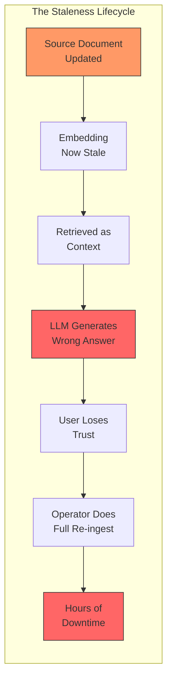

The problem decomposes into three sub-problems:

1. **Detection** — How do you know something changed?
2. **Invalidation** — How do you mark stale data for refresh?
3. **Re-ingestion** — How do you efficiently update only what changed?

Most RAG frameworks address (3) to varying degrees but largely ignore (1) and (2), leaving them as exercises for the developer.

---

## Change Detection Strategies

Change detection is the foundation of any refresh system. The strategies form a hierarchy from cheapest to most reliable:

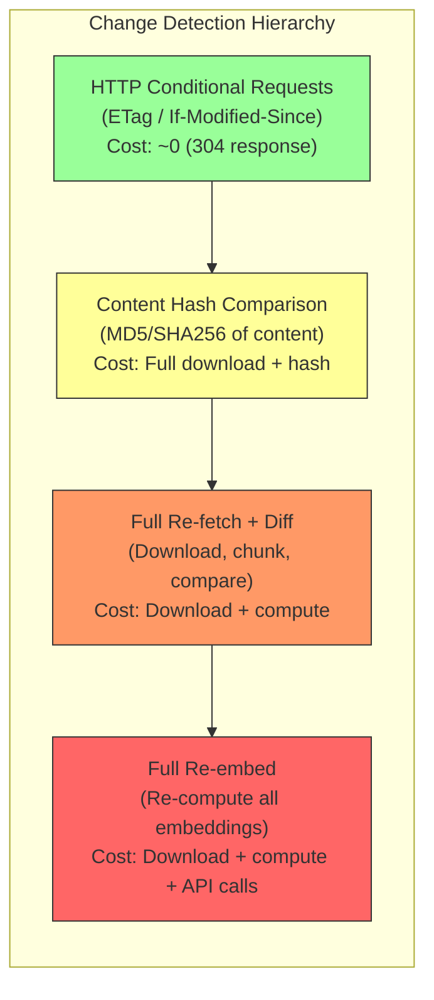

### HTTP Conditional Requests (ETags and If-Modified-Since)

The cheapest change detection mechanism leverages HTTP protocol features. When a server supports conditional requests, the client can ask "has this changed since I last fetched it?" without downloading the full content.

**How it works:**

1. First request: Server returns content + `ETag: "abc123"` header
2. Subsequent request: Client sends `If-None-Match: "abc123"`
3. If unchanged: Server returns `304 Not Modified` (no body, ~200 bytes)
4. If changed: Server returns `200 OK` with new content and new ETag

The [`requests-cache`](https://requests-cache.readthedocs.io/en/stable/) library handles this transparently — it stores ETags and Last-Modified timestamps and automatically sends conditional headers on cache expiry. This is the primary reason archi is adopting `requests-cache` as its caching layer.

**Limitations:**
- Not all servers support ETags or Last-Modified (notably many internal wikis and CMSes)
- Does not work for non-HTTP sources (git repos, API calls, local files)
- Does not detect *semantic* changes — a page might return 200 with a new footer but identical article content

### Content Hashing

The most common approach in RAG frameworks. Every document gets a hash computed from its content. On subsequent ingestion, the new hash is compared against the stored hash.

**Used by:**
- [LlamaIndex](https://docs.llamaindex.ai/en/stable/module_guides/loading/ingestion_pipeline/) — hashes each `(node, transformation)` pair
- [LangChain](https://python.langchain.com/docs/how_to/indexing/) — hashes `page_content + metadata` via RecordManager
- Archi's `PersistenceService` — already uses MD5 hash-based dedup via `resource_hash` in the PostgreSQL catalog

**Trade-off:** Requires downloading the full content before detecting a change. For large corpora with many unchanged documents, this means significant wasted bandwidth — the exact problem that HTTP conditional requests solve.

### Timestamp-Based Detection

Some source systems provide reliable modification timestamps:
- **Databases:** `updated_at` columns
- **CMS APIs:** Last-modified metadata (e.g., JIRA's `updated` field)
- **S3/Cloud Storage:** Object metadata timestamps
- **File systems:** `mtime`

**Used by:**
- Archi's JIRA collector — already supports `updated >= since_iso` for incremental fetching
- LangChain's RecordManager — stores `write_timestamp` per document

**Limitations:**
- Web pages rarely expose reliable timestamps
- Timestamps can be unreliable (build systems may touch all files)
- Git timestamps reflect commit time, not content change time

### Webhook / Event-Driven Detection

The most responsive approach — the source system notifies you when content changes rather than you polling for changes.

**Examples:**
- GitHub webhooks on push events
- CMS publish hooks (WordPress, Confluence)
- Database change data capture (CDC)

**Limitations:**
- Requires source system support
- Requires archi to expose a webhook endpoint
- Unreliable — webhooks can be dropped, delayed, or duplicated
- Not applicable to most web scraping scenarios

---

## Framework Survey

### LlamaIndex

[LlamaIndex](https://www.llamaindex.ai/) (formerly GPT Index) has the most mature incremental update system among the surveyed frameworks.

**Architecture:**

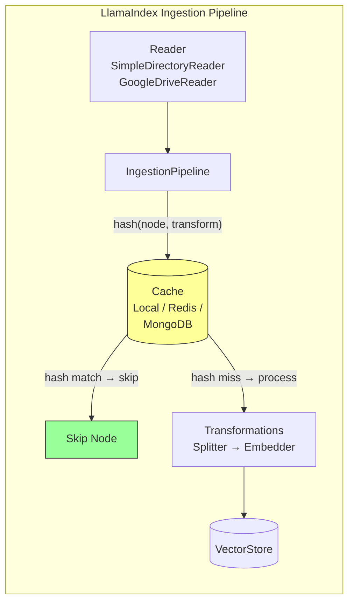

**Three Docstore Strategies:**

| Strategy | Behavior | Handles Deletions? |
|---|---|---|
| `duplicates_only` | Skip if hash exists in docstore | No |
| `upserts` | Re-process if hash changed, upsert to vectorstore | No |
| `upserts_and_delete` | Same as upserts + delete docs not seen in current run | Yes |

**Key insight:** LlamaIndex's `refresh_ref_docs()` method on `VectorStoreIndex` maintains a `doc_id → document_hash` mapping in a persistent `docstore.json`. This is conceptually identical to archi's `resource_hash` in the PostgreSQL catalog.

**Known issue:** `refresh_ref_docs()` has [documented bugs](https://github.com/run-llama/llama_index/issues/8832) with PGVector where `get_hash()` returns `None`, causing full re-indexing on every run. A cautionary tale for hash-based approaches.

**What it lacks:**
- No UI for triggering refresh
- No separation of "re-fetch from source" vs "re-embed"
- No hierarchical source management
- No HTTP-level caching

### LangChain

[LangChain's Indexing API](https://python.langchain.com/docs/how_to/indexing/) is the most architecturally clean approach, explicitly separating document loading from indexing.

**Architecture:**

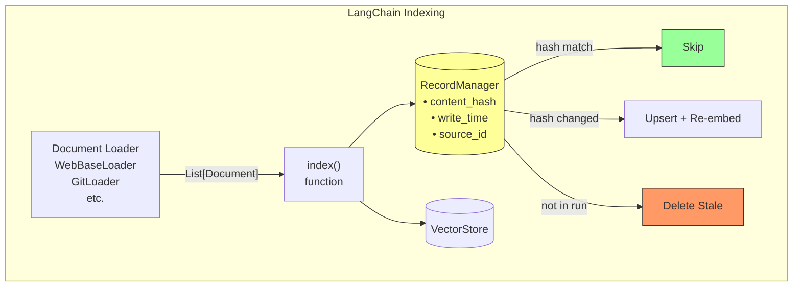

**Four Cleanup Modes:**

| Mode | Behavior | Limitation |
|---|---|---|
| `None` | No automatic cleanup | Stale docs accumulate forever |
| `incremental` | Delete old versions sharing same `source_id` | Does NOT delete docs whose entire source was removed |
| `full` | Delete ALL docs not seen in current run | Requires loader to return complete dataset |
| `scoped_full` | Like `full` but tracks source IDs in memory | Better for batch processing |

**The `source_id` concept** is LangChain's closest analog to archi's desired "source tree." Documents carry a `source` field in metadata, and the `source_id_key` parameter tells `index()` which field to use for grouping. However, it's flat — no hierarchy, no parent/child relationships.

**What it lacks:**
- No UI for triggering refresh
- No HTTP-level caching
- `source_id` is flat, not hierarchical
- `incremental` mode can't detect when an entire source is removed

### Haystack (deepset)

[Haystack](https://haystack.deepset.ai/) has the **least sophisticated** incremental update story. The `DocumentWriter` component supports a `DuplicatePolicy` enum but no higher-level refresh logic.

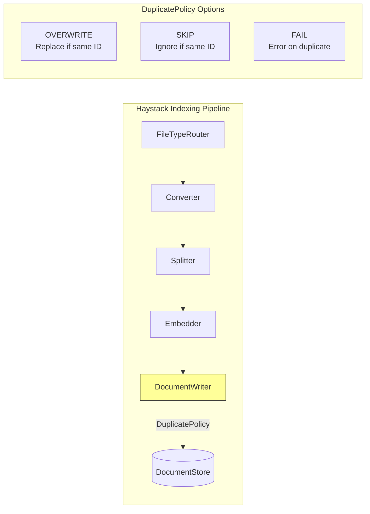

**Critical limitation:** Document IDs are derived from content hashes. If content changes, the ID changes, so the old version persists as a *separate* document. There is no built-in mechanism to detect that a source was updated and replace the old version. The [Haystack documentation](https://docs.haystack.deepset.ai/docs/document-store) explicitly warns about this.

**What it lacks:**
- No RecordManager equivalent
- No automatic stale document cleanup
- No change detection beyond ID matching
- No source tracking

### Verba (Weaviate)

[Verba](https://github.com/weaviate/Verba) is notable as one of the few RAG tools with a **data management UI**. Users can upload files, view ingested documents, and delete individual documents through a web interface.

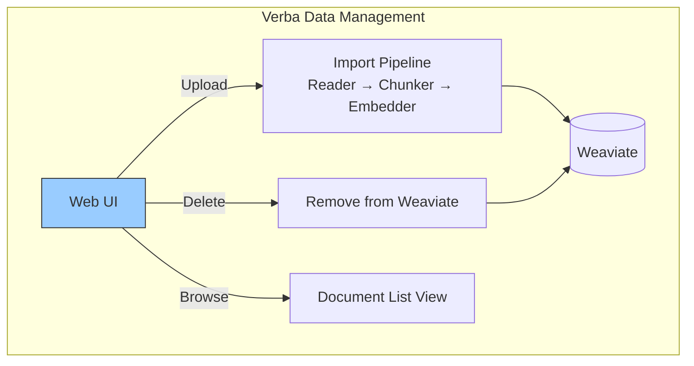

**What Verba gets right:**
- A visible, accessible UI for data management
- Per-document delete capability
- Multiple import connectors (GitHub, GitLab, Firecrawl)

**What it lacks:**
- No "refresh" — only add and delete
- No change detection
- No incremental updates
- Source connectors are one-shot imports, not monitored/synced
- No concept of source grouping

---

## Vector Database Patterns

Vector databases are the storage layer, not the orchestration layer. They provide primitives but leave refresh logic to the application.

### Qdrant

[Qdrant](https://qdrant.tech/) provides:
- **Upsert:** Overwrites entire point if same ID exists. Immediately searchable.
- **Partial update:** `set_payload` modifies only payload fields without re-uploading the vector. Useful for metadata-only changes.
- **No change detection.** The application must track content hashes in the payload and decide what to re-embed.

**Recommended pattern** from [Qdrant's documentation](https://qdrant.tech/documentation/data-ingestion-beginners/): Store a `content_hash` field in the payload. Before re-embedding, query for existing points by source ID, compare hashes, and only upsert points whose content changed.

### Pinecone

[Pinecone](https://www.pinecone.io/) introduces a unique concept:
- **Log Sequence Numbers (LSN):** Every write gets an LSN. Query responses include `x-pinecone-max-indexed-lsn`. Comparing `request-lsn >= max-indexed-lsn` confirms writes are queryable.
- **Eventual consistency:** Writes are not immediately visible. LSN lets you poll for freshness.
- **Namespace partitioning:** Logical separation of vector spaces. Writes to one namespace don't affect another's freshness.

This is the only vector DB that provides **write-level freshness tracking**, though it still doesn't detect source changes.

### ChromaDB

[ChromaDB](https://www.trychroma.com/) has a notable feature:
- **Automatic re-embedding on update:** If you call `update()` or `upsert()` with `documents` but no `embeddings`, Chroma automatically recomputes embeddings using the collection's embedding function.

This is unique — other vector DBs require you to provide pre-computed embeddings. It simplifies the refresh pipeline but couples the store to the embedding model.

**Comparison:**

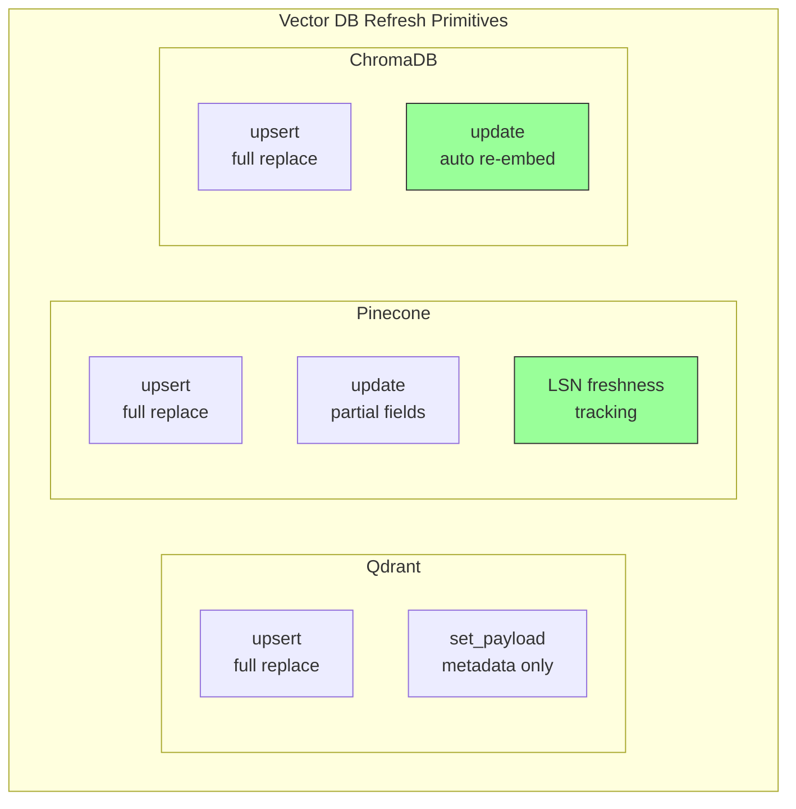

---

## Refresh Granularity

A critical design dimension that no framework addresses comprehensively. Refresh operations can target different scopes:

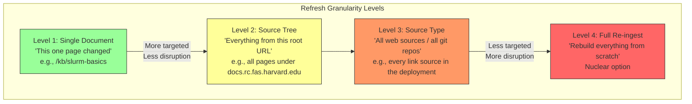

| Level | Use Case | Cost | Framework Support |
|---|---|---|---|
| **Single Document** | Admin knows a specific page was updated | Low — 1 fetch, 1 embed | LangChain (via source_id), LlamaIndex (via doc_id) |
| **Source Tree** | A documentation site was restructured | Medium — N fetches, M embeds | **None** |
| **Source Type** | All git repos need a pull | High — all sources of that type | LangChain (`full` cleanup mode) |
| **Full Re-ingest** | Embedding model changed, or drift suspected | Very High — everything | All frameworks (trivially) |

The **Source Tree** level is the most operationally useful but the least supported. When an admin knows that "the FASRC documentation site was just updated," they want to refresh everything that came from that site — not a single page, and not every source in the system.

---

## Architectural Patterns

### Pattern 1: TTL-Based Expiration (Passive)

The simplest approach. Cache entries expire after a fixed duration, and the next fetch gets fresh content.

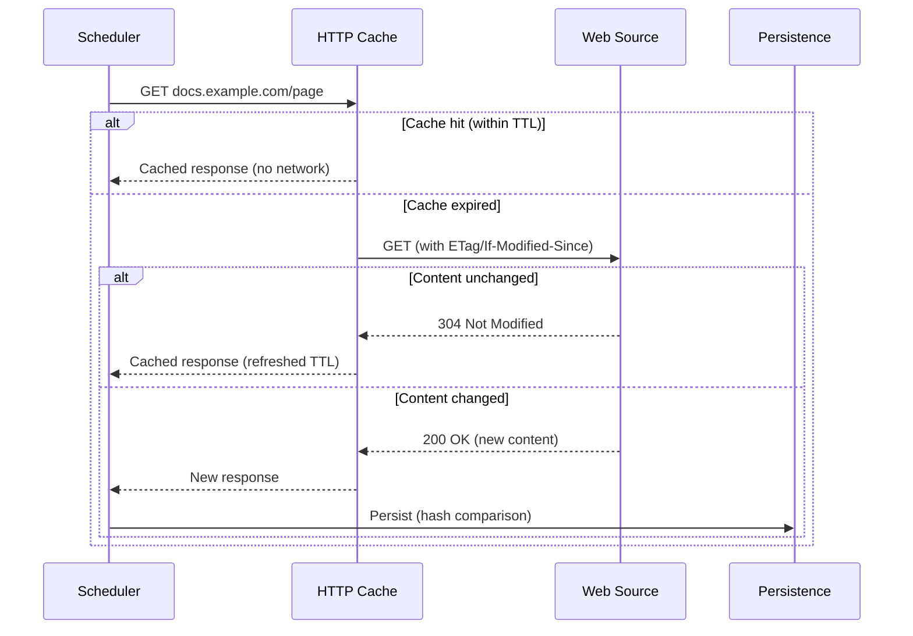

**Pros:** Zero operational overhead after setup. ETags minimize bandwidth.
**Cons:** No control over when refresh happens. Stale data persists until TTL expires.

### Pattern 2: Imperative Invalidation (Active)

An operator explicitly triggers a refresh. This is the "button" approach.

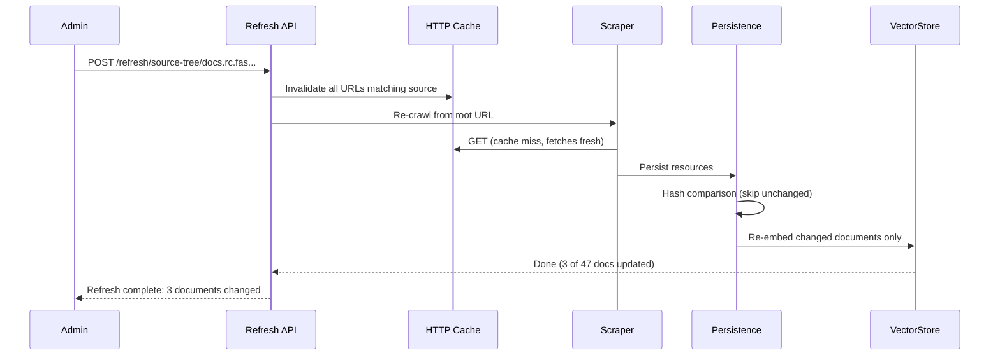

**Pros:** Immediate freshness when you know something changed. Targeted scope.
**Cons:** Requires admin awareness. Requires source tree tracking.

### Pattern 3: Hybrid (TTL + Imperative + Webhooks)

The production-grade approach. Multiple detection mechanisms feed into a unified refresh pipeline.

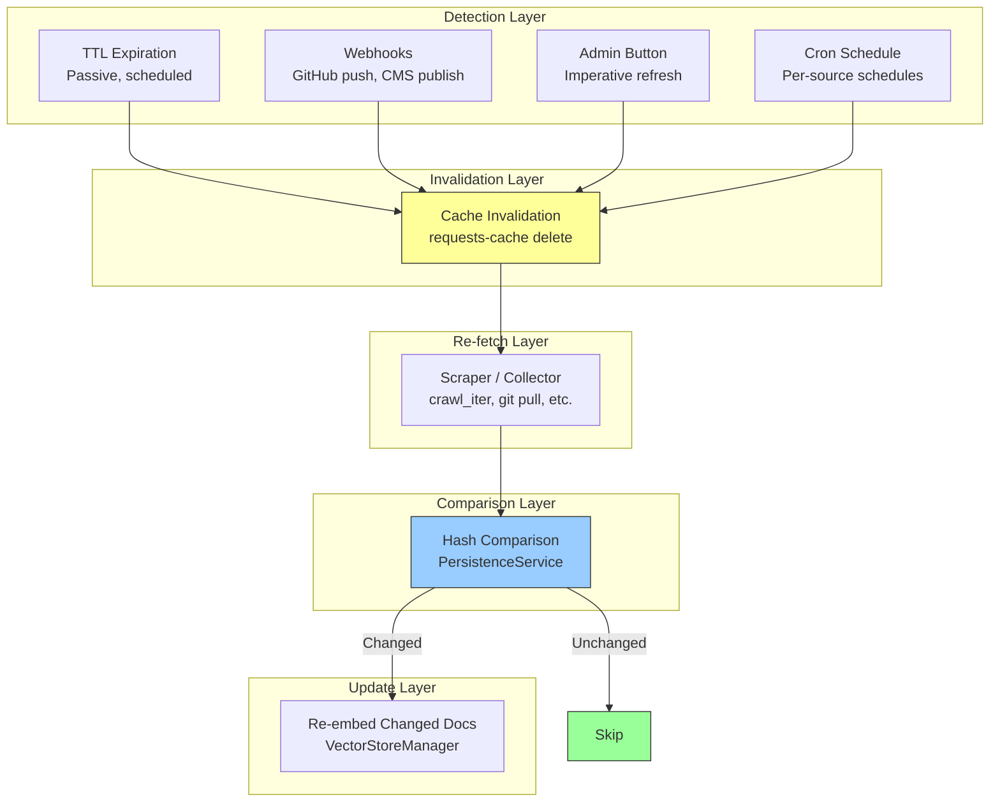

### Pattern 4: Blue-Green Indexing

For large knowledge bases where re-indexing takes hours. Build the new index in the background, swap atomically when complete.

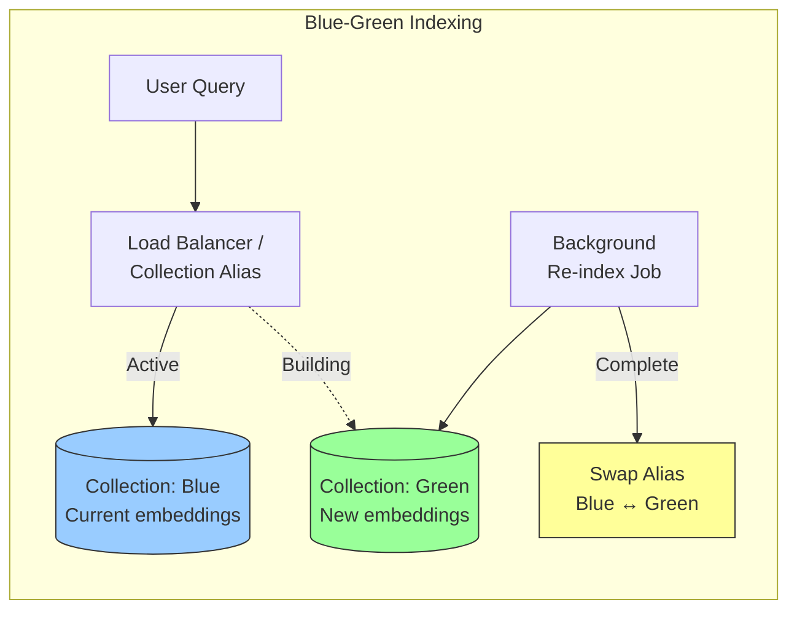

**Pros:** Zero downtime. No stale period during re-indexing. Easy rollback (swap back).
**Cons:** Requires 2x storage. More complex operationally. Overkill for incremental updates.

This pattern is most relevant when changing embedding models or performing major knowledge base restructuring — not for routine content updates.

---

## The Source Tree Problem

This is the gap in the ecosystem. No major framework provides hierarchical source management.

### What Exists Today

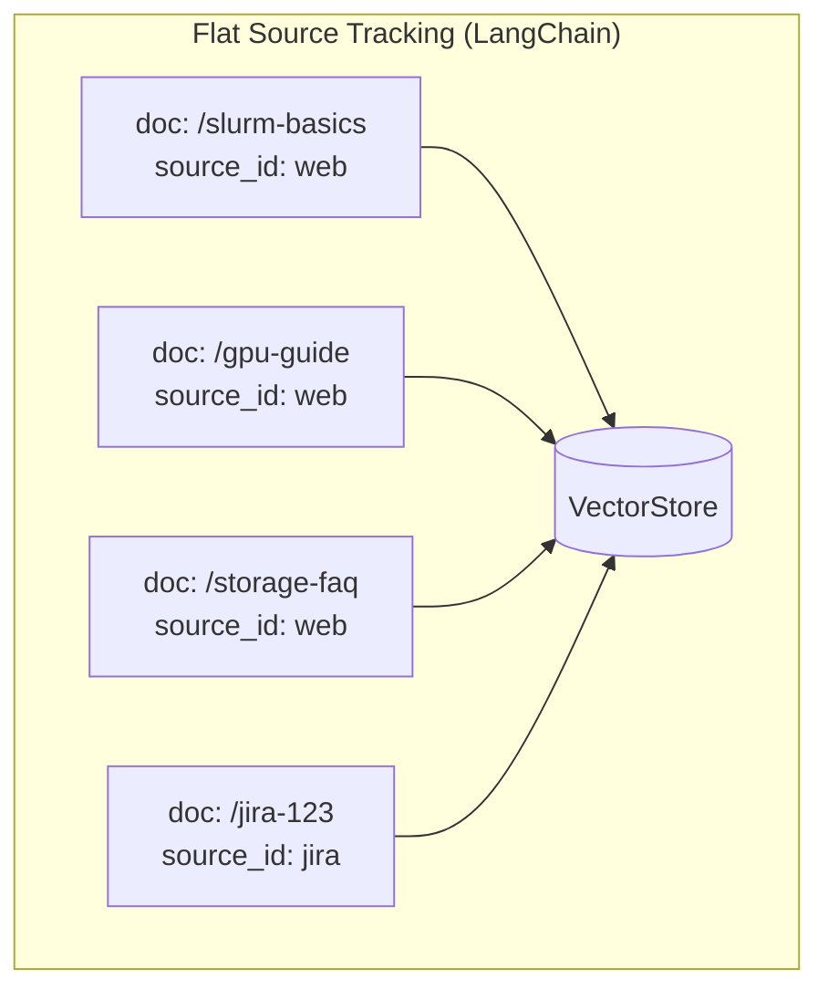

All web documents share the same `source_id`. You can refresh "all web sources" but not "all pages from the FASRC docs site."

### What's Needed

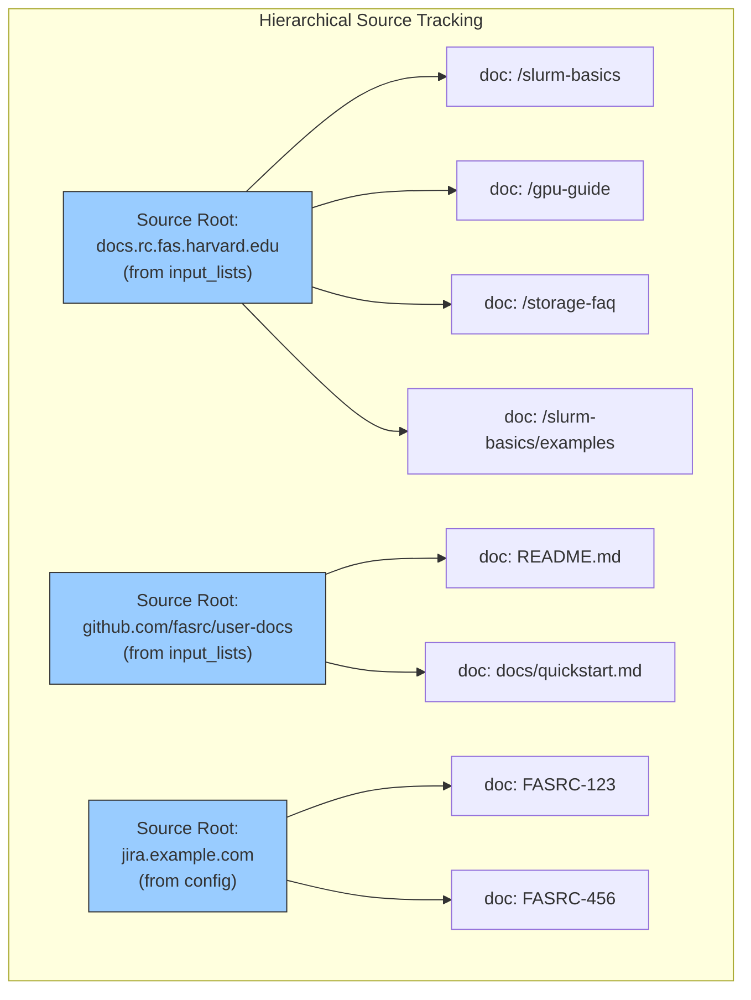

### Three Approaches to Source Trees

**Approach A: Explicit `source_root_url` Column**

Add a new column to the `documents` table in PostgreSQL:

```sql
ALTER TABLE documents ADD COLUMN source_root_url TEXT;
CREATE INDEX idx_documents_source_root ON documents(source_root_url);
```

Every document crawled from `crawl_iter(start_url=X)` gets `source_root_url = X`. Refresh queries become: `SELECT url FROM documents WHERE source_root_url = ?`.

*Pros:* Clean, explicit, fast queries.
*Cons:* Schema migration required. Must be populated at crawl time.

**Approach B: URL Prefix Inference**

No schema change. Infer the source tree from URL patterns: `SELECT url FROM documents WHERE url LIKE 'https://docs.rc.fas.harvard.edu/%'`.

*Pros:* No migration. Works retroactively on existing data.
*Cons:* Breaks for cross-subdomain crawls. Fragile with URL restructuring. Slower queries (LIKE vs equality).

**Approach C: Input List Entry as Source ID**

The URLs in `input_lists` files are already the root URLs that define crawl trees. Tag each crawled page with the input list entry that spawned it — effectively making the input list entry the source tree root.

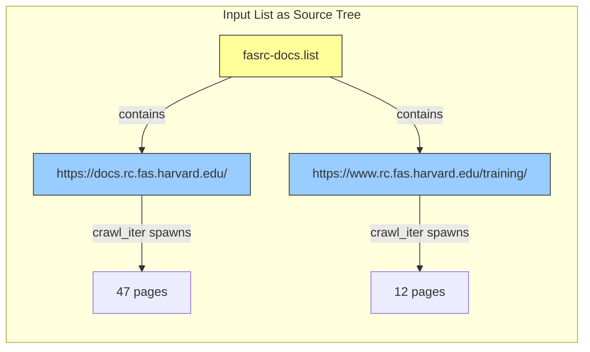

*Pros:* Maps naturally to existing config. The input list entry IS the source tree definition. No new concepts — just surfaces what's already implicit.
*Cons:* Tied to input list structure. Doesn't work for dynamically added URLs (via uploader API).

---

## Recommendations for Archi

Based on this survey, archi is positioned to advance beyond the current state of the art in several ways. The following architecture combines passive TTL-based caching with imperative invalidation, and introduces source tree tracking that no other open-source RAG framework offers.

### Proposed Architecture

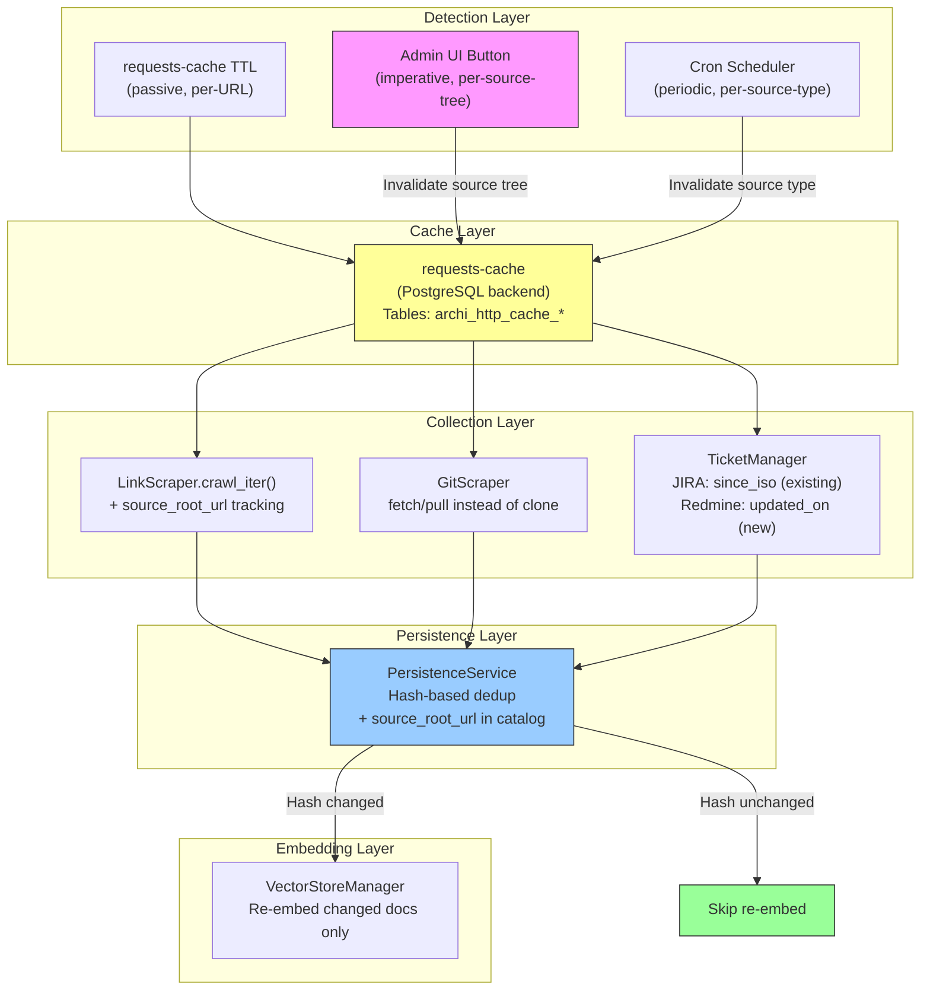

### Key Design Decisions

| Decision | Choice | Rationale |
|---|---|---|
| **Caching library** | `requests-cache` with PostgreSQL backend | Reuses existing infra, survives restarts, handles ETags |
| **Source tree tracking** | `source_root_url` column + input list entry as root | Clean queries, natural mapping to existing config |
| **Change detection** | HTTP conditional requests → content hash → full re-fetch | Layered: cheapest check first |
| **Refresh trigger** | Chat app `/data` page + uploader API | Where admins already manage data |
| **Embedding update** | Re-embed only changed documents | Hash comparison in PersistenceService already exists |
| **Stale doc cleanup** | Soft delete (`is_deleted=true`) on missing-from-crawl | Existing catalog pattern, reversible |

### What This Gets Archi That Nobody Else Has

1. **HTTP-level caching with ETag/304 support** — no other RAG framework caches at the HTTP layer
2. **Source tree-level refresh** — "refresh everything from this documentation site" as a first-class operation
3. **Imperative invalidation UI** — an admin button that nobody else provides in OSS
4. **Three-layer change detection** — HTTP conditional → content hash → full re-fetch, minimizing unnecessary work at each stage
5. **Separation of concerns** — fetching, caching, persistence, and embedding are distinct pipeline stages with independent invalidation

---

## References

### Frameworks

- LlamaIndex Ingestion Pipeline — [https://docs.llamaindex.ai/en/stable/module_guides/loading/ingestion_pipeline/](https://docs.llamaindex.ai/en/stable/module_guides/loading/ingestion_pipeline/)
- LlamaIndex Document Management — [https://docs.llamaindex.ai/en/stable/examples/ingestion/document_management_pipeline/](https://docs.llamaindex.ai/en/stable/examples/ingestion/document_management_pipeline/)
- LlamaIndex refresh_ref_docs issue #8832 — [https://github.com/run-llama/llama_index/issues/8832](https://github.com/run-llama/llama_index/issues/8832)
- LangChain Indexing API — [https://python.langchain.com/docs/how_to/indexing/](https://python.langchain.com/docs/how_to/indexing/)
- LangChain index() API Reference — [https://reference.langchain.com/v0.3/python/core/indexing/langchain_core.indexing.api.index.html](https://reference.langchain.com/v0.3/python/core/indexing/langchain_core.indexing.api.index.html)
- Haystack DocumentStore — [https://docs.haystack.deepset.ai/docs/document-store](https://docs.haystack.deepset.ai/docs/document-store)
- Haystack DocumentWriter — [https://docs.haystack.deepset.ai/docs/documentwriter](https://docs.haystack.deepset.ai/docs/documentwriter)
- Haystack DuplicatePolicy discussion #6430 — [https://github.com/deepset-ai/haystack/issues/6430](https://github.com/deepset-ai/haystack/issues/6430)
- Verba by Weaviate — [https://github.com/weaviate/Verba](https://github.com/weaviate/Verba)
- Verba blog post — [https://weaviate.io/blog/verba-open-source-rag-app](https://weaviate.io/blog/verba-open-source-rag-app)

### Vector Databases

- Qdrant Data Ingestion Guide — [https://qdrant.tech/documentation/data-ingestion-beginners/](https://qdrant.tech/documentation/data-ingestion-beginners/)
- Qdrant Upsert API — [https://api.qdrant.tech/api-reference/points/upsert-points](https://api.qdrant.tech/api-reference/points/upsert-points)
- Pinecone Data Freshness — [https://docs.pinecone.io/guides/data/data-freshness/understanding-data-freshness](https://docs.pinecone.io/guides/data/data-freshness/understanding-data-freshness)
- Pinecone Upsert Guide — [https://docs.pinecone.io/guides/index-data/upsert-data](https://docs.pinecone.io/guides/index-data/upsert-data)
- ChromaDB Update Data — [https://docs.trychroma.com/docs/collections/update-data](https://docs.trychroma.com/docs/collections/update-data)

### Caching

- requests-cache Documentation — [https://requests-cache.readthedocs.io/en/stable/](https://requests-cache.readthedocs.io/en/stable/)
- requests-cache PostgreSQL Backend — [https://requests-cache.readthedocs.io/en/stable/user_guide/backends.html](https://requests-cache.readthedocs.io/en/stable/user_guide/backends.html)

### General RAG Architecture

- RAGOps: Managing RAG Systems in Production — [https://arxiv.org/html/2506.03401v1](https://arxiv.org/html/2506.03401v1)
- Enterprise RAG Data Ingestion (Informatica) — [https://www.informatica.com/resources/articles/enterprise-rag-data-ingestion.html](https://www.informatica.com/resources/articles/enterprise-rag-data-ingestion.html)
- RAG Knowledge Base Updates (apxml) — [https://apxml.com/courses/optimizing-rag-for-production/chapter-7-rag-scalability-reliability-maintainability/rag-knowledge-base-updates](https://apxml.com/courses/optimizing-rag-for-production/chapter-7-rag-scalability-reliability-maintainability/rag-knowledge-base-updates)
- Caching Strategies for High-Performance RAG (ChatNexus) — [https://articles.chatnexus.io/knowledge-base/caching-strategies-for-high-performance-rag-systems-developer-experience-technical-documentation/](https://articles.chatnexus.io/knowledge-base/caching-strategies-for-high-performance-rag-systems-developer-experience-technical-documentation/)
- RAG Strategies 2025 (Morphik) — [https://www.morphik.ai/blog/retrieval-augmented-generation-strategies](https://www.morphik.ai/blog/retrieval-augmented-generation-strategies)
- LlamaIndex Data Management (Medium) — [https://akash-mathur.medium.com/data-management-in-llamaindex-smart-tracking-and-debugging-of-document-changes-7b81c304382b](https://akash-mathur.medium.com/data-management-in-llamaindex-smart-tracking-and-debugging-of-document-changes-7b81c304382b)
